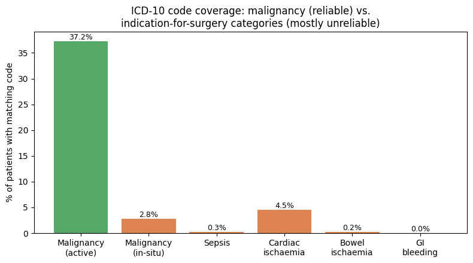

# Questions for Clinicians — INSPIRE Mortality Project

Each question below is tied to a specific finding or open decision from the analysis, so
the clinical team has something concrete to react to rather than an abstract ask. Grouped
by theme, roughly in priority order — the first section blocks the most downstream work.

*(Companion doc: `ASA_POSSUM_NELA_Theory_and_Validation.md` has the full math, references,
and field-availability audit behind Section 3 below — kept separate so this doc stays
short and clinician-facing.)*

---

## 1. The mortality label itself — ✅ RESOLVED (full-data analysis, no clinician input needed)

- True 30-day mortality: **469 deaths / 99,886 patients = 0.47%** (not 942 / ~0.9% from
  the raw folder label).
- Breakdown: 301 deaths among single-op patients + 168 deaths among multi-op patients
  (111 + 57, see Section 2).
- 473 folder-labeled "died" patients died **after** 30 days — currently counted as
  "survived" for the 30-day task.

**Still open for clinicians:**
1. Is 30-day all-cause mortality the right target, or should it be narrowed to
   surgery-related deaths specifically? *(exploring separately in the Pipeline section)*
2. Should the 473 "died after 30 days" patients be their own labeled cohort instead of
   folded into "survived"?
3. **[MUST ASK]** Is 30 days the right window at all, vs. 90-day or in-hospital-only?

## 2. Multiple operations per patient — ✅ RESOLVED (full-data analysis, no clinician input needed)

**Does operation count itself predict risk?**

- Mortality rises steadily with operation count: 0.4% (1 op) → 0.6% (2) → 1.2% (3) → 1.3%
  (4), then dips slightly at 5+ (1.0%) — likely a smaller-sample effect, not a real
  reversal.
- **Takeaway: number of prior operations is itself a real risk signal**, worth including
  as a feature.
- **[MUST CHECK CLINICALLY]** Is there a specific time window — i.e. does having
  multiple surgeries within a short period (rather than just the raw count) actually
  drive the risk up, and could that pattern reliably help flag a patient as high-risk?

**Which operation should anchor the 30-day death label — first or last?**

- Of 21,565 multi-op patients, only **111** get a different Yes/No death answer depending
  on which operation you anchor to. The other 21,454 give the same answer either way.
- The disagreement only ever runs one direction (last-op says "died", first-op says
  "survived") — **never** the reverse. This is mathematically guaranteed: a patient's last
  operation always comes after their first, so dying within 30 days of the first
  operation always also falls within 30 days of the last one too.

**Why does it run only one direction? — the gap between operations:**

- For these 111 patients: **median gap = 11 months** between first and last operation
  (mean 700 days, up to ~8 years).
- **Takeaway: these are not staged/planned procedures** (which would show gaps of days).
  They're patients with an old, unrelated earlier surgery, who came back much later for a
  new, separate operation — and died shortly after *that* one.

**Conclusion: last-operation is the correct anchor.** Using first-operation would wrongly
exclude 111 real deaths just because an old, unrelated earlier surgery happened to fall
outside the 30-day window. **469 is the settled, defensible death count.** The pipeline's
existing approach (anchor on last operation) was already correct.

- **Open follow-up:** anchoring on the last operation answers "which single operation to
  measure 30 days from," but not "does *clustering* of operations in a short window carry
  its own risk signal, separate from the anchor question." Worth testing directly.

**Still open for clinicians:**
4. Does this match clinical intuition — that a much-earlier, unrelated operation
   shouldn't be the reference point for a death that follows a later, separate surgery?
5. Is there any subgroup where "first operation" would still be the clinically correct
   reference (e.g. genuinely staged procedures with short gaps) that's worth carving out
   separately, even though it's rare in this data?
6. Alongside the last-operation anchor: should we also flag patients who had **multiple
   operations within a short window** (e.g. within 30/60/90 days of each other) as a
   distinct risk marker — does clustering of surgeries in a short span clinically signal
   a deteriorating patient, separate from the raw operation count?

## 3. ASA, POSSUM, NELA — which scores actually matter here

**Finding:** ASA class alone is a very strong predictor in this data — mortality climbs
from 0.07% (ASA 1) to 82.5% (ASA 6), a clean and expected staircase.

**How the three differ, briefly:**
- **ASA** — no formula, a doctor's judgment call (1-6).
- **POSSUM** — 18 variables scored into two sub-totals, fed into a small equation.
- **NELA** — ~20 variables fed directly into one bigger equation, already coded in this
  repo (`nela.py`), real published weights.

**Data check — what we can actually compute from our data:**
- **NELA: mostly buildable.** Almost all its real inputs exist (age, ASA, albumin, pulse,
  BP, urea, WBC), except:
  - GCS — only **8.4%** of patients have it recorded, and it's **not missing at random**
    (concentrated in neurosurgery/cardiothoracic, emergencies, and high-ASA patients).
  - Malignancy stage / indication for surgery — checked against real ICD-10 codes
    (malignancy, sepsis, ischaemia, bleeding ranges); see companion doc for coverage.
- **POSSUM: not fully buildable.** Several inputs (peritoneal soiling, cardiac/respiratory
  exam grade, ECG) aren't captured in this dataset at all — not a naming issue, genuinely
  absent.
- **Plan:** build a real NELA score from our data and feed it into the DNN as an input
  feature, rather than only comparing against it as a separate baseline.

7. Given ASA already captures so much signal on its own, does the clinical team see real
   value in adding POSSUM/NELA as *additional* model inputs, or are they more useful as
   **comparison baselines** (i.e. "does our model beat what ASA/POSSUM/NELA alone would
   have predicted") rather than inputs to fuse into the model?
8. ASA is assigned by an anesthesiologist's judgment before surgery — is there a concern
   about **circularity**, where a clinician who already suspects the patient is high-risk
   assigns a higher ASA, which the model then partly "reads back" rather than learning
   independently from the raw physiological data? Should ASA be excluded from model inputs
   for this reason, even though it's a strong predictor?
9. GCS is missing for over 90% of patients — is that expected (most patients here are
   lucid), or a data-capture gap worth investigating?
10. For the NELA terms we can't compute directly (malignancy stage, indication for
    surgery) — are ICD-10 codes a clinically acceptable way to derive these? **Update:**
    we tested this on real data — malignancy detection worked well (37.2% of patients
    have an active cancer code), but the indication categories mostly came back empty
    (sepsis 0.3%, bowel ischaemia 0.2%, **GI bleeding 0.0% — zero patients out of 5,000**),
    which suggests our code ranges don't match how these are actually coded here.

    

    **Further update:** likely explanation found — we'd used narrow, hand-picked code
    ranges (e.g. just `A40-A41` for sepsis) instead of the full official WHO ICD-10
    chapter ranges (e.g. the complete infectious-disease chapter, `A00-B99`). Re-running
    with the correct full ranges — see `ICD10_Architecture_Research.md` — before
    concluding these categories are genuinely undercoded in this dataset.

    Can the clinical team point us to the correct codes, or confirm these indication
    categories genuinely aren't reliably derivable from diagnosis codes in this dataset?
11. Is an admittedly-incomplete "NELA-partial" score (missing GCS/malignancy/indication)
    still clinically useful as a model input, or does it need to be complete to mean
    anything?

## 4. Frailty (HFRS)

**Original finding:** HFRS frailty category is a real but comparatively modest signal
here (high frailty: ~1.0% mortality vs. low frailty: ~0.4%) — much weaker on its own than
ASA. Also, our current implementation does **not** yet use the published 2-year lookback
/ age 75+ eligibility window that HFRS was originally validated for.

**Update — we fixed it and re-ran on real data (5,000-patient sample):**
- Confirmed directly in the code: the 2-year window was never implemented (a `# NEED TO
  FIGURE OUR TWO YEARS OF CODES` comment sat unactioned), and the age≥75 eligibility check
  was written but commented out.
- **Only 14.7% of patients (735/5,000) are even age-eligible** for HFRS under its real
  validation criteria — the other 85% should never have gotten a score at all.
- Among eligible patients, fixing the window **roughly halved the mean score** (7.48 →
  3.74) — the current version is substantially over-estimating frailty from old, no-longer
  relevant diagnoses.

- **16.2% of eligible patients change category** once corrected — over half of currently
  "high"-frailty patients (53 of 102) drop to intermediate/low once old diagnoses are
  excluded.

- **The corrected version is a meaningfully better predictor:** current HFRS barely
  separates intermediate (1.80%) from high (1.96%) mortality; corrected HFRS shows a clean
  jump to **4.08%** mortality at high frailty vs. ~1% at low/intermediate. Fixing this bug
  doesn't just correct methodology — it makes the score noticeably more useful.
- Caveat: only 49 "high"-frailty patients in this 5,000-patient sample (noisy at full
  scale too, since age-75+ is a minority of this surgical cohort) — directionally clear,
  worth confirming on the full cohort before treating as final.

12. Given the corrected numbers above (4.08% high vs. ~1% low/intermediate), does that
    match clinical expectation better than the original buggy numbers (1.96% vs. 1.80%)?
13. Is chronological age at time of surgery, on its own, expected to be a stronger or
    weaker predictor than HFRS in a population like this? (Useful for us to know what to
    expect before we run that comparison.)
14. **[NEW]** Given HFRS only ever applies to ~15% of this surgical cohort (age 75+), is
    it worth the model complexity, or would a simpler age-based frailty proxy cover most
    of the same ground for this population?

## 5. Organ-system feature grouping

**Original finding:** we're grouping ~126 parameters (labs, vitals, diagnoses) into six
systems — renal, cardiovascular, respiratory, metabolic/hepatic,
haematology/coagulation, neurological — so the model can report a per-system risk
breakdown rather than one opaque number.

**Update — researched against the actual clinical literature:**
- **SOFA** (Sequential Organ Failure Assessment — the real clinical gold standard for
  organ-dysfunction scoring, Vincent et al. 1996) uses exactly **six** systems, almost
  identical to ours — and **deliberately has no 7th "infection" system.** Under
  **Sepsis-3** (Singer et al. 2016, *JAMA*), sepsis is defined as an infection *triggering*
  a SOFA score change — infection is a cross-cutting flag layered on the six systems, not
  a competing 7th one. **We've revised our grouping to match this** — CRP/WBC stay in
  haematology (they're blood tests) but also serve as an "infection context" flag, rather
  than owning a separate system.
- **Lactate moved from metabolic to cardiovascular** — strong, repeated clinical
  literature frames it as a tissue-perfusion/circulatory-shock marker (used directly in
  cardiogenic shock staging), matching the clinician's own instinct in the original
  question below.
- **Data-driven check planned:** running hierarchical clustering on real INSPIRE lab/vital
  correlations to see whether features that cluster together in the actual data match this
  literature-informed grouping — results pending.
- **Second independent line of evidence, for the diagnosis-code side specifically:**
  ICD-10's own official WHO chapter structure *also* treats infectious disease as its own
  dedicated chapter (Chapter I, A00-B99), separate from every organ-system chapter — the
  same conclusion SOFA/Sepsis-3 reached from a completely different angle (clinical
  scoring practice vs. diagnosis coding standard). See `ICD10_Architecture_Research.md`
  for the full chapter mapping and how it feeds the `DX_EMB` part of the architecture.

15. **Infection/sepsis doesn't have a clean home in this six-system split** — CRP is
    currently under "metabolic/hepatic" and WBC under "haematology," but the actual
    mortality-linked ICD-10 codes we found in the data (D65, I46, R57, J80, K72, A41)
    cluster around sepsis/inflammation rather than any single organ. Should
    infection/inflammation be its **own seventh category**, and if so, which specific labs
    and vitals should the clinical team consider core markers of it (CRP, WBC, lactate,
    procalcitonin if available, temperature)? **Proposed answer, pending clinical
    sign-off:** no — follow SOFA/Sepsis-3's approach and treat infection as a
    cross-cutting flag rather than a competing 7th system.
16. Are there parameters in our current grouping that a clinician would put in a different
    system than we have (e.g. lactate is currently under metabolic — some clinicians treat
    it primarily as a marker of tissue perfusion/shock, which is arguably cardiovascular)?
    **Proposed answer, pending clinical sign-off:** yes — moved lactate to cardiovascular
    based on the literature above.

## 6. Scope: pre-operative only, or including intra-operative data

**Decision needed:** we can build this as (a) a pre-operative decision-support tool only
("should we operate, should ICU be booked"), (b) one that also uses intra-operative
vitals for real-time monitoring, or (c) one that also watches early post-op data for
early-warning/rescue. These are three different clinical products, not three versions of
the same one.

17. Which of these three is the most clinically useful starting point for the team, given
    how the tool would actually be used day to day?
18. If intra-operative vitals are eventually added: are there specific intra-op events
    (e.g. a hypotensive episode, a specific arrhythmia, blood loss volume) that the
    clinical team already treats as strong informal predictors of poor outcome, that we
    should make sure are explicitly represented rather than left for the model to
    discover on its own?

## 7. Concept Bottleneck — naming intermediate clinical concepts

**Plan:** rather than predicting mortality directly, we want an intermediate layer that
predicts named clinical concepts first (e.g. "AKI stage," "haemodynamic instability,"
"respiratory failure stage"), and predicts mortality from those.

19. For each of these three example concepts, what would the clinical team consider the
    correct **staging definition and thresholds** to use as ground truth (e.g. KDIGO
    criteria for AKI stage — is that the right standard for this population)?
20. Are there other named clinical concepts, beyond these three, that the team would
    consider essential intermediate steps in reasoning about a surgical patient's
    trajectory toward death, that we should build a concept head for?

## 8. Departments and case mix

**Finding:** mortality varies a lot by department in ways that partly overlap with feature
significance in our screen — some features (e.g. albumin, platelets) remain predictive
even after adjusting for department, which is reassuring, but department itself carries a
lot of the raw signal.

21. Should the model be trained as one model across all departments, or does the clinical
    team think department-specific models (e.g. cardiothoracic surgery vs. general
    surgery) would be more clinically meaningful, given how different the baseline risk
    and relevant physiology are across departments?

---

## How to use this

Sections 1-2 are now **resolved by full-scale data analysis** — no clinician input
needed to move forward with the 469-death, last-op-anchored label. The remaining
questions there are optional context, not blockers. Sections 3-8 are still fully open and
need clinical input before those parts of the project proceed.
