# Clinician Validation — Comparative Study, Mapping Checks, and Open Questions

**What this page is:** every question below was asked in one batch, about work already
scattered across `Clinician_Questions.md`, `ASA_POSSUM_NELA_Theory_and_Validation.md`,
`ICD10_Architecture_Research.md`, `INSPIRE_Complete_Findings_Summary.md`, and
`roadmap_and_architecture.md`. This page pulls all of it into one place, next to a
**clean restatement of the question**, the **existing analysis + pictures** where they
exist, and an honest **status tag** — so it's obvious at a glance what's already answered
with real data vs. what genuinely still needs a clinician's sign-off.
---

## Contents

1. [HFRS (frailty score) analysis](#1-hfrs-frailty-score-analysis)
2. [Which ICD-10 diagnosis codes actually drive the frailty score](#2-which-icd-10-diagnosis-codes-actually-drive-the-frailty-score)
3. [Comparative study — ASA vs. POSSUM vs. NELA validation](#3-comparative-study--asa-vs-possum-vs-nela-validation)
4. [Feature/parameter table validation — mapping from clinicians](#4-featureparameter-table-validation--mapping-from-clinicians)
5. [Labs → organ systems: many-to-one / many-to-many mapping check](#5-labs--organ-systems-many-to-one--many-to-many-mapping-check)
6. [Multi-surgery patients — should all of them be used?](#6-multi-surgery-patients--should-all-of-them-be-used)
7. [Does clustering of surgeries in a short window carry its own risk signal?](#7-does-clustering-of-surgeries-in-a-short-window-carry-its-own-risk-signal)
8. [Pre-op, peri-op, and post-op — which window(s) to build for](#8-pre-op-peri-op-and-post-op--which-windows-to-build-for)
9. [Concept Bottleneck — naming intermediate clinical concepts](#9-concept-bottleneck--naming-intermediate-clinical-concepts)
10. [Departments and case mix](#10-departments-and-case-mix)
11. [System-level breakdown — every parameter, per organ system, as a flowchart](#11-system-level-breakdown--every-parameter-per-organ-system-as-a-flowchart)
12. [Appendix — all 21 original clinician questions, cross-referenced](#12-appendix--all-21-original-clinician-questions-cross-referenced)

---

## 1. HFRS (frailty score) analysis

**Question, clearly framed:** Is the Hospital Frailty Risk Score (HFRS), as currently
implemented, computing frailty correctly, and how predictive is it once computed
correctly?


### Impact of fixing it (5,000-patient sample)

| | Value |
|---|---|
| Patients actually age-eligible (75+) | 735 / 5,000 (**14.7%**) — the other ~85% should never have been scored at all |
| Mean score, current (no window) | 7.48 |
| Mean score, corrected (2-yr window) | 3.74 — roughly **halved** |
| Eligible patients who change frailty category | 119 / 735 (**16.2%**) |

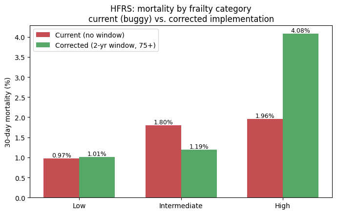

| Category | Current mortality | Corrected mortality |
|---|---|---|
| Low | 0.97% | 1.01% |
| Intermediate | 1.80% | 1.19% |
| High | 1.96% | **4.08%** |

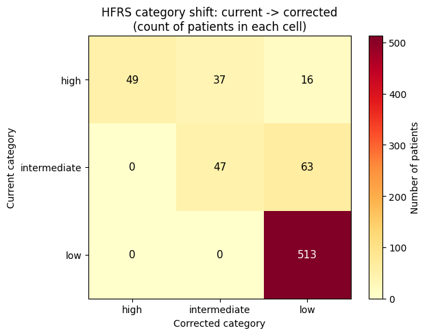

| Current → Corrected | High | Intermediate | Low |
|---|---|---|---|
| **High** | 49 | 37 | 16 |
| **Intermediate** | 0 | 47 | 63 |
| **Low** | 0 | 0 | 513 |

Over half of currently "high"-frailty patients (53 of 102 shown in the earlier eligible
subset) drop to intermediate/low once stale diagnoses are excluded.

### The corrected version is a meaningfully better predictor, not just more methodologically correct

Current HFRS barely separates intermediate (1.80%) from high (1.96%) mortality. Corrected
HFRS shows a clean jump to **4.08%** mortality at high frailty vs. ~1% at low/intermediate
— fixing the bug makes the score more useful, not just more defensible.

### At full-scale (before the fix was applied cohort-wide)

| HFRS category | Mortality rate | Patients |
|---|---|---|
| High | 1.01% | 6,024 |
| Intermediate | 0.77% | 8,457 |
| Low | 0.41% | 80,865 |
| Unknown (no diagnoses) | 0.18% | 4,540 |

High-frailty patients die at roughly 5–6× the rate of low-frailty patients — a real,
ordered signal, but weaker on its own than ASA (which reaches 82% mortality at its
extreme vs. HFRS's ~1–4%). HFRS looks like a legitimate contributing feature, not a
standalone dominant predictor.

### Does frailty matter more for emergency surgery? — now answered on the full dataset


The reasoning: a surgeon who schedules an elective operation has already, informally,
screened the patient for fitness, so frailty should carry *less* extra information for
scheduled surgery. For emergency surgery, no such screening happens, so frailty should
matter *more*. **Confirmed on the full cohort:** emergency mortality is far higher than
scheduled mortality at every frailty level — low (2.7% vs. 0.2%), intermediate (4.1% vs.
0.4%), high (3.4% vs. 0.6%) — roughly a 6–13× gap depending on category.

**One real, unexpected wrinkle:** intermediate-frailty emergency patients (4.1%) show
*higher* mortality than high-frailty emergency patients (3.4%) — not the clean staircase
you'd expect. This could be a genuine clinical pattern or a small-subgroup artifact (the
high-frailty + emergency cell is a much smaller slice of the cohort than intermediate);
worth a clinician's read before treating it as a real finding.

**Question for the clinician:** the emergency-vs-scheduled gap is confirmed and large — but
why does *intermediate* frailty show higher emergency mortality than *high* frailty? Is
this a real clinical pattern (e.g. the highest-frailty patients get triaged toward
different, more conservative management, which paradoxically shows up as lower measured
mortality), or should we treat it as noise from a small subgroup and expect it to smooth
out with more data?

**Still open for clinicians:**
- Does the corrected split (4.08% high vs. ~1% low/intermediate) match clinical
  expectation better than the original buggy numbers (1.96% vs. 1.80%)?
- Is chronological age alone expected to be a stronger or weaker predictor than HFRS in
  this population?
- Given HFRS only ever applies to ~15% of this surgical cohort (age 75+), is it worth the
  added model complexity, or would a simpler age-based frailty proxy cover most of the
  same ground?

---

## 2. Which ICD-10 diagnosis codes actually drive the frailty score

**Question, clearly framed:** What are the actual diagnosis (ICD-10) codes being fed into
the frailty calculation, and how does the pipeline turn a patient's diagnosis history into
the HFRS number?

### Where it comes from

HFRS uses **109 specific ICD-10 diagnosis clusters**, each with its own point value,
originally derived by Gilbert et al. (2018, *Lancet*) from a cluster analysis of frail vs.
non-frail hospital patients. The full weight table is hard-coded in
`src/frailty_hfrs.py`, function `get_hfrs_weights()` — a direct, complete transcription of
the original paper's Table A2, not an approximation. A representative sample of the 109
codes (full list is in the source file):

| ICD-10 code | Description | Points |
|---|---|---|
| A04 | Other bacterial intestinal infections | 1.1 |
| A09 | Diarrhoea and gastroenteritis of presumed infectious origin | 1.1 |
| A41 | Other septicaemia | 1.6 |
| B96 | Other bacterial agents as the cause of diseases classified elsewhere | 2.9 |
| D64 | Other anaemias | 0.4 |
| E86 | Volume depletion | 2.3 |
| E87 | Other disorders of fluid, electrolyte and acid-base balance | 2.3 |
| F00 | Dementia in Alzheimer's disease | 7.1 |
| F03 | Unspecified dementia | 2.1 |
| F05 | Delirium, not induced by alcohol and other psychoactive substances | 3.2 |
| *(101 more codes, spanning falls/fractures, incontinence, pressure ulcers, malnutrition, mobility disorders, etc.)* | | |

### How it's actually computed (`compute_hfrs()`, `subject.py`)

1. Take every ICD-10 diagnosis code on record for the patient.
2. Match each code against the 109-cluster weight table above (3–4 character match).
3. Sum the matched points.
4. Bucket the total: **< 5 = low, 5–15 = intermediate, > 15 = high**.

**The two eligibility bugs described in Section 1 live exactly here:** step 1 should only
include diagnoses from the **2 years before the operation** (not the patient's entire
history), and the whole calculation should only run for patients **age 75+** (the
population HFRS was actually validated on). Both are now fixed in the corrected version
whose results are shown in Section 1.

### How this connects to the organ-system mapping in Section 5

These 109 codes are a **separate, purpose-built list** for frailty specifically — distinct
from the organ-system ICD-10 chapter mapping used elsewhere (Section 11 below). There's a
real overlap point worth flagging: **ICD-10 Chapter M (musculoskeletal — fractures,
osteoporosis)** shows up both as "frailty-adjacent" in the organ-system mapping *and*
contributes to several of the 109 HFRS codes directly (fall/fracture codes are a
recognized frailty marker in the original Gilbert et al. methodology). This is one more
concrete instance of the many-to-many mapping question from Section 5 — a diagnosis code
can legitimately inform both a general frailty score and an organ-system flag at once.

**Still open for clinicians:** none of the 109 codes themselves are in question (they're a
direct transcription of a published, peer-reviewed instrument) — the open items are the
*implementation* questions already listed in Section 1 (does the corrected version match
clinical expectation, is the age-75+ restriction worth keeping as-is for this surgical
population).

---

## 3. Comparative study — ASA vs. POSSUM vs. NELA validation

**Question, clearly framed:** Of the three standard surgical-risk scores (ASA, POSSUM,
NELA), which ones can we actually reproduce from INSPIRE's real fields, how do they
compare to each other structurally, and is a head-to-head comparative study against our
own model feasible?

### How the three differ structurally

| | ASA | POSSUM | NELA |
|---|---|---|---|
| Inputs | None — a holistic clinical impression | 18 variables → two sub-scores (PS, OSS) | ~20 variables, no sub-scores |
| Computation | None — direct 1–6 judgment call | Sum into PS/OSS, then one small logistic equation | Every variable enters one logistic regression directly, its own fitted weight |
| Reproducible from data alone? | ❌ No — depends on who's looking | ✅ Yes, if inputs exist | ✅ Yes, if inputs exist |

### Does ASA behave the way it clinically should in our data? Yes — a clean staircase

| ASA class | Mortality rate | Patients |
|---|---|---|
| 1 | 0.07% | 34,748 |
| 2 | 0.17% | 54,107 |
| 3 | 2.16% | 8,024 |
| 4 | 10.3% | 464 |
| 5 | 24.2% | 33 |
| 6 | 82.5% | 57 |

Mortality roughly triples with each ASA step. ASA class 6 (brain-dead organ donors) shows
82.5% mortality — expected, not alarming. This is a strong sanity check that the dataset
is clinically coherent, and confirms ASA is a surprisingly powerful single predictor on
its own (Koo et al. 2015's 77-study meta-analysis puts ASA alone at AUROC 0.736 across
165,705 patients — a literature benchmark worth re-testing directly against our own
99,886-patient cohort).

### Real field-by-field availability audit (5,000-patient sample)

| Field | Status | Note |
|---|---|---|
| Age | ✅ Available | Static field, ~100% |
| Systolic BP | ✅ Available (renamed) | `nibp_sbp`, 98.2%/99.4% |
| Pulse | ✅ Available (renamed) | `hr`, 98.4%/100% |
| Hb, WBC, Sodium, Potassium, Albumin | ✅ Available | 93–95% |
| Urea | ✅ Available (renamed) | `bun`, 93.2% |
| Number of procedures | ✅ Available (different table) | `n_operations`, 100% |
| Total blood loss | ✅ Available (renamed) | `ebl`, 59.3% intra-op |
| GCS | ⚠️ Partial | Only 8.4% coverage, **not random** — see below |
| Urgency banding (elective/2–6h/6–18h/<2h) | ⚠️ Partial | Only binary `emop` exists |
| Malignancy | ✅ Derivable | 37.2% via ICD-10 C00-C97 |
| Sepsis / ischaemia / GI bleeding indication | ❌/🔧 Attempted, unreliable | Narrow code ranges tried first — see Section 5 below |
| Cardiac/respiratory exam grade, ECG, peritoneal soiling | ❌ Not available | Genuinely absent from this dataset, not a naming issue |

**GCS missingness is systematic, not random** — checked against department, ASA class, and
emergency status:

| Breakdown | GCS coverage |
|---|---|
| CTS (cardiothoracic) | 37.5% |
| NS (neurosurgery) | 25.2% |
| Most other departments | 1.7%–7.5% |
| Emergency (`emop`=1) | 20.7% |
| Elective (`emop`=0) | 7.1% |
| ASA 6 | 60.0% |
| ASA 1 | 3.2% |

GCS gets recorded when a clinical team already suspects it matters — so its absence is
itself informative (this patient likely wasn't neurologically concerning), not a random
gap to impute away.

### Bottom line, per score

- **NELA — mostly buildable.** 9 of ~14 term-groups (Age, ASA×Age, Albumin, Pulse,
  SystolicBP, Urea, WBC, Malignancy) are fully available right now. Only GCS, respiratory
  status, urgency banding, and the three indication categories remain genuine gaps.
- **POSSUM — not fully buildable.** Several Operative Severity Score inputs (peritoneal
  soiling grade, exam-based cardiac/respiratory signs, ECG) simply aren't captured in this
  dataset — a real absence, not a mapping problem.

### What a real comparative study would need to run

1. **ASA-alone baseline** — one logistic regression on ASA class only, benchmarked
   against Koo et al.'s pooled AUROC 0.736.
2. **NELA (real, per-patient)** — build the actual NELA score for all 99,886 patients
   using the fields above (already coded in `nela.py`, but never yet run on real per-patient
   data — see caveat below).
3. **POSSUM / P-POSSUM** — not currently buildable in full; would need a partial version
   with the missing OSS terms defaulted, explicitly labeled as partial.
4. **Our model vs. all three** — AUROC/AUPRC/calibration comparison, ideally with the same
   train/test split used for the GBM/DNN models.

**Important existing caveat, carried over from `Base_Comparitive_Study_Models.md`:** NELA,
POSSUM, and NEWS2 have so far only been run as **demo calls with made-up illustrative
values**, to confirm the equations themselves work — **no real per-patient NELA/POSSUM
score exists yet for any actual INSPIRE patient.** Building that mapping for all 99,886
patients is a real, not-yet-done piece of work, not a completed baseline.

### The circularity question this comparative study should carry alongside it

ASA is assigned by a clinician's judgment *before* surgery. If a clinician already
suspects a poor outcome and assigns a higher ASA, and that ASA then triggers more
conservative management, the resulting death partly reflects the *management decision*,
not pure physiology (Merton 1948's self-fulfilling-prophecy concept, formalized for
clinical models in van Amsterdam et al. 2025, *Patterns*). **What can be tested from our
data:** an ablation (GBM with vs. without ASA) to see how much independent signal ASA adds
beyond the labs already in the model. **What cannot be tested from this dataset alone:**
true causal circularity — that needs treatment/intervention data, not just an
observational AUROC comparison.

**Still open for clinicians:**
- Does the team want POSSUM/NELA fused in as *model inputs*, or kept purely as
  *comparison baselines*?
- Should ASA be excluded from model inputs specifically because of the circularity
  concern, even though it's the single strongest univariate predictor found so far?
- Is an admittedly-incomplete "NELA-partial" score (missing GCS/malignancy/indication)
  still useful as an input, or does it need to be complete to mean anything?

---

## 4. Feature/parameter table validation — mapping from clinicians

**Question, clearly framed:** Of the 126 total parameters in the dataset's own schema
(`parameters.csv`), which ones has the team actually validated for coverage and
usability, and which groupings (into organ systems, into pre-op-usable vs. not) still
need a clinician to confirm they make clinical sense?

### The real schema, audited (not assumed)

| Table | Count | Usable for pre-op prediction? |
|---|---|---|
| `labs` | 38 | ✅ Yes |
| `ward_vitals` | 16 | ✅ Yes |
| `vitals` (intra-op) | 72 | ❌ No — only exists during surgery |

**54 feature types (38 + 16) are usable for a pre-op-only prediction.**

### Per-patient completeness — coverage tiers (30-patient audit, replicated at 5,000-patient scale in other sections)

| Tier | Coverage | Features |
|---|---|---|
| Near-universal | 90–93% | `hr`, `bt`, `nibp_dbp`, `nibp_sbp`, `rr` |
| Solid core | 50–70% | `chloride, hb, hct, potassium, sodium, wbc, platelet, lymphocyte, seg, creatinine, bun, calcium, phosphorus, albumin, alp, alt, ast, glucose, total_bilirubin, total_protein, ptinr` |
| Patchy | 20–50% | `aptt, fibrinogen, crp, spo2, hco3, sao2, be, ck, ckmb, paco2, pao2, ph, nibp_mbp` |
| Basically absent | <20% | `ica, troponin_i, fio2, gcs_e, gcs_m, lacate, vent, hba1c, crrt, ecmo, gcs_v, iabp` |
| Never present pre-op | 0% | `d_dimer, troponin_t, uo` |

Two coverage findings worth a clinician's read specifically: `uo` (urine output) appears
in 63% of patients *somewhere* in their record but **0% pre-op** — it seems to only get
recorded once a patient is already admitted/in ICU. `spo2` similarly drops from 93%
"anywhere" to 40% pre-op, for the same reason (monitors go on at admission, not before).

### The open validation ask for clinicians

This is the direct feature-table sign-off request: **is the near-universal + solid-core
tier (~26 features, all ≥50% coverage) a clinically defensible starting feature set**, or
are there patchy/rare features (e.g. `crp`, `lacate`, `gcs`) the team considers essential
enough to keep despite low coverage, because their *absence* is itself clinically
meaningful (as shown for GCS in Section 3)?

---

## 5. Labs → organ systems: many-to-one / many-to-many mapping check

**Question, clearly framed:** the current architecture assigns every lab/vital to
**exactly one** organ system (a strict many-to-one mapping: many parameters, one system
each). Is that assignment actually correct, or do some parameters genuinely belong to
**multiple** systems (many-to-many) and are being forced into a single bucket?

### How the check was actually run

Rather than trusting the hand-built system list, real hierarchical clustering was run on
5,000 patients' lab/vital correlations, to see whether features that move together *in
the real data* match the literature-assigned system groupings.

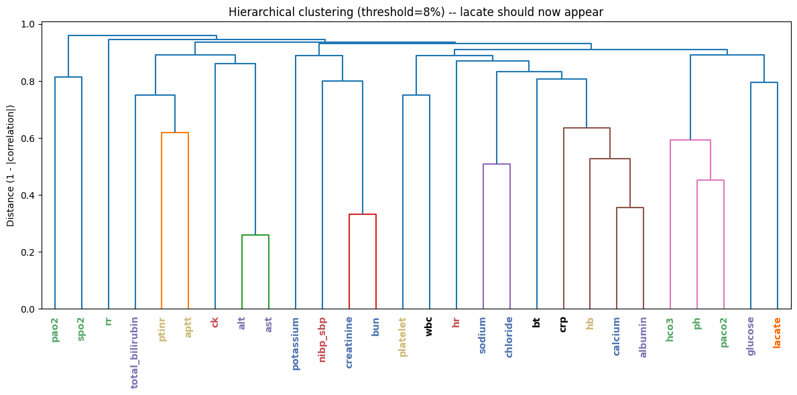

### Strongly confirmed — clean one-to-one clusters, mapping holds

| Pair | System |
|---|---|
| creatinine + bun | Renal |
| sodium + chloride | Renal |
| alt + ast | Hepatic |
| ptinr + aptt | Coagulation |
| hco3 + ph + paco2 | Acid-base / respiratory |

### Genuinely many-to-many — the mapping check's real findings

| Parameter | Assigned system (current) | What the real data shows | Verdict |
|---|---|---|---|
| **CRP** | Haematology/coag | Strongest real correlate is **albumin** (r = −0.487 — the classic acute-phase response: CRP rises as albumin falls), *not* other haematology markers | Genuinely cross-system: haematology **and** an infection-context flag, kept in haematology by convention (SOFA/Sepsis-3 don't give infection its own organ system either — see below) |
| **WBC** | Haematology/coag | Correlates more with **platelet** (haematology) than with CRP | Belongs in haematology, but *also* serves double duty as an infection-context flag alongside CRP |
| **Lactate** | Cardiovascular (literature default) | Weak correlations across the board (max \|r\| = 0.21): hco3 (−0.207, respiratory/acid-base), glucose (+0.204, metabolic), ph (−0.161, respiratory), ptinr (+0.123, coagulation), hr (+0.120, cardiovascular) | **Genuinely unresolved.** Literature frames it as a perfusion/shock (cardiovascular) marker; the correlation data leans slightly toward acid-base chemistry instead. Two caveats limit how much to trust this: only ~10% of patients have a pre-op lactate at all (likely a biased, sicker subsample), and lactate's real clinical value is in its *trend*, which one pre-op value can't capture |
| **Temperature (`bt`)** | Currently under Metabolic/hepatic (ward vitals) | Not yet clustered/tested directly | Flagged here because fever is a classic infection signal — same cross-cutting question as CRP/WBC, not yet run through the same clustering check |
| **ICD-10 Chapter M (musculoskeletal)** | "Frailty-adjacent," not a core system | Overlaps HFRS's fracture/osteoporosis codes | A genuine many-to-many case at the *diagnosis-code* level, not just the lab level — the same code can inform both an organ-system flag and the separate frailty score |

### Why this matters, and the resolution path taken

**Two independent sources agree infection shouldn't be a competing 7th organ system:**
- **SOFA** (Vincent et al. 1996, the clinical gold standard for organ dysfunction scoring)
  uses exactly six systems and deliberately has no 7th "infection" system.
- **Sepsis-3** (Singer et al. 2016, *JAMA*) defines sepsis as an infection *triggering* a
  SOFA change — infection is a cross-cutting flag layered on the six systems, not a
  system of its own.
- **ICD-10's own WHO chapter structure independently agrees** — Chapter I (infectious
  disease, A00-B99) is its own dedicated chapter, separate from every organ chapter. A
  third, structurally independent source reaching the same conclusion.

**Decision, pending final clinical sign-off:** treat CRP, WBC (and candidate: temperature)
as **belonging to one home system (haematology) while also carrying an infection-context
flag** — a genuine many-to-many representation — rather than forcing a false choice between
one system or a 7th competing one. Lactate stays under cardiovascular as the
literature-backed default, explicitly flagged as unresolved rather than settled, since the
data doesn't clearly back either home.

**Still open for clinicians:**
- Does the CRP/WBC "haematology home + infection flag" resolution match clinical
  intuition, or should infection get its own explicit system after all?
- Where should lactate actually sit, given the ambiguous correlation evidence?
- Are there other parameters the team would independently flag as belonging to more than
  one system, beyond the ones the clustering check surfaced?

---

## 6. Multi-surgery patients — should all of them be used?

**Question, clearly framed:** Should the analysis restrict itself to patients with a
single surgery (or surgeries within a narrow window), or should every patient — including
those with many surgeries spread across months or years — be included as-is?

### The scale of the issue

**21,565 of 99,886 patients (~22%) had more than one operation.** This isn't a small edge
case to shrug off.

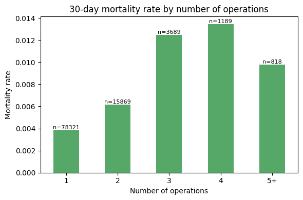

| Operations | Mortality | Patients |
|---|---|---|
| 1 | 0.4% | 78,321 |
| 2 | 0.6% | 15,869 |
| 3 | 1.2% | 3,689 |
| 4 | 1.3% | 1,189 |
| 5+ | 1.0% | 818 (likely a small-sample dip, not a real reversal) |

**Mortality rises steadily with operation count — multi-op patients are a real, higher-risk
subgroup**, not statistical noise to filter out.

### The full-dataset, unbinned view — every operation count from 1 to 30

The table above bins everything above 4 into "5+." The real per-count breakdown is far
more granular, and shows a real spike worth flagging directly:


Mortality climbs through counts 1–5 (0.4% → ~1.4%), dips at 6 (n=182, ~0.5%), stays low
through 7–8 (n=76, n=49), then **spikes sharply at 9 operations (n=32, ~3.1% mortality)**
— more than double the rate at any lower count — before the remaining counts (10 through
30) become too sparse (n=1 to n=17 each) to read reliably.

**Question for the clinician:** is the mortality spike at exactly 9 operations (n=32,
~3.1%) a real clinical signal — e.g. a specific repeat-surgery pathway (recurrent
complications, staged revisions) that tends to cluster around that many procedures — or is
32 patients too small a group to trust, and should operation count be **binned** (e.g.
1 / 2 / 3 / 4 / 5+) rather than used as a raw continuous feature once the tail gets this
sparse?

### Which operation should anchor the 30-day death label — first or last?

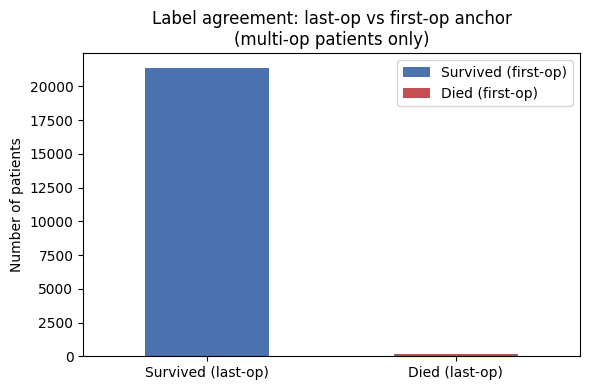

Of 21,565 multi-op patients, only **111** get a different death label depending on which
operation is used as the anchor. The disagreement only ever runs one direction (last-op
says "died," first-op says "survived") — mathematically guaranteed, since a patient's last
operation always comes after their first.

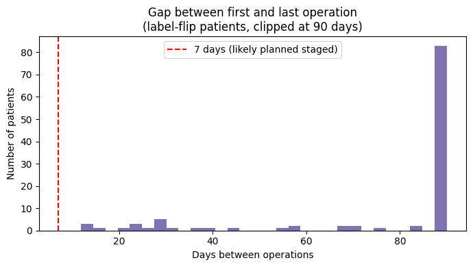

For those 111 patients: **median gap = 11 months** between first and last operation (mean
700 days, up to ~8 years). These are **not staged/planned procedures** — they're patients
with an old, unrelated earlier surgery who came back much later for a separate operation,
and died shortly after *that* one.

**Conclusion: last-operation is the correct anchor. 469 is the settled death count.**
Using first-operation would wrongly exclude 111 real deaths just because an old, unrelated
surgery fell outside the 30-day window.

### Should multi-op patients be excluded to "simplify" the cohort? No — this was tested directly.

| Option (Path C) | Argument for | Risk |
|---|---|---|
| Label from last operation (current, adopted) | Matches "did this specific operation kill the patient" | Ignores earlier ops entirely as separate risk events |
| Label from first operation | Captures the full surgical journey | Wrong reference point for a late, major, unrelated surgery |
| Exclude multi-op patients entirely | Cleanest label | **Selection bias** — multi-op patients are a systematically sicker subgroup (0.8% vs. 0.4% mortality); dropping them biases the model toward easier, healthier cases |

**Recommendation on file: keep all multi-op patients, anchor on the last operation, and
add operation count itself as a model feature** — dropping them would both throw away real
data and bias the cohort.

### The "1-year / 6-month window" question, addressed directly

There is a real, separate 6-month window already built into the dataset itself, described
in the dataset's own documentation (`README.md`, sourced from the INSPIRE *Nature Scientific
Data* paper): diagnoses, vitals, labs, and medications are captured from **6 months before**
"time zero" to the discharge after the **last** operation (medications extend to 6 months
after the last discharge). This 6-month window is a **data-collection boundary set by the
original dataset creators**, not a modeling choice this project makes — worth being
precise that "1-year surgery only" isn't a current filter in this pipeline; the closest
real analog is this pre-existing 6-month lookback baked into how the raw tables were
built.

**Still open for clinicians:**
- Does this match clinical intuition — that a much-earlier, unrelated operation shouldn't
  be the reference point for a death following a later, separate surgery?
- Is there a subgroup (e.g. genuinely staged procedures with short gaps) where
  first-operation would still be the clinically correct reference, even though it's rare
  in this cohort?

---

## 7. Does clustering of surgeries in a short window carry its own risk signal?

**Question, clearly framed:** Separately from *which* operation to anchor the mortality
label on, does having **multiple surgeries within a short time span** (e.g. within
30/60/90 days of each other) itself function as a risk marker — a sign of a deteriorating
patient — independent of the raw operation count?

**Status: 🔧 OPEN / NOT YET TESTED — a genuine gap, flagged in three separate places in the existing docs, never actually run.**

### What's already known that's adjacent to this question

The gap-between-operations analysis above was built to explain *why* the first-op/last-op
label disagreement only runs one direction — it found the 111 disagreeing patients have a
**median 11-month gap**, meaning those specific cases are *not* short-window clustering.
That analysis answered a different question (label-anchor choice) and, as a byproduct,
showed those particular flip-patients aren't the short-window pattern this question is
actually asking about.

**What hasn't been built yet:** a direct test of whether patients with, say, 2+ operations
within a 30/60/90-day window have a *different* (likely higher) mortality rate than
patients with the same operation count spread out over months or years. The existing
operation-count-vs-mortality chart (Section 6) treats every multi-op patient the same
regardless of spacing — it cannot currently distinguish "3 operations in 10 days"
(a plausibly very sick, rapidly deteriorating patient) from "3 operations over 6 years"
(likely three unrelated, low-risk events).

### What this analysis would need to compute

1. For every multi-op patient, the **time gap between each consecutive pair of
   operations** (already computable — the operation_gap analysis proves the underlying
   timestamps exist and are usable).
2. A **windowed clustering flag** — e.g. "had 2+ operations within 30 days,"
   "within 90 days" — as a new binary or count feature, separate from total operation
   count.
3. A mortality comparison: windowed-cluster patients vs. same-operation-count patients
   without short-window clustering, to see if the clustering itself adds signal beyond
   what raw operation count already captures.

**This is explicitly called out as an open follow-up in `Clinician_Questions.md`
(Section 2, questions 4–6) and in the roadmap task list — it has not been run.**

**Still open for clinicians:**
- Does clustering of surgeries in a short window clinically signal a deteriorating
  patient, separate from the raw operation count?
- What window(s) would the clinical team consider clinically meaningful to test — 30
  days, 60, 90, something condition-specific?

---

## 8. Pre-op, peri-op, and post-op — which window(s) to build for

**Question, clearly framed:** Should the model be built as a pre-operative-only tool, one
that also uses intra-operative vitals, one that also watches early post-operative data, or
should all three be built and compared as genuinely different products?
### The three windows, mapped onto real fields that already exist in every patient record

```
[admission_time=0] ... [orin_time] —— surgery —— [orout_time] ... [discharge_time]
        ↑ pre-op window                              ↑ post-op window
                        ↑ intra-op window (orin_time to orout_time)
```

- **Pre-operative** (the only window the current pipeline reads — 5 days before
  `orin_time`): captures the patient's *baseline* state — chronic disease, nutritional
  status, kidney/liver function, how sick they already were walking in. This is what ASA,
  POSSUM, and NELA are all fundamentally trying to summarize in one number.
- **Intra-operative** (72-parameter `vitals` table, currently entirely unused): captures
  the *acute physiological stress response* to surgery and anaesthesia itself — blood
  loss, blood-pressure instability, anaesthesia duration, whether oxygenation held up. Two
  patients with identical pre-op labs can have very different intra-operative courses.
- **Post-operative**: captures whether the patient is *recovering or deteriorating* — ICU
  length of stay, whether CRRT/ECMO/IABP got started, trending labs after surgery.

### Why vitals really are more reliable intra-operatively (not just an assumption)

Two concrete findings from the feature audit explain this directly: `spo2` coverage drops
from 93% "anywhere in the record" to 40% "in the pre-op window" specifically, and `uo`
(urine output) drops from 63% "anywhere" to **0% pre-op** — both because monitors and
catheters typically go on once a patient is already in the OR or ICU, not beforehand. This
is a real, data-grounded reason intra-op data is denser and more reliable than pre-op data
for these specific parameters, not a general assumption.

### Three genuinely different products, not three versions of one model

| Option (Path B) | What it produces | Use case |
|---|---|---|
| Pre-op only (current) | Decision-support tool | "Should we operate? Should ICU be booked in advance?" |
| + intra-operative vitals | Real-time monitoring tool | "Should the surgical team escalate mid-case?" |
| + early post-operative | Early-warning / rescue tool | "Flag this patient before a formal deterioration event" |

**Recommendation on file:** because this dataset unusually has all three windows
available for the same patients, the plan is to train and report all three rather than
picking one and treating it as final — a pre-op-only model, a pre-op+intra-op model, and a
pre-op+intra-op+early-post-op model — and see where the AUROC gain plateaus, framing the
result as three distinct clinical products rather than "more data = better."

**Still open for clinicians:**
- Which of the three is the most clinically useful starting point, given how the tool
  would actually be used day to day?
- If intra-operative vitals are eventually added: are there specific intra-op events
  (a hypotensive episode, a specific arrhythmia, blood-loss volume) the clinical team
  already treats as strong informal predictors of poor outcome, that should be explicitly
  represented rather than left for the model to discover on its own?

---

## 9. Concept Bottleneck — naming intermediate clinical concepts

**Question, clearly framed:** instead of predicting mortality directly from raw
labs/vitals, should the model first predict **named, clinically-recognized intermediate
concepts** (e.g. AKI stage, haemodynamic instability, respiratory failure stage), and
predict mortality *from those* — trading a black-box jump straight to a risk number for a
chain of interpretable clinical judgments the model has to justify along the way?

**Status: 🔧 OPEN — a design plan exists (Section 4.4 of the architecture roadmap), no
concept-staging definitions have been agreed yet, and nothing has been built.**

### Why this is being proposed at all

This is listed as the project's **stated main interpretability aim**, not a side feature —
the goal is a model that can say "this patient's renal trajectory looks like stage 2 AKI,
which is driving the risk score up," rather than only a single opaque probability. It's the
natural next layer on top of the system-separated encoders in Section 11 below: once a
`renal_embedding` exists, a small classifier head on top of it can be trained to predict
"AKI stage" specifically, using a recognized clinical staging system as ground truth,
*before* that embedding also contributes to the final mortality prediction.

### What's blocking it — clinical staging definitions, not data or code

This is a rare case where the blocker is genuinely a **clinical judgment call**, not a
data-availability question (unlike most of Sections 1–8, which had real numbers to check
against). Three example concepts were proposed as a starting set:

| Concept | Candidate staging standard | Status |
|---|---|---|
| AKI (acute kidney injury) stage | KDIGO criteria | Not yet confirmed as the right standard for this population |
| Haemodynamic instability | No standard proposed yet | Fully open |
| Respiratory failure stage | No standard proposed yet | Fully open |

**Still open for clinicians (original Questions 19–20):**
- For each of the three example concepts above, what would the clinical team consider the
  correct **staging definition and thresholds** to use as ground truth — e.g. is KDIGO the
  right standard for AKI stage in *this* surgical population specifically?
- Are there other named clinical concepts, beyond these three, that the team would
  consider essential intermediate steps in reasoning about a surgical patient's
  trajectory toward death, that a concept head should be built for?

---

## 10. Departments and case mix

**Question, clearly framed:** should the model be trained as **one model across every
department**, or does it make more clinical sense to build **department-specific models**
(e.g. cardiothoracic surgery vs. general surgery), given how different the baseline risk
and relevant physiology are across departments?

### What's already known

Mortality varies substantially by department — this shows up repeatedly elsewhere in this
page as a confound to control for (it's exactly why the 15-feature significance screen in
`Base_Comparitive_Study_Models.md` re-checked every feature *after* adjusting for
department, not just on raw correlation). Reassuringly, several features (albumin,
platelets) stayed predictive even after that department adjustment — real physiological
signal, not just "which department is this patient in." But department itself still
carries a large share of the raw signal on its own, and department-level sample sizes were
too small in the early 30-patient audit to say anything definitive (1–6 patients per
department at that scale — see `feature_audit_findings.md` §4). This needs to be
revisited now that the full 99,886-patient cohort is available.

### The real tension this question is pointing at

- **One model, all departments:** more training data per parameter, simpler to maintain
  and deploy, but risks blurring genuinely different physiology (a cardiothoracic
  patient's "normal" heart rate range and risk profile isn't a general-surgery patient's).
- **Department-specific models:** matches clinical intuition that different surgical
  specialties carry different baseline risk and different relevant physiology, but splits
  the 469 total deaths across departments — some departments may not have enough deaths to
  train or validate a model reliably at all.

**Still open for clinicians (original Question 21):** does the clinical team think
department-specific models would be more clinically meaningful given how different the
baseline risk and relevant physiology are across departments, or does one unified model
(with department as an input feature, capturing the effect without fragmenting the
training data) better match how the tool would actually be used?

---

## 11. System-level breakdown — every parameter, per organ system, as a flowchart

This section answers the "mapping of everything" ask directly: every one of the 126
parameters, broken out **per subsystem**, shown as its own flowchart of what feeds each
system's encoder. Parameters flagged in Section 5 (labs → organ systems mapping check) as
many-to-many are marked with `⇄` and called out explicitly rather than silently assigned
to one box.

### 11.1 Renal system

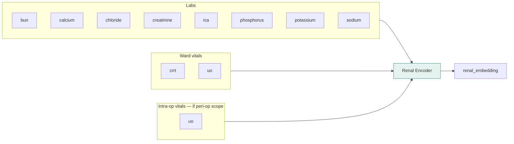

### 11.2 Cardiovascular system

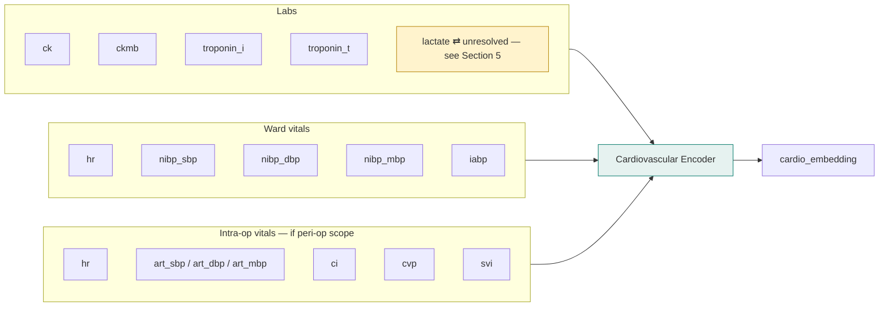

### 11.3 Respiratory system

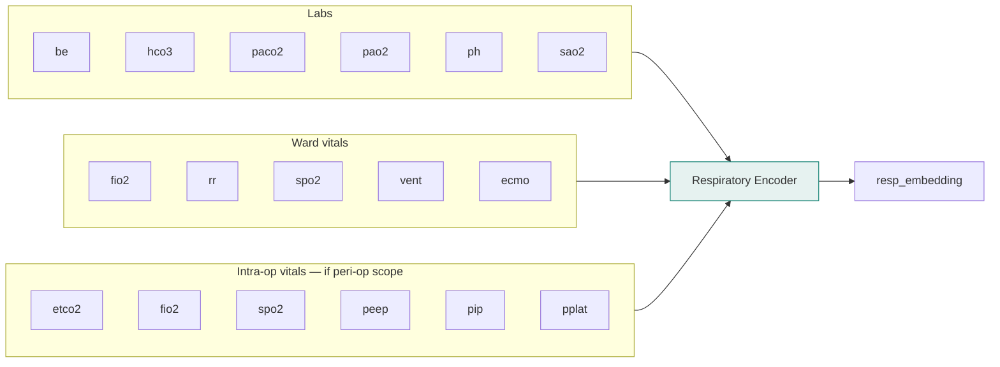

### 11.4 Metabolic / hepatic system

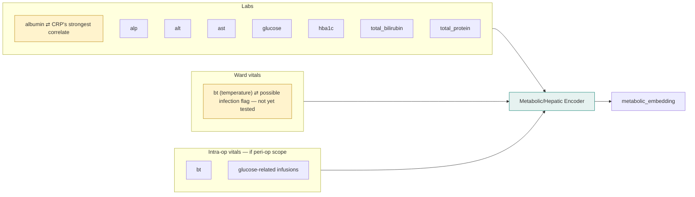

### 11.5 Haematology / coagulation system

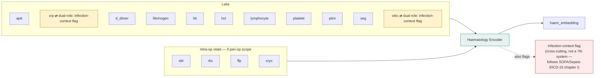

### 11.6 Neurological system

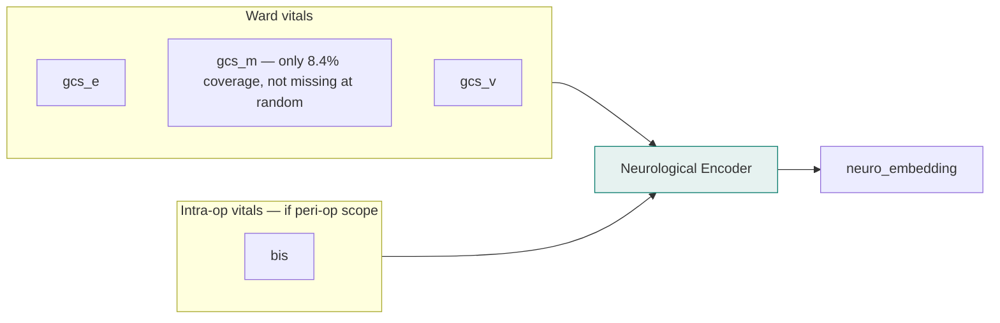

### 11.7 Non-time-series inputs — diagnoses, medications, static facts

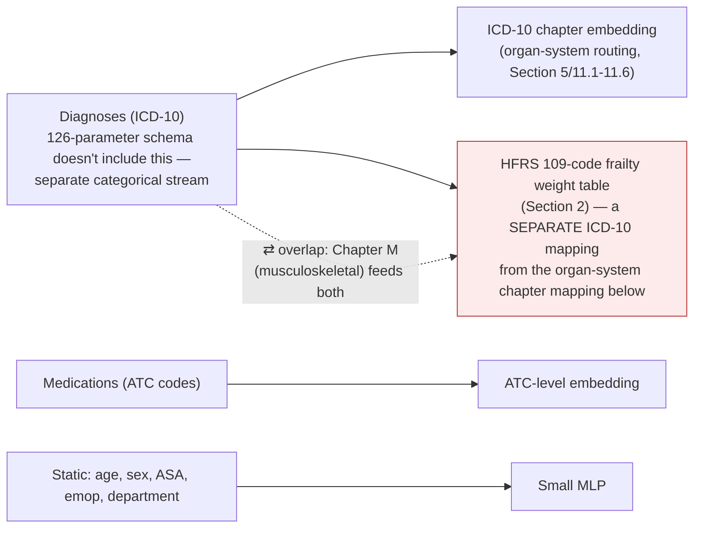

### 11.8 Full picture — all systems feeding the fusion layer

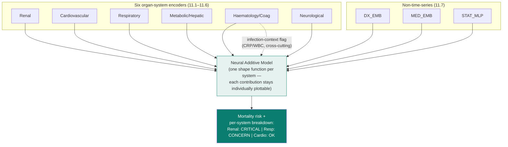

**Reading the `⇄` markers across all the diagrams above:** every parameter marked this way
is a place where the *current* one-system-per-parameter architecture is a simplification —
Section 5's clustering check found real evidence these specific parameters carry signal
relevant to more than one system. They're kept in their primary system for now (with
CRP/WBC's infection role handled as an explicit cross-cutting flag rather than a
duplicate assignment), but each one is an open item for clinical sign-off, not a settled
design choice.

---

## 12. Appendix — all 21 original clinician questions, cross-referenced

Every numbered question from `Clinician_Questions.md`, verbatim in substance, with where
it's addressed on this page and its status. Nothing from the original list is dropped —
this is the completeness check for the clinical team, so they can work straight down one
list rather than hunting across files.

### Mortality label (Clinician_Questions.md §1) — ✅ resolved, optional context only

| # | Question | Addressed in | Status |
|---|---|---|---|
| 1 | Is 30-day all-cause mortality the right target, or should it be narrowed to surgery-related deaths specifically? | Not directly re-litigated on this page — carried over as still-open framing from the source doc | 🔧 Open, optional |
| 2 | Should the 473 "died after 30 days" patients be their own labeled cohort instead of folded into "survived"? | Section 6 (label settled at 469; this specific relabeling question not re-tested here) | 🔧 Open, optional |
| 3 | **[MUST ASK]** Is 30 days the right window at all, vs. 90-day or in-hospital-only? | Section 6 | 🔧 Open, flagged as a must-ask in the source doc |

### Multiple operations (Clinician_Questions.md §2) — ✅ resolved, optional context + two genuinely open follow-ups

| # | Question | Addressed in | Status |
|---|---|---|---|
| 4 | Does last-operation anchoring match clinical intuition — that an old, unrelated earlier operation shouldn't be the reference point for a death following a later, separate surgery? | Section 6 | 🔧 Open, optional |
| 5 | Is there a subgroup (e.g. genuinely staged procedures with short gaps) where first-operation would still be the clinically correct reference? | Section 6 | 🔧 Open, optional |
| 6 | Should patients with multiple operations within a short window (30/60/90 days) be flagged as a distinct risk marker, separate from raw operation count? | Section 7 | 🔧 Open, not yet tested |

### ASA / POSSUM / NELA (Clinician_Questions.md §3)

| # | Question | Addressed in | Status |
|---|---|---|---|
| 7 | Given ASA already captures so much signal alone, does the team see value in POSSUM/NELA as additional model *inputs*, or only as *comparison baselines*? | Section 3 | 🔶 Sign-off needed |
| 8 | Is there a circularity concern with ASA — should it be excluded from model inputs even though it's a strong predictor? | Section 3 | 🔶 Sign-off needed |
| 9 | GCS is missing for over 90% of patients — is that expected (most patients are lucid), or a data-capture gap worth investigating? | Section 3 | 🔶 Sign-off needed |
| 10 | For NELA terms we can't compute directly (malignancy stage, indication for surgery) — are ICD-10 codes a clinically acceptable way to derive these, and can the team confirm the correct code ranges? | Section 3 | 🔶 Sign-off needed |
| 11 | Is an admittedly-incomplete "NELA-partial" score (missing GCS/malignancy/indication) still clinically useful as a model input, or does it need to be complete to mean anything? | Section 3 | 🔶 Sign-off needed |

### Frailty / HFRS (Clinician_Questions.md §4)

| # | Question | Addressed in | Status |
|---|---|---|---|
| 12 | Does the corrected split (4.08% high vs. ~1% low/intermediate) match clinical expectation better than the original buggy numbers (1.96% vs. 1.80%)? | Section 1 | 🔶 Sign-off needed |
| 13 | Is chronological age at time of surgery, on its own, expected to be a stronger or weaker predictor than HFRS in this population? | Section 1 | 🔶 Sign-off needed |
| 14 | **[NEW]** Given HFRS only ever applies to ~15% of this surgical cohort (age 75+), is it worth the model complexity, or would a simpler age-based frailty proxy cover most of the same ground? | Section 1 | 🔶 Sign-off needed |

### Organ-system feature grouping (Clinician_Questions.md §5)

| # | Question | Addressed in | Status |
|---|---|---|---|
| 15 | Should infection/inflammation be its own 7th organ-system category, and if so, which labs/vitals should count as core markers? | Section 5 | 🔶 Sign-off needed — proposed answer on file: no, follow SOFA/Sepsis-3 |
| 16 | Are there parameters the clinical team would place in a different system than currently assigned (e.g. lactate under metabolic vs. cardiovascular)? | Section 5 | 🔶 Sign-off needed — proposed answer on file: lactate moved to cardiovascular, but genuinely unresolved by the data |

### Scope: pre-op, peri-op, or post-op (Clinician_Questions.md §6)

| # | Question | Addressed in | Status |
|---|---|---|---|
| 17 | Which of the three scope options (pre-op-only / +intra-op / +early post-op) is the most clinically useful starting point, given how the tool would actually be used day to day? | Section 8 | 🔶 Sign-off needed |
| 18 | If intra-operative vitals are eventually added — are there specific intra-op events (hypotensive episode, arrhythmia, blood-loss volume) the team already treats as strong informal predictors of poor outcome, that should be explicitly represented? | Section 8 | 🔶 Sign-off needed |

### Concept Bottleneck (Clinician_Questions.md §7)

| # | Question | Addressed in | Status |
|---|---|---|---|
| 19 | For each of AKI stage / haemodynamic instability / respiratory failure stage — what staging definition and thresholds should be used as ground truth (e.g. is KDIGO right for AKI in this population)? | Section 9 | 🔧 Open |
| 20 | Are there other named clinical concepts, beyond these three, essential to reasoning about a surgical patient's trajectory toward death, that a concept head should be built for? | Section 9 | 🔧 Open |

### Departments and case mix (Clinician_Questions.md §8)

| # | Question | Addressed in | Status |
|---|---|---|---|
| 21 | Should the model be one model across all departments, or would department-specific models be more clinically meaningful given differing baseline risk and physiology? | Section 10 | 🔶 Sign-off needed |

---

## Source documents this page consolidates

| Topic | Original file |
|---|---|
| Full clinician-facing question list | `Clinician_Questions.md` |
| ASA/POSSUM/NELA math, references, field audit | `ASA_POSSUM_NELA_Theory_and_Validation.md` |
| ICD-10 chapter mapping, embedding-methods literature | `ICD10_Architecture_Research.md` |
| Full-cohort findings (label, multi-op, ASA, HFRS, organ-system clustering) | `INSPIRE_Complete_Findings_Summary.md` |
| Feature/parameter coverage audit | `feature_audit_findings.md` |
| Pre-op/peri-op/post-op windows, product framing | `Research_Aim.md` §2.6 |
| System-separated architecture, base mermaid pipeline | `roadmap_and_architecture.md` §4 |
| Plain-language full-run results (ASA staircase, HFRS, multi-op) | `Base_Comparitive_Study_Models.md` |
| HFRS 109-code weight table and eligibility logic | `src/frailty_hfrs.py`, `src/subject.py` (`compute_hfrs`) |