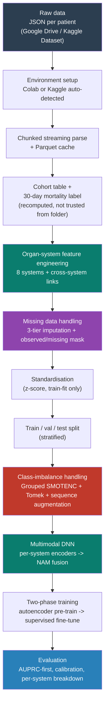
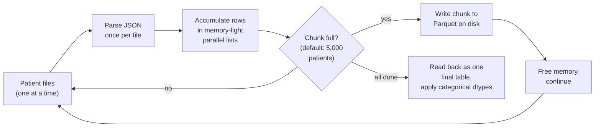
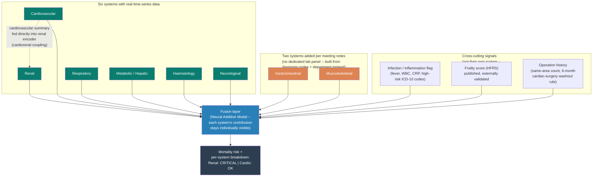

# INSPIRE Multimodal Mortality Prediction — Baseline Pipeline Summary

**Status:** Pipeline fully built and tested end-to-end on a development subset (zero errors). Currently being run on the full ~99,886-patient cohort — no trained-model results yet, this document covers the pipeline itself.

**Goal:** Predict 30-day post-surgical mortality from the INSPIRE dataset using a deep learning model that reads clinical time series organ-system by organ-system, so a prediction can be explained ("kidneys critical, heart okay") rather than reported as one opaque number.

---

## 1. End-to-end pipeline at a glance

---

## 2. Environment setup — Colab and Kaggle, both supported

The same notebook runs on either platform without editing — the environment is auto-detected and every path decision follows from it.

| Step | What happens |
|---|---|
| **Environment detection** | Checks for `google.colab` (Colab) vs. `/kaggle/input` (Kaggle) vs. neither (local) |
| **Colab bootstrap** | Mounts Google Drive, clones the repo, extracts the data zip **locally** (not to Drive — writing many small files to Drive is slow; local disk is fast) |
| **Kaggle path** | Auto-searches `/kaggle/input` for a folder containing `died/`/`survived/` subfolders — depth-capped and stops at first match, so it can't hang scanning a large dataset |
| **Checkpointing** | Model training state saved every N epochs to a persistent location (Drive on Colab), so a session disconnect doesn't lose progress — training auto-resumes from the last checkpoint |
| **Parsed-data caching** | The expensive JSON-parsing step (below) is cached to Parquet after the first run — every later run loads in seconds instead of re-parsing |

**Known platform gotcha, already worked through:** both Drive and Kaggle datasets are slow when the data is many small files (thousands of individual JSONs) rather than one zip — the fix in both cases is to keep the data as a single zip and extract it once to local/working disk, not to the cloud-mounted storage.

---

## 3. Data loading — chunked streaming parse

**The problem this solves:** at ~99,886 patients, naively parsing everything into memory before processing it can both run out of memory and take a very long time.

**Technique used: chunked streaming parse with incremental disk writes**

- Every patient file is opened and parsed **exactly once**, not re-scanned once per table (labs, vitals, medications, etc. are all extracted from the same single pass).
- Rows accumulate in **parallel column-lists**, not one Python dictionary object per row — measured ~6x lighter in memory for the same data.
- Every 5,000 patients (configurable), the accumulated chunk is written to disk and memory is freed — so peak memory depends on **chunk size**, not total cohort size.
- Column dtypes are locked explicitly and consistently across every chunk (nullable integer/string types) so chunks can never disagree on schema partway through a long run.
- Result is cached as Parquet — a second run of the same configuration loads in seconds.

---

## 4. Missing data handling

Most lab/vital values are missing most of the time — no patient gets every test every hour. Three techniques, chosen per type of measurement:

| Technique | Used for | How it works |
|---|---|---|
| **Interpolation with fade-to-average** | Fast-changing vitals (heart rate, blood pressure) | Straight line between real observed points; the further from any real data, the more the estimate fades toward the population average |
| **Forward-fill (carry last value forward)** | Slow-changing labs (creatinine, albumin) | Repeats the last known reading until a new one appears |
| **Population-average fill** | Anything with zero data for that patient | Falls back to the training-set average — the only option when there's nothing to interpolate from |

**A technique applied on top of all three, always:** every value is paired with an **observed/missing mask** — a second feature recording whether that number is real or filled in. This matters because *absence of a test* can itself be a clinical signal (a clinician who thinks a patient looks fine may simply not order a discretionary test) — the model gets to use that signal, not just a guessed number.

All statistics used for filling (medians, population averages) are computed from the **training split only**, never validation/test, to avoid leaking information across the split.

---

## 5. Organ-system architecture

**Core idea:** instead of one flat model reading every measurement mixed together, each physiological system gets its own encoder — so a prediction can be explained system-by-system, not just reported as one number.

**Meeting-note items and where they live in this architecture:**

| Item | Implementation |
|---|---|
| Add Gastrointestinal system | ICD-10 diagnosis chapter (digestive system) + surgical department — no dedicated lab exists for this in the dataset, confirmed directly against the data before building it this way |
| Add Musculoskeletal system | Same approach: ICD-10 chapter (musculoskeletal) + orthopaedic department |
| Renal ↔ Cardiovascular coupling | Two mechanisms: (1) the renal encoder receives a cardiovascular summary (heart rate, blood pressure) as direct input; (2) a hand-crafted interaction feature (creatinine × blood-pressure deviation) |
| Operations in the same area matter | Feature: count of prior operations in the same department + days since the most recent one |
| 6-month cardiac-surgery exception | Implemented as a **rule**, not a learned pattern — deliberately, since a clinical protocol doesn't need "discovering" from data, and a rule is directly checkable |
| ICD-10 code usage | Three uses: chapter membership (GI/MSK flags), a validated frailty score (HFRS, 109 published codes), and department/procedure context |

---

## 6. Class imbalance — deaths are rare (roughly 1 in 200 patients)

**Techniques used, combined rather than any single one alone:**

| Technique | What it does |
|---|---|
| **Grouped SMOTENC** | Creates realistic synthetic "died" examples by blending real ones — but only ever blends patients who are already clinically similar (same department, similar severity score), never across unrelated patient types |
| **Tomek-link cleanup** | After creating synthetic examples, removes any real "survived" patient that's confusingly close to a new synthetic one, sharpening the decision boundary |
| **Sequence augmentation** | For real minority (died) patients specifically: small realistic perturbations (noise, brief masked time windows) create a few extra training variants without inventing fake patients |
| **Class-weighted loss** | The model is told to weight death cases more heavily during training — combined with the above, not used alone |
| **Conservative synthesis ratio** | Targets a moderate rebalancing (roughly 1:10), not a full artificial 50/50 split, since over-synthesizing from a small number of real cases just recombines the same handful of examples repeatedly without adding real information |

---

## 7. The model itself

- **Per-system encoders**: each organ system's time series is read by its own small transformer (the same technology behind large language models, scaled down), producing a compact summary of that system's status.
- **Static branch**: a small network reads everything that isn't a time series — age, ASA score, department, ICD-10 flags, frailty score, operation history.
- **Fusion**: a Neural Additive Model combines every system's summary into one prediction, while keeping each system's individual contribution readable — this is what makes "renal pushed risk up, cardiovascular was neutral" a real, inspectable fact about the prediction, not a story added afterward.

**Training happens in two phases:**
1. **Pre-training** — every system's encoder first learns to reconstruct its own data, without using the death label at all, so it learns from the *entire* patient pool (not just the small number of death cases).
2. **Fine-tuning** — the whole network is then trained specifically to predict mortality, building on what it already learned.

---

## 8. Evaluation approach

- **Primary metric: AUPRC** (precision-recall), not plain accuracy or even AUROC — at roughly 0.5% true mortality rate, accuracy-style metrics can look deceptively good while being clinically useless.
- **Calibration checked separately** — whether a predicted "30% risk" actually corresponds to a 30% real-world rate, not just whether the model ranks patients correctly.
- **Decision threshold chosen from the data**, not left at an arbitrary 50%, which is meaningless at this prevalence.
- **Per-system breakdown available for any individual patient prediction**, directly from the model's own fusion layer.

---

## 9. Summary — techniques used, one line each

| Area | Technique |
|---|---|
| Environment | Auto-detected Colab/Kaggle setup, session-surviving checkpoints, parsed-data caching |
| Data loading | Chunked streaming parse, single pass per file, Parquet caching |
| Missing data | Interpolation (fast vitals) / forward-fill (slow labs) / population-average (no data) + observed/missing mask |
| Feature scaling | Z-score standardisation, fit on training data only |
| Architecture | 8 organ systems (6 with real time series, 2 diagnosis-driven), cardiorenal coupling, cross-cutting infection/frailty/operation-history signals |
| Class imbalance | Clinically-grouped synthetic oversampling (SMOTENC) + boundary cleanup (Tomek) + sequence augmentation + class-weighted loss |
| Model | Per-system transformer encoders + Neural Additive Model fusion (interpretable by design) |
| Training | Two-phase: unsupervised pre-training, then supervised fine-tuning |
| Evaluation | AUPRC-first, calibration, data-driven threshold, per-system explainability |

---

## 10. Current status

- Full pipeline built and verified error-free on a development subset.
- Real engineering issues found and fixed while scaling toward the full cohort: memory usage during data loading, parsing speed, and slow data-loading paths specific to each cloud platform.
- **Not yet completed:** a full training run on the complete ~99,886-patient cohort — this document describes the pipeline that is currently running, not yet its results.
