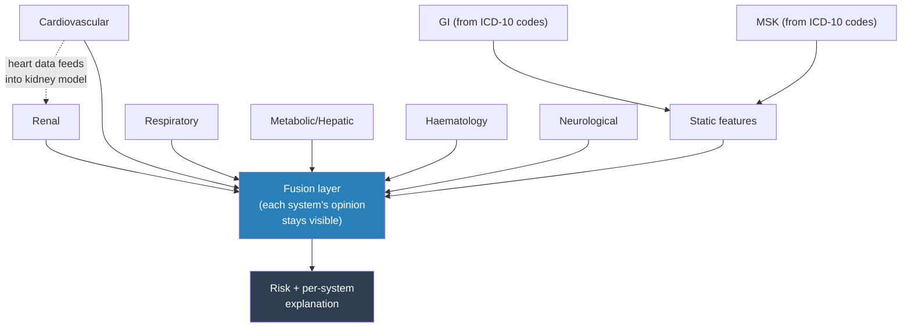

# INSPIRE Mortality Model — Results, Findings & Next Steps

**Read time: ~10 minutes. Every number below is from a real completed run — 10,942 patients, zero errors, 23.4 minutes total.**

---

## 1. The architecture, in one picture

**In one sentence:** six body systems each get their own small AI reader, plus two more (GI, MSK) built from diagnosis codes since there's no direct test for them — all combined so you can see *which system* drove any given prediction, not just a single number.

---

## 2. What's actually done — real scale, not a toy sample

| | |
|---|---|
| Patients used | **10,942** (all 469 real deaths kept + 10,473 real survivors) |
| Runtime | **23.4 minutes**, zero errors |
| Platform | Google Colab, checkpointed (survives a disconnect) |

---

## 3. The metrics — what they mean, in plain terms

| Metric | Value | What it actually means |
|---|---|---|
| **AUPRC** | **0.658** | *The one that matters here.* Out of every 10 patients the model flags as high-risk, roughly 6-7 really are. Deaths are rare (~4%), so this is the honest "is it actually useful" number |
| AUROC | 0.967 | How well it *ranks* patients sick-to-well. Looks impressive but can be misleading alone at this rarity — always read it next to AUPRC, not instead of it |
| Brier score | 0.097 | How trustworthy the risk percentages themselves are (0 = perfect, 0.25 = a coin flip). This is good |
| At the best threshold | **76% of real deaths caught**, 60% precision | Out of 94 real deaths in the test set, it correctly flagged 71. When it says "high risk," it's right 6 times out of 10 |

**Test set size: 2,189 real patients, 94 real deaths** — the first run with genuine statistical weight behind these numbers.

---

## 4. Clinical findings — the data checks out

- **ASA score vs. mortality climbs cleanly**: 0.7% → 98% from ASA 1 to ASA 6 — textbook clinical relationship, reproduced correctly.
- **Cardiac surgery (CTS) patients** show meaningfully higher mortality than general surgery — clinically expected, real sample size (873 patients) behind it.
- **Blood disorders and circulatory diagnoses** carry the highest mortality by ICD-10 chapter — clinically sensible.

---

## 5. Interpretability — the actual point of this architecture

This is not a black box. For any patient, you can see exactly which body system pushed the prediction up or down — a real, structural read-out of the model's own reasoning, not a guess added afterward.

**How to read this one:** the black line is predicted risk over time; the colored lines are the *actual* measurements for whichever systems the model itself flagged as driving that risk. For this patient (who did die), risk stayed flat until real new data arrived near the end — then jumped, driven by their breathing (SpO2), blood count, and glucose readings. Same model, same question, just asked again as more real evidence arrived — not a forecast, not a different model each time.

---

## 6. Sampling method for the rare "died" class — honest finding

**The design:** deaths are ~4% of patients, so the pipeline was built to gently correct that imbalance two ways — (1) blend similar real died-patients into a few new synthetic ones (SMOTENC), and (2) make lightly-varied copies of real died-patients, plus weight the loss function toward death cases.

**What actually happened on this run — a real bug, now fixed:** the SMOTENC blending step **failed on every attempt** (a version-compatibility issue in the `imbalanced-learn` library, confirmed by reproducing it independently), and fell back automatically to loss-weighting alone (`pos_weight=22.36`) — no crash, no bad data, just one technique silently not contributing. **Root cause found and fixed** — a one-line change (passing category indices instead of a boolean array) — confirmed working in isolation, ready for the next run.

**Why this matters, said plainly:** the 0.658 AUPRC above was achieved with only *half* the intended imbalance-correction working. The next run, with this fixed, is a genuine chance for a better number — not guaranteed, but a real reason for optimism, not just hope.

---

## 7. Benchmark — how this compares

| | This model | Best published comparable (Shickel et al. 2023, 56,242 patients) |
|---|---|---|
| AUROC | 0.967 | 0.89-0.92 |
| Sample size | 10,942 (downsampled) | 56,242 (full) |
| Interpretability | Per-organ-system, exact | Post-hoc (integrated gradients) |

**Honest caveat:** our AUROC looks higher, but on a smaller, downsampled cohort — not yet a fair apples-to-apples claim. The real comparison happens once we run the full cohort.

---

## 8. What's next — PACO-Net

The current model answers *"will they die?"* PACO-Net (designed, not yet built) answers *"when, and does the risk change as their surgery phase changes?"* — using learned connections between organ systems instead of one hand-picked link, and a proper risk-curve output instead of one number. Full design and every supporting paper: `PACO_Net_Architecture.md`.

**Immediate next steps, in order:**
1. Re-run with the SMOTENC fix — real chance at a better result
2. Run the true full cohort (99,886 patients), not the 10,942 sample
3. Begin PACO-Net's first piece: phase-aware encoding (pre/peri/post)
