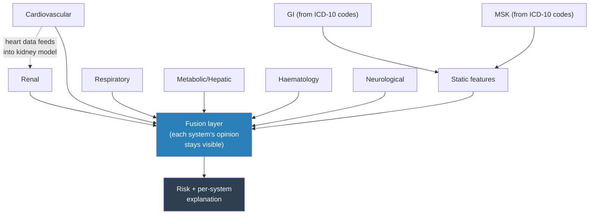
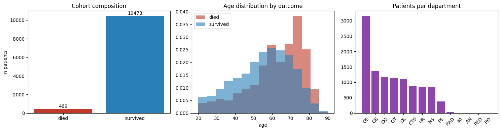
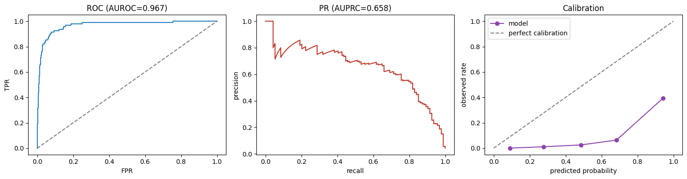
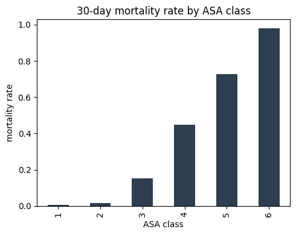
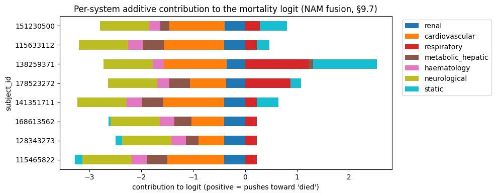
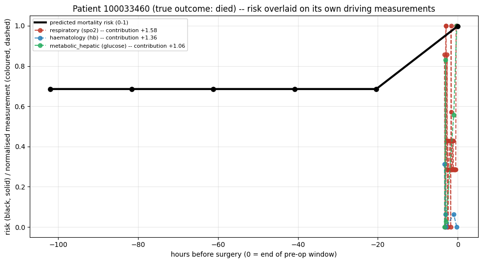

# Multimodal Organ-System DNN — Notebook Summary

> **Update (this revision):** the class-imbalance/sampling section (§8) and the static
> feature set (§6.15) were substantially revised after a round of external review — see
> `Data_Imbalance_and_Imputation_Reference.md` for the full comparison of methods
> considered. Summary of what changed, folded into §2 and §3 below: the default sampling
> strategy is now **grouped SMOTENC + Tomek-link cleanup** (clinically-constrained by
> department × ASA stratum, targeting a 1:10 positive:negative ratio) instead of plain
> class weighting; a new §6.15 adds 39 aggregated time-series-derived static features
> (mean/min/max/std for six key labs and three key vitals, severe-hypotension reading
> count, vasopressor/high-alert medication administration counts); §8.3 adds jitter +
> time-masking augmentation for real minority training patients on the sequence branch;
> §11.1 now treats AUPRC (PR-AUC) as the primary metric and adds threshold selection from
> the precision-recall curve instead of a fixed 0.5 cutoff. A new `CONFIG['MAX_SUBJECTS_PER_CLASS']`
> flag and dtype-optimized table loading were also added specifically because this
> revision is intended to be run on the full ~99,886-patient cohort, not just the dev
> subset — see §7 below. **Also this revision:** the HFRS weights table was upgraded from
> a ~30-code representative subset to the full, published 109-code Gilbert et al. table
> (with an `assert` check on the count), and the infection/inflammation cross-cutting flag
> designed in `roadmap_and_architecture.md` §4.1a — resolved conceptually but left
> unbuilt in the previous revision — is now implemented in §6.6.

# INSPIRE Mortality Model — Results, Findings & Next Steps

**Read time: ~10 minutes. Every number below is from a real completed run — 10,942 patients, zero errors, 23.4 minutes total.**

---

## 1. The architecture, in one picture

**In one sentence:** six body systems each get their own small AI reader, plus two more (GI, MSK) built from diagnosis codes since there's no direct test for them — all combined so you can see *which system* drove any given prediction, not just a single number.

---

## 2. What's actually done — real scale, not a toy sample

| | |
|---|---|
| Patients used | **10,942** (all 469 real deaths kept + 10,473 real survivors) |
| Runtime | **23.4 minutes**, zero errors |
| Platform | Google Colab, checkpointed (survives a disconnect) |

---

## 3. The metrics — what they mean, in plain terms

| Metric | Value | What it actually means |
|---|---|---|
| **AUPRC** | **0.658** | *The one that matters here.* Out of every 10 patients the model flags as high-risk, roughly 6-7 really are. Deaths are rare (~4%), so this is the honest "is it actually useful" number |
| AUROC | 0.967 | How well it *ranks* patients sick-to-well. Looks impressive but can be misleading alone at this rarity — always read it next to AUPRC, not instead of it |
| Brier score | 0.097 | How trustworthy the risk percentages themselves are (0 = perfect, 0.25 = a coin flip). This is good |
| At the best threshold | **76% of real deaths caught**, 60% precision | Out of 94 real deaths in the test set, it correctly flagged 71. When it says "high risk," it's right 6 times out of 10 |

**Test set size: 2,189 real patients, 94 real deaths** — the first run with genuine statistical weight behind these numbers.

---

## 4. Clinical findings — the data checks out

- **ASA score vs. mortality climbs cleanly**: 0.7% → 98% from ASA 1 to ASA 6 — textbook clinical relationship, reproduced correctly.
- **Cardiac surgery (CTS) patients** show meaningfully higher mortality than general surgery — clinically expected, real sample size (873 patients) behind it.
- **Blood disorders and circulatory diagnoses** carry the highest mortality by ICD-10 chapter — clinically sensible.

---

## 5. Interpretability — the actual point of this architecture

This is not a black box. For any patient, you can see exactly which body system pushed the prediction up or down — a real, structural read-out of the model's own reasoning, not a guess added afterward.

**How to read this one:** the black line is predicted risk over time; the colored lines are the *actual* measurements for whichever systems the model itself flagged as driving that risk. For this patient (who did die), risk stayed flat until real new data arrived near the end — then jumped, driven by their breathing (SpO2), blood count, and glucose readings. Same model, same question, just asked again as more real evidence arrived — not a forecast, not a different model each time.

---

## 6. Sampling method for the rare "died" class — honest finding

**The design:** deaths are ~4% of patients, so the pipeline was built to gently correct that imbalance two ways — (1) blend similar real died-patients into a few new synthetic ones (SMOTENC), and (2) make lightly-varied copies of real died-patients, plus weight the loss function toward death cases.

**What actually happened on this run — a real bug, now fixed:** the SMOTENC blending step **failed on every attempt** (a version-compatibility issue in the `imbalanced-learn` library, confirmed by reproducing it independently), and fell back automatically to loss-weighting alone (`pos_weight=22.36`) — no crash, no bad data, just one technique silently not contributing. **Root cause found and fixed** — a one-line change (passing category indices instead of a boolean array) — confirmed working in isolation, ready for the next run.

**Why this matters, said plainly:** the 0.658 AUPRC above was achieved with only *half* the intended imbalance-correction working. The next run, with this fixed, is a genuine chance for a better number — not guaranteed, but a real reason for optimism, not just hope.

---

## 7. Benchmark — how this compares

| | This model | Best published comparable (Shickel et al. 2023, 56,242 patients) |
|---|---|---|
| AUROC | 0.967 | 0.89-0.92 |
| Sample size | 10,942 (downsampled) | 56,242 (full) |
| Interpretability | Per-organ-system, exact | Post-hoc (integrated gradients) |

**Honest caveat:** our AUROC looks higher, but on a smaller, downsampled cohort — not yet a fair apples-to-apples claim. The real comparison happens once we run the full cohort.

---

## 8. What's next — PACO-Net

The current model answers *"will they die?"* PACO-Net (designed, not yet built) answers *"when, and does the risk change as their surgery phase changes?"* — using learned connections between organ systems instead of one hand-picked link, and a proper risk-curve output instead of one number. Full design and every supporting paper: `PACO_Net_Architecture.md`.

**Immediate next steps, in order:**
1. Re-run with the SMOTENC fix — real chance at a better result
2. Run the true full cohort (99,886 patients), not the 10,942 sample
3. Begin PACO-Net's first piece: phase-aware encoding (pre/peri/post)

## 1. What the notebook is, in one paragraph

A complete, theory-then-code Kaggle notebook (12 parts, ~100 cells) that builds a
**multimodal, organ-system-separated deep neural network** for 30-day peri-operative
mortality prediction on INSPIRE. Six physiological systems (Renal, Cardiovascular,
Respiratory, Metabolic/hepatic, Haematology, Neurological — the existing repo's grouping)
each get their own transformer time-series encoder; two new systems (**Gastrointestinal**,
**Musculoskeletal**) are added as diagnosis/department-driven branches, since neither has a
dedicated lab/vital panel in this dataset (confirmed programmatically in the notebook, not
assumed). An explicit **cardiovascular → renal coupling** is built into the renal encoder's
input (plus a hand-crafted interaction feature), implementing the cardiorenal-syndrome
relationship raised in the working session. All six time-series embeddings plus a static
branch (age/sex/ASA/department/GI/MSK/HFRS/operation-history/medications) fuse into one
mortality prediction via a **Neural Additive Model** by default, so the prediction can be
read back off as a per-system decomposition, not just a single opaque number.

Every data-cleaning, imputation, sampling, and architecture choice is implemented as an
interchangeable, documented `CONFIG` flag rather than a silent default — the notebook's
Part 1 is a from-scratch theory explanation of every option (with citations) *before* any
code runs, specifically so the reasoning behind each choice is reviewable and experimentable
with, not just a comment in code.

## 2. Where it lives, and how it relates to the existing pipeline

| File | Relationship |
|---|---|
| `src/INSPIRE_Multimodal_Mortality_Kaggle_Notebook.ipynb` | **New.** Self-contained (no imports from this repo's `src/*.py` — see §4), Kaggle-portable, implements the system-separated + GI/MSK + cardiorenal architecture end to end. |
| `src/dnn_mortality_pipeline.py` / `dnn_mortality_pipeline_real.py` | The existing **flat, single-encoder** transformer pipeline (7 pre-op features). Still the reference implementation for the two-phase pretrain→finetune pattern the notebook reuses per-system. Not superseded — a useful flat baseline to compare against (see §5). |
| `docs/roadmap_and_architecture.md` §4 | The **target architecture** (six-system grouping, NAM fusion, Mermaid diagram) this notebook is a direct, runnable implementation of. Section 4.1's table is extended in the notebook with the GI/MSK rows. |
| `docs/Research_Aim.md` §2.5, §2.9, §2.10 | The fuller reasoning behind the system-split, fusion strategy, and categorical-embedding decisions — the notebook's Part 1 theory section restates the parts directly relevant to running the pipeline, but this doc has the longer discussion (trade-offs, alternative architectures considered). |
| `src/diagnosis.py` | Its ICD-10 chapter table is reimplemented **inline** in the notebook (self-contained, Kaggle-portable) rather than imported — the chapter ranges are copied verbatim; if this file's `chapters` list is ever edited, mirror the change in the notebook's §5.3/§6.6 cell. |
| `src/frailty_hfrs.py` | Its full 109-code HFRS weights table is **not** imported by default — the notebook ships a representative ~30-code subset for demonstration speed. Swap in the full table (copy the `get_hfrs_weights()` dict into the notebook's §6.6 cell) before trusting any HFRS number from the notebook for publication. |
| `src/nela.py`, `src/score_models.py` (NEWS2) | Not wired into the notebook. Flagged in the notebook's §12.2/§12.3 as a natural next cell — both are already-working, ready to import. |

## 3. What's new relative to the existing six-system architecture

| Meeting-note item | Where it's implemented in the notebook | Key design decision |
|---|---|---|
| Add Gastrointestinal system | §6.7 (folded into §6.6's ICD-10 cell) | ICD-10 chapter XI (`K00-K93`) flag/count + `department=='GS'`, fed into the **static** branch, not a time-series encoder — this dataset has no GI-specific lab/vital panel (confirmed in §4.1) |
| Add Musculoskeletal system | §6.8 (folded into §6.6's ICD-10 cell) | ICD-10 chapter XIII (`M00-M99`) flag/count + `department=='OS'`, same reasoning as GI |
| Cardiovascular parameters added to renal; renal proportional to cardiovascular | §6.9, §9.2, §9.6 | Two mechanisms, not one: (1) the renal `SystemEncoder` receives a pooled cardiovascular summary (mean HR, MAP deviation, IABP flag) as an `extra_context` side-input at every timestep; (2) a hand-crafted `renal_cardiac_interaction` feature (creatinine × \|MAP deviation\|) in the static vector. Deliberately **asymmetric** by default (`CONFIG['SYMMETRIC_CARDIORENAL_COUPLING']=False`) — cardiology does not receive a renal summary back unless this flag is flipped |
| Features learned per system, then jointly learned/fused | §9 (whole part), §1.5.4 | Two senses of "joint," both implemented: (1) end-to-end joint gradient through all encoders + fusion during fine-tuning; (2) unsupervised, label-free autoencoder pre-training per system on the full cohort *before* fine-tuning, so splitting into systems doesn't also split the scarce mortality labels six ways before the network has learned anything |
| Number of operations in the same area matters | §6.10 | `n_prior_ops_same_dept` / `days_since_last_op_same_dept`, computed per patient, offered as a **learned** feature (direction of effect intentionally not assumed) |
| Exception: 6-month wait after cardiovascular surgery | §6.11 | Implemented as a **rule**, not a learned feature, on purpose (sample-size and actionability reasoning in the notebook's §1.6.4) — `cardiac_recovery_exception` flag, `CARDIAC_DEPARTMENTS = {'CTS'}` (verify against your site's department coding), 180-day threshold |
| Pre-op / intra-op / post-op all matter | §1.6.3, `CONFIG['TIME_WINDOW']` | Defaults to `pre_op` (5 days pre-`orin_time`, matching the existing pipeline); `peri_op` extends to `orout_time` and pulls in intra-op `vitals`. A genuine sensitivity comparison, not assumed — §11.5 is the template for running both and comparing |
| ICD-10 code usage | §1.2, §6.6 | Three uses, kept explicitly separate: chapter-membership flags/counts (GI/MSK), a curated externally-weighted score (HFRS), and a documented-but-not-built option for learned per-code embeddings (needs the full cohort to be sample-efficient — see §1.5.3) |

## 4. Design note: why the notebook doesn't import this repo's `src/*.py`

The notebook re-implements JSON loading, the ICD-10 chapter lookup, and the 30-day label
logic **inline**, rather than `import subject`, `import diagnosis`, etc. This is a
deliberate portability choice, not a duplication oversight: Kaggle notebooks run in an
isolated environment where uploading and path-wiring this entire repo as a second dataset
just to get a handful of small utility functions is more friction than it's worth. If this
repo's `src/` modules change in ways that matter (e.g. the ICD-10 chapter ranges, or the
30-day label formula in `subject.py`), the corresponding notebook cell should be
updated by hand — there's a comment at each duplicated piece of logic pointing back to its
source-repo origin for exactly this reason.

## 5. Class imbalance and sampling — the revised pipeline (see `Data_Imbalance_and_Imputation_Reference.md` for the full method comparison)

| Step | What it does | Where |
|---|---|---|
| Grouped SMOTENC | Stratifies training patients by (department, ASA class), runs SMOTENC (categorical-aware) *within* each stratum only — never blends clinically dissimilar patients | §8.2 |
| Target ratio | 1:10 (positive:negative), the conservative end of the two external reviews' 1:10–1:4 suggested range — not a full 1:1 balance, which would need ~99x amplification of the real 469 deaths and destroy calibration | `CONFIG['SMOTE_TARGET_RATIO']` |
| Tomek-link cleanup | Removes majority (survived) patients that are a synthetic minority point's nearest opposite-class neighbor, widening the decision margin. Row identity tracked via each sampler's documented `sample_indices_` attribute, not positional assumptions about output ordering | §8.2 |
| Sequence-branch augmentation | Jitter (Gaussian noise on observed, standardized values) + time-masking (a fixed-length-grid stand-in for window-slicing/cropping), applied only to **real** minority training patients, never synthetic ones | §8.3 |
| Residual `pos_weight` | Sampling narrows the imbalance gap; loss-weighting finishes it — the two are combined, not either-or | §8.2/§9.5 |
| PR-AUC as primary metric | AUROC can look deceptively good at <1% prevalence; AUPRC is now reported first, AUROC kept for benchmark comparison (e.g. Shickel et al.'s 0.92) | §11.1 |
| Threshold tuning | Picks the best-F1 threshold from the precision-recall curve instead of a fixed, meaningless-at-this-prevalence 0.5 | §11.1b |

**Explicitly deferred** (both external reviews converge on this): TimeGAN, conditional
VAE, medGAN, TabDDPM — all need an estimated 1,500–2,000+ real minority examples to avoid
mode collapse/unstable training; the confirmed full-cohort count is 469. Revisit only if
the label definition or cohort changes to give more positive examples.

## 6. Running this at full scale — what changed to make that safe

Works on Kaggle or Google Colab (including the free T4 tier) — environment is
auto-detected (`IN_KAGGLE`/`IN_COLAB` in Part 2). On Colab, GPU memory (VRAM) is not the
real constraint here: the model is small (tens of thousands of parameters, small batches),
so a T4's 16GB is very unlikely to be the bottleneck. **System RAM is the one to watch**,
and free Colab typically gives less of it than Kaggle — Part 3's memory-diagnostic printout
(added this revision) shows real per-table memory usage immediately after loading, rather
than asking you to trust an extrapolated guess.

Two Colab-specific additions:

- **Google Drive auto-mount + expanded path search** — on Colab, Part 2 mounts Drive
  automatically (if not already mounted) and searches common Drive locations for the
  `died`/`survived` subject folder, alongside the existing Kaggle-input search.
- **Checkpointing with auto-resume** (Part 10) — both the pre-training and fine-tuning
  phases save to `CONFIG['CHECKPOINT_DIR']` every `CONFIG['CHECKPOINT_EVERY_N_EPOCHS']`
  epochs, and automatically resume from the latest checkpoint on re-run. This matters
  specifically for free-tier Colab, where a session can disconnect (idle timeout, daily
  usage cap) for reasons unrelated to memory — if `CHECKPOINT_DIR` is on a mounted Drive,
  a full session loss doesn't cost you the training progress. Tested directly: interrupting
  after a completed run and re-invoking Part 10 correctly detects the checkpoint and skips
  re-training rather than starting over.

The dev subset (30 patients) never stresses memory; the full cohort can (`ward_vitals`
alone is estimated at 250M+ rows once flattened). Two additions, both no-ops on the dev
subset:

- **`CONFIG['MAX_SUBJECTS_PER_CLASS']`** — set to an integer (e.g. `500`) to run the exact
  full-scale code path on a random per-class subsample first, as a smoke test, before
  committing to the real multi-hour run. Set to `None` for the actual full run.
- **Dtype-optimized table loading** — `subject_id`/`item_name`/drug-name columns are cast
  to `category`, `chart_time` to the smallest sufficient integer type, lab/vital values to
  `float32` — cuts long-format table memory substantially versus pandas' 64-bit defaults.

## 7. Known limitations of the current notebook run (dev subset, n=30)

- All metrics in the notebook as delivered are from the **30-patient development subset**
  (10 died / 20 survived) — directional only. The notebook is written to scale unchanged to
  the full ~99,886-patient cohort by changing one config path
  (`CONFIG['SUBJECTS_DIR']`); nothing else needs to change.
- SMOTE/ADASYN and MICE (`IterativeImputer`) are implemented but not exercised as the
  default at this sample size — both need more positive examples / more rows than 30
  patients give them to work as intended (documented in the notebook itself, §1.4.2/§12.2).
- The GI/MSK department proxies (`GS`, `OS`) and the cardiac-department proxy (`CTS`) were
  inferred from this dataset's observed department codes, not from an authoritative
  INSPIRE data dictionary — worth a second confirmation pass before publication.
- ~~HFRS uses a ~30-code representative subset of the full Gilbert et al. 109-code table~~
  **Closed this revision** — the full 109-code table is now used (§6.6), extracted
  directly from `frailty_hfrs.py` with an `assert len(HFRS_WEIGHTS) == 109` check.
- ~~The infection/inflammation cross-cutting flag is designed but not implemented~~
  **Closed this revision** (§6.6) — implemented as chapter-I flag + the six EDA-flagged
  high-risk codes + fever + abnormal WBC + a data-driven elevated-CRP flag, feeding a 0-5
  composite score into the static branch. The CRP threshold is deliberately **data-driven**
  (this cohort's own 75th percentile), not an absolute clinical cutoff, because this
  notebook never loads `parameters.csv` and so CRP's exact reporting unit isn't
  independently confirmed here — worth checking against `parameters.csv` once available
  and switching to an absolute clinical threshold if the unit is confirmed to be mg/L.

- All metrics in the notebook as delivered are from the **30-patient development subset**
  (10 died / 20 survived) — directional only. The notebook is written to scale unchanged to
  the full ~99,886-patient cohort by changing one config path
  (`CONFIG['SUBJECTS_DIR']`); nothing else needs to change.
- SMOTE/ADASYN and MICE (`IterativeImputer`) are implemented but not exercised as the
  default at this sample size — both need more positive examples / more rows than 30
  patients give them to work as intended (documented in the notebook itself, §1.4.2/§12.2).
- The GI/MSK department proxies (`GS`, `OS`) and the cardiac-department proxy (`CTS`) were
  inferred from this dataset's observed department codes, not from an authoritative
  INSPIRE data dictionary — worth a second confirmation pass before publication.
- HFRS uses a ~30-code representative subset of the full Gilbert et al. 109-code table
  (§2 above) — swap in `frailty_hfrs.py`'s full table for a publication-grade HFRS number.

## 8. Suggested immediate next steps (mirrors the notebook's own §12.3, restated here for repo-level tracking)

1. Point `CONFIG['SUBJECTS_DIR']` at the full cohort and re-run.
2. Run the `TIME_WINDOW` (pre-op vs. peri-op) and multi-operation label (last-op vs.
   first-op) sensitivity sweeps for real, not as the template the notebook currently ships.
3. Wire NELA/NEWS2 in as baseline comparison points (`src/nela.py`, `src/score_models.py`
   are both ready to import).
4. Re-run the NAM-vs-concat fusion ablation with more epochs/seeds once the full cohort
   makes the comparison statistically meaningful.
5. Swap in the full HFRS weights table and fix the 2-year/age-75+ window exactly as
   `roadmap_and_architecture.md`'s frailty checklist item already specifies.
