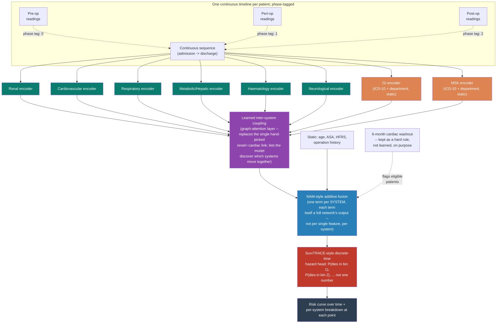

# PACO-Net: a Phase-Aware, Coupled-Organ, Interpretable Architecture

> **What this page is.** The next-generation architecture proposal that supersedes the
> current organ-system baseline described in `roadmap_and_architecture.md` §4. This page
> covers the complete end-to-end pipeline (data → prediction), the specific novelty being
> aimed for, and every paper the design decisions below are grounded in. Nothing on this
> page is built yet — this is the researched design, written up *before* implementation,
> per the working process for this project. See `roadmap_and_architecture.md` for what's
> actually running today.
>
> **Working name:** PACO-Net — **P**hase-**A**ware, **C**oupled-**O**rgan Network. Four
> real ingredients, one name; rename freely once it has results behind it.

---

## 1. One-paragraph summary

PACO-Net predicts perioperative mortality risk **as a curve over time** (not one number),
built from **organ-system-specific encoders** that read a patient's full pre-op → intra-op
→ post-op timeline at once (not three separate models bolted together), whose outputs are
combined through a **learned attention layer that discovers which organ systems move
together** (not a single hand-picked link), fused through an **additive layer that keeps
every organ system's contribution individually readable** (not a black box), producing a
prediction you can point at and say *why*, at *any point in the patient's timeline*.

---

## 2. Architecture at a glance

---

## 3. The end-to-end pipeline, step by step

Ten top-level steps. Each one expands into its own sub-steps — click to open only the ones
you need; collapsed, this section is a 10-line map of the whole pipeline.

### Step 1 — Load and parse patient records

??? note "Sub-steps"
    1. Stream-parse every patient JSON file exactly once, in chunks (not all-at-once),
       to bound peak memory regardless of cohort size.
    2. Extract six raw tables in the same pass: labs, intra-op vitals, ward vitals,
       operations, diagnoses, medications.
    3. Cache the parsed result to disk (Parquet) so re-runs load in seconds instead of
       re-parsing every JSON file again.
    4. Apply memory-efficient dtypes throughout (categorical, nullable integer/float)
       so schema stays consistent across chunks.

### Step 2 — Establish the ground-truth label

??? note "Sub-steps"
    1. Recompute 30-day mortality directly from operation timestamps — **never** trust
       the raw folder/label provenance, which conflates "died at any point" with "died
       within 30 days."
    2. Cross-check the recomputed label against the provided one and log the
       disagreement rate as a standing data-quality metric.
    3. Resolve the multi-operation question explicitly (label from last operation vs.
       first vs. exclusion) as a tracked, revisitable decision — not a silent default.

### Step 3 — Build the phase-tagged continuous timeline **(new in PACO-Net)**

??? note "Sub-steps"
    1. For each patient, construct one timeline spanning admission → discharge, not
       three separate windows.
    2. Tag every reading with a phase indicator (0 = pre-op, 1 = peri-op, 2 = post-op),
       the same pattern BERT uses for segment embeddings — one shared encoder learns to
       weigh phases differently via attention, instead of physically tripling the
       network.
    3. Extend data loading to include true post-operative recovery data (ward vitals
       after `orout_time`) — **not present in the current baseline**, a genuine gap this
       step closes.

### Step 4 — Route signals to organ systems

??? note "Sub-steps"
    1. Six systems keep their existing real time-series routing (renal, cardiovascular,
       respiratory, metabolic/hepatic, haematology, neurological) — unchanged from the
       current baseline, re-verified against the item-name inventory each run.
    2. GI and MSK stay diagnosis/department-derived (ICD-10 chapters XI and XIII, `GS`/
       `OS` departments) — confirmed programmatically, not assumed, that neither has a
       dedicated lab/vital panel in this dataset.
    3. Document the hepatic/GI lab-overlap boundary explicitly (AST/ALT/bilirubin stay
       in metabolic/hepatic, not duplicated into GI) to avoid double-counting the same
       signal under two names.

### Step 5 — Handle missing data

??? note "Sub-steps"
    1. Apply the existing three-tier rule (interpolate-and-fade for fast-changing
       vitals, forward-fill for slow-changing labs, population-average fallback) —
       unchanged, already benchmarked per-system.
    2. Keep the observed/imputed mask feature alongside every value, always — the
       mechanism that lets the model recover MNAR (missing-not-at-random) signal.
    3. Re-run the held-out masking accuracy benchmark (§7.6 of the current notebook) at
       full cohort scale, since the small-sample result likely under-represents
       regression imputation's real potential.
    4. Evaluate SAITS (self-attention imputation for time series) as a genuine upgrade
       path beyond `IterativeImputer`/MICE — better-matched to irregular, sparse,
       multivariate clinical data per the benchmarking literature (§5 below).

### Step 6 — Standardise and split

??? note "Sub-steps"
    1. Z-score standardise every continuous feature, fit on the training split only.
    2. Stratified train/validation/test split, preserving true label prevalence in
       every fold.
    3. Validation and test folds stay 100% real data — the class-imbalance handling in
       Step 7 never touches them.

### Step 7 — Handle class imbalance

??? note "Sub-steps"
    1. Grouped SMOTENC (synthetic patients blended only within clinically similar
       strata — same department, similar ASA) for the static-feature branch.
    2. Tomek-link cleanup after synthesis, to sharpen the decision boundary.
    3. Jitter + time-masking augmentation for real minority (died) patients on the
       sequence branch — real data, lightly perturbed, not invented.
    4. Residual class weighting in the loss function, combined with (not instead of)
       the above.
    5. Target ratio capped conservatively (~1:10), not full 1:1 balance — informed by
       the literature's caution against over-amplifying a small real minority class.

### Step 8 — Encode each organ system

??? note "Sub-steps"
    1. One transformer encoder per organ system (six real, two diagnosis-derived),
       reading the **whole phase-tagged timeline** from Step 3, not a fixed pre-op-only
       window.
    2. Mask-aware input: value and observed/imputed mask concatenated per feature,
       carried into the encoder itself.
    3. Two-phase training per encoder: unsupervised autoencoder pre-training on the
       full unlabelled cohort first (so splitting into systems doesn't also split the
       scarce mortality labels six-plus ways before any branch has learned anything),
       then supervised fine-tuning.

### Step 9 — Couple systems and fuse **(new in PACO-Net)**

??? note "Sub-steps"
    1. Replace the single hand-picked renal←cardiovascular link with a small
       graph-attention layer connecting **every pair** of system embeddings, letting the
       model learn which systems move together from the data itself.
    2. Retain the hand-crafted renal-cardiac interaction feature (creatinine × MAP
       deviation) in the static branch alongside the learned coupling — a
       sample-efficient prior sitting next to a data-driven mechanism, not replaced by
       it.
    3. Fuse all system embeddings (post-coupling) plus the static branch through a
       Neural Additive Model, **at the organ-system level** — each additive term is a
       whole sub-network's output over many raw features, not a single scalar feature
       (see novelty, §4).
    4. Keep the 6-month post-cardiac-surgery washout as a **hard rule**, deliberately
       outside the learned coupling layer — a stated, reasoned choice (sample size +
       actionability), not an oversight.

### Step 10 — Predict a risk curve, not a single number **(new in PACO-Net)**

??? note "Sub-steps"
    1. Discrete-time hazard output head (SurvTRACE-style): a probability per future
       time bin, not one flat "died within 30 days" number.
    2. Auxiliary classification and regression losses alongside the main survival loss,
       specifically to improve probability calibration — a documented SurvTRACE design
       choice, not an ad hoc addition.
    3. At every prediction point, the per-system NAM breakdown remains readable — so the
       output is simultaneously "when" (the hazard curve) and "why" (the per-system
       decomposition) at each point on that curve.

---

## 4. The novelty being aimed for — stated precisely, with honest bounds

**The core claim:** an additive, per-**organ-system** decomposition — where each additive
term is the output of a full temporal deep network reading dozens of raw, time-varying
features for that system — applied specifically to perioperative mortality, with the
organ-system coupling itself learned rather than assumed.

Broken into four checkable pieces, each compared against the closest real precedent found:

| Piece | What's claimed | Closest precedent found | Why it's still different |
|---|---|---|---|
| System-level (not feature-level) additive decomposition | Each NAM term is a whole sub-network's output over a *group* of raw time-series features | An interpretable additive neural network already exists for postoperative mortality (59,985 patients, AUC 0.921) | That model decomposes into **single scalar features** (age, one lab value), and explicitly avoids feature *interactions* "to avoid cluttering the interpretation" |
| Learned inter-organ coupling | A graph-attention layer discovers which systems move together | IOC-MT (2025) — six organ systems, GAT-based inter-organ correlation | IOC-MT is general ICU organ-dysfunction prediction (SOFA-derived labels), not perioperative mortality; its adjustment mechanism isn't a strict, guaranteed additive sum the way NAM is |
| Mixed-modality organ set | Six systems with real time series + two (GI, MSK) with only diagnosis/department proxies, unified in one framework | IOC-MT's six organs are *all* time-series-derived | No precedent found for a genuinely mixed real-data/proxy-data organ set inside one coupling-and-fusion framework |
| Explicit hard-rule-vs-learned split | The 6-month cardiac washout stays a fixed rule beside a learned coupling layer, for a stated reason | Not discussed as a deliberate stance anywhere found — papers are either fully learned or fully rule-based (ASA/POSSUM-style) | — |

**The honest caveat, stated plainly (keep this in any presentation of this table):** the
searches behind this table are a targeted sample across Google Scholar, PubMed, and
arXiv — real evidence, not a systematic review. Treat this as *"a strong reason to
formally investigate this as a novelty claim,"* not as *"confirmed novel."* A proper
systematic search — ideally with input from James/Julius on the review-methodology side —
is the right next step before this goes in a paper or thesis.

**One thing already checked and correctly ruled out:** Monte Carlo dropout
uncertainty-scoring is **not** novel here — Shickel et al. 2023 already applied it to
nearly this same clinical problem. Flagged explicitly so it doesn't get claimed by
accident.

---

## 5. Every paper this design is grounded in

Grouped by what each one actually informed.

### Perioperative / postoperative mortality prediction

- **Shickel et al. 2023**, *Scientific Reports* — "Dynamic predictions of postoperative
  complications from explainable, uncertainty-aware, and multi-task deep neural
  networks." 56,242 patients. The closest precedent for the phase-split design; source of
  the "combining phases doesn't significantly help mortality specifically" caution, and
  of the MC-dropout uncertainty method (already used, not proposed as new here).
- **Fritz et al.**, *British Journal of Anaesthesia* — multipath CNN for 30-day
  postoperative mortality using intraoperative time series.
- **Development and validation of a DNN model to predict postoperative mortality, AKI,
  and reintubation** — single feature-set, multi-outcome comparison against ASA.
- **Predicting Postoperative Mortality With DNNs and NLP** — fusion of structured data
  with free-text preoperative notes.
- **2025 systematic review**, PubMed/Scopus/Google Scholar, 21 studies (2015-2025) —
  confirms ML outperforms traditional risk scores across all three perioperative phases
  separately, supporting the phase-split premise generally.
- **TRAPOD (2024)** — transformer-only architecture for intraoperative time series,
  explicitly tested different observation-window lengths and found meaningful
  differences — supports treating window/phase choice as a real design variable.

### Multi-organ / organ-system architectures

- **Kong et al. 2025**, *BioData Mining* — "Inter-organ correlation based multi-task deep
  learning model" (IOC-MT). Six SOFA-derived organ systems, shared encoder + task heads,
  Graph Attention Network for inter-organ correlation. The direct precedent for PACO-Net's
  learned-coupling layer (§9 above).

### Interpretability

- **Agarwal et al. 2021**, NeurIPS — Neural Additive Models, the base mechanism behind
  the fusion layer (§9). Original paper's own supplementary material already applies NAM
  to ICU mortality (MIMIC-II) at the feature level.
- **Interpretable neural network for postoperative in-hospital mortality** (GAM-NN),
  *npj Digital Medicine* — 59,985 surgical records, AUC 0.921. The closest existing
  additive/interpretable model for this exact clinical problem; the paper the novelty
  table above is benchmarked against.
- **Bras-Geraldes et al.** — GAM-NN for ICU mortality (cited within the above), earlier
  and smaller-scale precedent for additive interpretable clinical models.
- **Koh et al. 2020**, ICML — Concept Bottleneck Models, the general principle behind
  forcing a network through named intermediate concepts.
- **Choi et al. 2016**, NeurIPS — RETAIN, two-level attention over clinical time series;
  early precedent for architecture-as-explanation.

### Missing data and imputation

- **Rubin 1976**, *Biometrika* — the foundational MCAR/MAR/MNAR framework already
  underpinning the current notebook's missing-data theory.
- **Van Buuren & Groothuis-Oudshoorn 2011** — MICE, the basis for the current
  `IterativeImputer` regression-imputation option.
- **Che et al. 2018**, *Scientific Reports* — GRU-D, an early deep-learning imputation
  method with a temporal decay mechanism.
- **Cao et al. 2018**, NeurIPS — BRITS, bidirectional recurrent imputation.
- **Du, Cote & Liu 2023**, *Expert Systems with Applications* — SAITS, self-attention
  imputation for time series; the specific recommended upgrade path (§5, Step 5.4 above).
- **Yoon et al. 2019** — M-RNN, multi-directional imputation across and within streams.
- **2026 Nature Scientific Reports benchmark** — critical-care imputation strategy
  comparison under real-world-inspired missingness scenarios; found deep methods (SAITS,
  BRITS) generally ahead of MICE/MissForest for multivariate time series, though
  method/dataset-dependent.
- **MICE-RF vs. BRITS vs. Transformer vs. SAITS comparison** (healthcare noisy time
  series) — found MICE-RF competitive at missingness under 60%, deep methods pulling
  ahead on irregular multivariate data without periodic structure — directly informs why
  our own regression-imputation benchmark result (1/6 systems) isn't surprising.

### Time-to-event / hazard modelling

- **Lee et al. 2018**, AAAI — DeepHit, discrete-time competing-risks survival model; the
  original hazard-curve architecture discussed.
- **Lee et al. 2019** — Dynamic-DeepHit, the longitudinal/time-varying-covariate
  extension.
- **Wang & Sun 2022** — SurvTRACE, transformer-based discrete-time hazard model with
  auxiliary calibration losses; the recommended upgrade over DeepHit (§10 above).
- **Shinohara et al. 2024**, *PLOS ONE* — clinical validation of SurvTRACE on real
  cardiovascular (PCI) patient data, beating a conventional risk score.
- **Landmarking-based dynamic prediction models** — the formal name for the notebook's
  existing "repeated snapshot" risk-over-time mechanism; a recognised, legitimate simpler
  baseline against Dynamic-DeepHit/SurvTRACE.

### Class imbalance and sampling

- **Chawla et al. 2002**, JAIR — SMOTE, the base synthetic-oversampling method.
- **He et al. 2008**, IJCNN — ADASYN.
- **Lin et al. 2017**, ICCV — Focal loss.

### Multimodal fusion (general)

- **Baltrušaitis, Ahuja & Morency 2019**, *IEEE TPAMI* — multimodal machine learning
  survey and taxonomy; the early/late/hybrid fusion framing used throughout.
- **Devlin et al. 2019** — BERT; source of the segment-embedding pattern proposed in
  Step 3 (phase-tagging within one shared encoder instead of tripling networks).

### Clinical domain grounding (unchanged from the current baseline)

- **Ronco et al. 2008**, *JACC* — cardiorenal syndrome, the clinical basis for the
  renal↔cardiovascular coupling.
- **Gilbert et al. 2018**, *The Lancet* — Hospital Frailty Risk Score (HFRS).
- **Vincent et al. 1996** — SOFA; **Singer et al. 2016** — Sepsis-3; together the basis
  for treating infection as a cross-cutting modifier rather than its own organ system.

---

## 6. Status

Design stage only — nothing on this page is implemented. See `roadmap_and_architecture.md`
for the currently-running baseline, and `Multimodal_Notebook_Summary.md` for how that
baseline maps to actual notebook code. This page will be updated as pieces of PACO-Net
move from researched → prototyped → validated.
