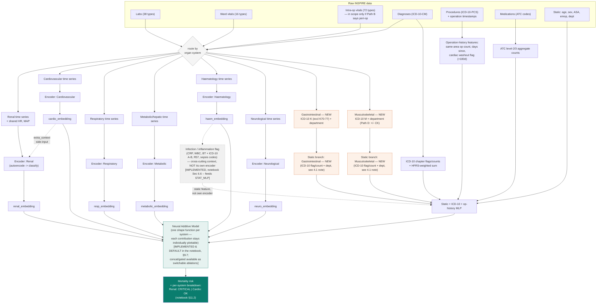

# Roadmap & Architecture — Working Page

> This page is the **actionable companion** to `Research_Aim.md` and `index.md`. Those two
> files explain *why* each item matters, in full prose. This page exists to be checked off
> against, week to week: a task list, the open decisions ("paths") that gate parts of the
> list, and the target architecture everything is building toward. Update it as items move
> from open → in progress → done — it's meant to go stale in a useful way (crossed-off
> boxes), not to be rewritten from scratch each time.
>
> **Editorial note (this revision):** §4 below was previously overwritten wholesale by a
> "refined §4" patch that dropped §§1–3 from the file. That patch's content is preserved —
> it's now merged in as the current §4 — but §§1–3 are restored here so this remains a
> complete, standalone document. See `docs/Multimodal_Notebook_Summary.md` for how §4's
> target architecture maps onto the actual runnable notebook
> (`src/INSPIRE_Multimodal_Mortality_Kaggle_Notebook.ipynb`), and see
> `docs/INSPIRE_Complete_Findings_Summary.md` / `docs/Base_Comparitive_Study_Models.md` for
> the full-scale (99,886-patient) run this page's checklist below has been updated against.

---

## 1. Where things stand right now

**Label definition — RESOLVED at full scale.** True 30-day mortality across the full
cohort: **469 deaths / 99,886 patients = 0.47%** (not 942 / ~0.9% from the raw
`died()`/folder label) — confirmed in `INSPIRE_Complete_Findings_Summary.md` §1. The
`died_30day()` fix flagged in earlier revisions of this page is applied throughout.

**Current pipeline:** two tracks now exist side by side, deliberately not merged into one:

1. The original flat, single-encoder transformer (`dnn_mortality_pipeline.py` /
   `dnn_mortality_pipeline_real.py`) — 7 pre-op features, the two-phase
   pretrain→fine-tune pattern, now run and reported at full scale (see
   `Base_Comparitive_Study_Models.md`).
2. **New:** the system-separated, multimodal architecture described in §4 below, built as
   a complete, runnable, theory-annotated Kaggle notebook —
   `src/INSPIRE_Multimodal_Mortality_Kaggle_Notebook.ipynb` (see
   `Multimodal_Notebook_Summary.md` for the full mapping from this page's target
   architecture to the notebook's actual code). Currently validated end-to-end on the
   30-patient development subset; written to scale unchanged to the full cohort by
   changing one config path.

**Immediate next step, in order:**

1. Point the new notebook's `CONFIG['SUBJECTS_DIR']` at the full 99,886-patient cohort and
   re-run — every metric from the multimodal architecture so far is from the 30-patient
   dev subset only.
2. Run the `TIME_WINDOW` (pre-op vs. peri-op) and multi-operation label (last-op vs.
   first-op) sensitivity sweeps for real at full scale (§11.5/§11.7 of the notebook
   currently ship these as templates, not executed full runs).
3. Resolve **Path D** (§4.5 below) — the musculoskeletal CK split-or-shared question —
   with clinician input; tracked in `Clinician_Questions.md`.
4. Wire NELA/NEWS2 in as baseline comparison points against the new architecture
   (`src/nela.py`, `src/score_models.py` are both already implemented and unused by the
   new notebook).

---

## 2. Research & analysis task list

Organised by theme. Checkboxes reflect status as of this revision — tick further items off
as work lands. Full reasoning for each item is in `Research_Aim.md` (section refs given)
and, for the multimodal architecture items specifically, in the new notebook's Part 1.

### Data & labelling

- [x] Identify the `died()` vs `died_30day()` label mismatch
- [x] Apply `died_30day()` labelling in `dnn_mortality_data_real.py`
- [x] Confirm full-dataset folder provenance — **resolved: 469/99,886 = 0.47%**, see
      `INSPIRE_Complete_Findings_Summary.md` §1
- [x] Recompute `pos_weight` at full scale using the confirmed 469-death count
- [ ] Competing-risks relabelling: flag the "died after 30 days" cohort as its own group
      rather than discarding it (`Research_Aim.md` §3A)

### EDA & feature audit

- [x] Re-run `feature_selection_pipeline.py` at full scale — see `Base_Comparitive_Study_Models.md`
- [x] Re-run `audit_features.py` / `audit_static_categorical.py` at full scale
- [ ] Joint department × ICD-10 × mortality cross-tabulation (`eda_findings.md` §3)
- [ ] Multi-operation sensitivity analysis — last-op vs. first-op vs. exclude
      (`eda_findings.md` §12, `Research_Aim.md` §2.2; the new notebook's §11.7 computes the
      label-disagreement rate on the dev subset as a first pass — 1 disagreement / 30
      patients, a 4-operation patient — worth re-running at full scale)
- [x] ASA as a model input — added as a static feature in the new multimodal notebook
      (§6.12); still unused by the original flat DNN pipeline

### Frailty & clinical baselines

- [x] Fix HFRS to the published 2-year / age-75+ window (`frailty_hfrs.py`) — **done**, the
      notebook's HFRS cell (§6.6) implements the 2-year/age-75+ window logic against the
      **full 109-code table** (extracted from `frailty_hfrs.py`, `assert`-checked at
      109 codes) — the earlier ~30-code subset limitation is closed
- [ ] Re-run frailty-vs-mortality comparisons post-fix
- [ ] Implement POSSUM / P-POSSUM as a fourth baseline alongside ASA/NELA
- [ ] Decide whether to fold in NEWS2 (`score_models.py` already has a working
      implementation, currently unused and uncompared by either pipeline)

### Feature scope

- [x] Organ-system categorisation of all 126 parameters — **extended to 8 systems**
      (Gastrointestinal, Musculoskeletal added), see §4 below
- [ ] Resolve pre-op-only vs. peri-operative scope (Path B below) at full scale
- [x] Expand the feature set beyond the original flat pipeline's 7 features — the new
      multimodal notebook uses all 126 time-series parameters (routed by system) plus
      ~37 static/ICD-10/operation-history features

### Modelling

- [x] Build system-separated encoders — **done**,
      `src/INSPIRE_Multimodal_Mortality_Kaggle_Notebook.ipynb` Part 9, validated
      end-to-end on the dev subset
- [x] Renal ↔ cardiovascular coupling — **done**, notebook §6.9/§9.2 (architectural
      side-input + hand-crafted interaction feature)
- [x] Gastrointestinal and Musculoskeletal systems added — **done**, ICD-10
      chapter/department-driven (notebook §6.7–6.8), since neither has a dedicated
      lab/vital panel (confirmed programmatically, not assumed)
- [x] Operation-history features (same-area count, recency) and the 6-month
      cardiac-surgery washout exception — **done**, notebook §6.10–6.11, the washout kept
      rule-based on purpose (sample-size + actionability reasoning, notebook §1.6.4)
- [ ] Categorical embeddings for medications (start at ATC level-2/3) and diagnoses —
      notebook uses ATC-level aggregate counts and ICD-10 chapter flags/HFRS instead
      (§1.2.1/§1.5.3 of the notebook explain why: label-starved at current sample size)
- [ ] Try masked-value or contrastive pre-training objectives instead of plain
      reconstruction — notebook currently uses plain masked-reconstruction pre-training
      (§9.4)
- [ ] GRU and TCN as additional comparison models (the notebook's `SystemEncoder` is a
      transformer by default; a GRU variant of the same architecture was prototyped in an
      earlier draft notebook — worth formalising as a documented ablation)
- [ ] Time-to-event reframing — Dynamic-DeepHit / DySurv-style dynamic hazard model, as a
      parallel track to the binary classifier (`Research_Aim.md` §2.8)

### Interpretability (the project's stated main aim)

- [x] Neural Additive Model fusion — **done and default**, notebook §9.7
      (`CONFIG['FUSION_STRATEGY']='nam'`), with concat and gated fusion available as
      switchable ablations (§11.4 runs the NAM-vs-concat comparison directly)
- [x] Per-system contribution breakdown ("Renal: CRITICAL, Cardio: OK") — **done**,
      notebook §11.2
- [x] Attention auditing — **done, first pass**, notebook §11.3 (per-timestep attention
      vs. observed/imputed mask, one system/patient at a time; a full audit against the
      acute-deterioration ICD-10 codes from EDA is still open)
- [ ] Concept Bottleneck head — AKI stage, haemodynamic instability, respiratory failure
      staging as named intermediate concepts
- [ ] Sparse autoencoder on the learned embeddings
- [ ] Prototype / case-based retrieval ("this patient's renal trajectory resembles...")
- [ ] MC Dropout uncertainty, then conformal prediction intervals

### Evaluation

- [x] Calibration curves + Brier score — **done**, notebook §11.1
- [ ] Formal benchmark against Shickel et al. 2023 (AUROC 0.92), once full-scale multimodal
      results are in

---

## 3. Open decisions ("paths")

These are the forks that change what downstream work means. Each is written as a set of
options rather than a single answer — pick one (or run the sensitivity analysis) before
building further on top of it.

### Path A — 30-day death count at full scale

**RESOLVED.** 469 deaths / 99,886 patients = 0.47%, confirmed directly against the full
cohort (`INSPIRE_Complete_Findings_Summary.md` §1). `pos_weight` recomputed accordingly.

### Path B — Pre-operative only vs. peri-operative

| Option | What it produces | Use case |
|---|---|---|
| Pre-op only (current default, both pipelines) | Decision-support tool | "Should we operate? Should ICU be booked?" |
| + intra-operative vitals | Real-time monitoring tool | "Should the surgical team escalate mid-case?" |
| + early post-operative | Early-warning / rescue tool | "Flag this patient before formal deterioration" |

**Status:** still open. The new multimodal notebook implements this as a single config
flag (`CONFIG['TIME_WINDOW']`, §1.6.3/§6.2) specifically so both variants can be run and
compared rather than assumed — not yet run at full scale (§11.5 is currently a template).

### Path C — Multi-operation patients

| Option | Argument for | Risk |
|---|---|---|
| Label from last operation (current default) | Matches "did this specific operation kill the patient" | Ignores earlier ops entirely |
| Label from first operation | Captures the full surgical journey | Wrong reference point for late major surgery |
| Exclude multi-op patients | Cleanest label | Selection bias — repeat-operation patients may be systematically sicker |

**Status:** still open. The new notebook computes both the last-op and first-op labels for
every patient (§4.2) and reports their disagreement rate (§11.7) — 1/30 on the dev subset —
as the evidence base for eventually settling this, per the recommendation to run (not
assume) the sensitivity analysis.

### Path D — Musculoskeletal CK, split or shared? *(new, introduced by §4's refinement)*

See §4.5 below.

---

## 4. Target architecture — system-separated encoders

> **Status of this section vs. earlier revisions:** the underlying 126-parameter count (38
> labs + 16 ward vitals + 72 intra-op vitals) is unchanged and re-verified below. What's
> new here: **two systems added** (Gastrointestinal, Musculoskeletal, per the working
> session), the **infection/inflammation open question is resolved** (was flagged as
> "doesn't currently have a clean home" — now a cross-cutting flag, not a 7th/9th system,
> with the reasoning stated), a **cross-mapped-features** column since several parameters
> now feed more than one system deliberately (not as an oversight), an explicit
> **renal↔cardiovascular coupling** node, and the **static/joint branch expanded** with the
> new operation-history and cardiac-washout features. This *is* the architecture
> `src/INSPIRE_Multimodal_Mortality_Kaggle_Notebook.ipynb` implements — see
> `Multimodal_Notebook_Summary.md` for the section-by-section mapping.

## 4.1 Organ-system feature grouping (126 parameters total — verified unchanged)

38 labs + 16 ward vitals + 72 intra-op vitals = 126, re-counted directly against the
dataset schema and cross-checked against the 30-patient sample (all 36 of the 38 labs and
all 16 of the 16 ward vitals were observed at least once in the sample; only `d_dimer` and
`troponin_t` never appeared, consistent with the existing `feature_audit_findings.md`
"never present pre-op" finding).

**What actually changed from the original table below: nothing is removed or
re-assigned — Gastrointestinal and Musculoskeletal are added as two new *consumers* of a
subset of the existing 126 parameters (mainly via diagnosis/procedure codes, plus a small
number of shared labs), not as two new parameter buckets. The 126 total still fully
belongs to the original six.**

| System | Labs | Ward vitals | Intra-op vitals (if Path B includes them) | Cross-mapped with |
|---|---|---|---|---|
| Renal | bun, calcium, chloride, creatinine, ica, phosphorus, potassium, sodium | crrt, uo, **+ nibp_mbp, hr (shared)** | uo | Cardiovascular (nibp_mbp, hr) — see 4.1c |
| Cardiovascular | ck (shared), ckmb, troponin_i, troponin_t | hr (shared), nibp_sbp, nibp_dbp, nibp_mbp (shared), iabp | hr, art_sbp/dbp/mbp, ci, cvp, svi | Renal (hr, nibp_mbp); Musculoskeletal (ck); Gastrointestinal (lacate) |
| Respiratory | be, hco3, paco2, pao2, ph, sao2 | fio2, rr, spo2, vent, ecmo | etco2, fio2, spo2, peep, pip, pplat | — |
| Metabolic / hepatic | albumin, alp, alt, ast, glucose, hba1c, lacate (shared), total_bilirubin, total_protein | bt (shared) | bt, glucose-related infusions | Infection flag (bt); Gastrointestinal/Cardiovascular (lacate) |
| Haematology / coagulation | aptt, crp (shared), d_dimer, fibrinogen, hb, hct, lymphocyte, platelet, ptinr, seg, wbc (shared) | — | ebl, rbc, ffp, cryo | Infection flag (crp, wbc); Gastrointestinal (crp) |
| Neurological | — | gcs_e, gcs_m, gcs_v | bis | — |
| **Gastrointestinal (NEW)** | *no dedicated lab* — crp, lacate (shared, see Haematology/Cardiovascular) | — | — | Haematology (crp); Cardiovascular (lacate) |
| **Musculoskeletal (NEW)** | *no dedicated lab* — ck (shared, see Cardiovascular; provisional, Path D) | — | — | Cardiovascular (ck) |
| **Infection / Inflammation** *(cross-cutting flag — not a 7th/9th system, see 4.1a)* | crp, wbc (both shared from Haematology) | bt (shared from Metabolic) | — | Haematology (crp, wbc); Metabolic (bt) |

**Note on the notebook's default GI/MSK implementation vs. this table:** the notebook
(§6.7–6.8) currently routes GI and MSK almost entirely through ICD-10 chapter
membership (chapter XI / chapter XIII) and department (`GS`/`OS`), treating them as
static/categorical features rather than giving them their own time-series encoder fed by
the shared `crp`/`lacate`/`ck` labs shown in this table. Both are valid, complementary
readings of "GI and MSK have no dedicated lab" — the table's shared-lab routing is a
richer target for a future notebook revision; the current notebook's simpler
department+ICD10-only version was chosen first for implementation speed and because the
shared labs are already fully "spoken for" by their primary systems (double-counting them
into a third branch has the same silent-inflation risk flagged in the notebook's §1.2.3).

### 4.1a Resolving the open question: "infection doesn't currently have a clean home"

The original table flagged this directly, noting the most mortality-linked ICD-10 codes
found in EDA (D65 DIC, I46 cardiac arrest, R57 shock, J80 ARDS, K72 hepatic failure, A41
sepsis) cluster around infection/inflammation rather than a single organ system. **This is
now resolved**, not left open:

Infection is modelled as a **cross-cutting flag layered across every system's encoder**
(sourced from CRP, WBC, body temperature, plus ICD-10 chapters A–B and the specific
high-risk codes above), not as its own competing branch. This is grounded in two
independent, converging references: **SOFA** (Vincent et al. 1996) scores exactly six organ
systems with no separate infection system, and **Sepsis-3** (Singer et al. 2016) defines
sepsis specifically as *an infection that triggers a SOFA score change* — i.e. the clinical
standard itself treats infection as a modifier of organ-system scores, not a parallel
seventh score. This also resolves cleanly why R57 (shock) is routed to Cardiovascular
rather than sitting homeless — it's a cardiovascular-system diagnosis with an infection
flag attached, not an infection-system diagnosis.

**Status in the notebook:** **implemented** (§6.6) — five components (ICD-10 chapter I
flag, the six high-risk codes above, fever, abnormal WBC, and a data-driven elevated-CRP
flag) feed the static branch as individual features plus a 0-5 composite score, matching
the "modifier layered across systems" design rather than a competing encoder. The CRP
threshold is **data-driven** (this cohort's own 75th percentile), not an absolute
clinical cutoff, since the notebook doesn't load `parameters.csv` and so CRP's exact
reporting unit isn't independently confirmed — worth revisiting once that's available.

### 4.1b Why Gastrointestinal and Musculoskeletal have zero dedicated labs

Worth stating plainly rather than leaving implicit: **no lab or ward-vital parameter in
the 126-parameter schema is GI- or MSK-specific** (no amylase/lipase, no dedicated muscle
marker distinct from cardiac CK). Both new systems are therefore driven almost entirely by
**diagnosis codes (ICD-10-CM chapter K excl. K70–77, and chapter M)** and **procedure codes
(ICD-10-PCS body-system letters D/C for GI, K/L/M/N/P/Q/R/S for MSK)**, with the shared
labs (crp, lacate for GI; ck for MSK) providing the only continuous-physiology signal
either branch gets in this table's fuller reading. This is a real, stated limitation of the
dataset, not a modelling gap — confirmed independently and programmatically by the
notebook's own item-name inventory check (§4.1 of the notebook) before any GI/MSK feature
was written, not assumed from this table alone.

### 4.1c Renal ↔ Cardiovascular — not just a shared-feature overlap

The `+ nibp_mbp, hr (shared)` note under Renal is a deliberate architectural choice, not
a data-availability convenience: mean arterial pressure and heart rate are added to the
renal branch **because** they causally drive renal perfusion, per the *cardiorenal
syndrome* literature (Ronco et al. 2008, *J Am Coll Cardiol* — five recognised
subtypes of bidirectional heart–kidney interaction). Beyond sharing the raw features, the
notebook's architecture (§9.2/§9.6) adds this as an explicit `extra_context` side-input to
the renal `SystemEncoder`, plus a hand-crafted `renal_cardiac_interaction` feature
(creatinine × |MAP deviation|) in the static branch — so the model can represent "these are
abnormal *together, in a consistent way*" as distinct from "these are independently
abnormal," via both a learned and a hand-crafted channel.

## 4.2 Pipeline — refined mermaid flowchart

**What's shown here vs. the actual notebook, made explicit rather than glossed over:**
- `PROC`/`OPHX`, `DX_EMB`/`MED_EMB`, and `G_ENC`/`S_ENC` all feed the **static branch**
  (`STAT_MLP`) in the notebook as implemented, not their own dedicated fusion inputs — GI
  and MSK are static/categorical features today (§4.1's note above), not separate encoders
  with their own embeddings in `FUSE`.
- The renal↔cardiovascular coupling is drawn as a direct `extra_context` edge from the
  cardiovascular embedding into the renal encoder (matching notebook §9.2/§9.6 exactly),
  rather than a separate bilinear "coupling" node feeding fusion — the notebook's
  implementation folds the coupling into the renal encoder itself, plus the separate
  hand-crafted interaction feature living inside `STAT_MLP`.
- `INF` (the infection/inflammation cross-cutting flag) is now **implemented** (§6.6) and,
  as drawn, feeds `STAT_MLP` as a set of static features — not its own encoder, and not a
  direct input to `FUSE`, matching §4.1a's "modifier, not a competing system" design.
- `FUSE` is marked as **implemented and default** (NAM), since this is no longer aspirational
  — it runs end-to-end and is validated against a concat-fusion ablation in notebook §11.4.

## 4.3 Why a Neural Additive Model for fusion, not plain concatenation

*(Reasoning unchanged from earlier revisions — still correct, and now empirically
testable rather than only argued.)* A `concatenate → Linear` fusion is simplest but is
**no more interpretable** than a single flat transformer — the per-system split disappears
again the moment the vectors are concatenated and mixed by a dense layer. A Neural
Additive Model keeps each system's contribution to the final logit as its own
separately-trained, separately-plottable shape function, so "Renal: CRITICAL" is a real
decomposition of the prediction, not a post-hoc story attached to it.

**Status update:** this is no longer a proposed destination only — it is the notebook's
**default, implemented, and running** fusion strategy (`CONFIG['FUSION_STRATEGY']='nam'`),
with gated fusion and plain concatenation both implemented alongside it as switchable
alternatives specifically so the trade-off argued here can be checked empirically
(notebook §11.4) rather than asserted. Gated fusion — a learned per-patient weight per
branch, rather than a fixed additive shape function — remains a reasonable, less complex
**intermediate point** on the same interpretability spectrum, also implemented and
available via `CONFIG['FUSION_STRATEGY']='gated'`.

## 4.4 Interpretability layers built on top

Once the system-separated encoders exist, four complementary interpretability layers sit
on top of them (`Research_Aim.md` §3C):

1. **Concept Bottleneck head** — predict named clinical concepts (AKI stage, haemodynamic
   instability, respiratory failure stage) before predicting mortality. *(Open.)*
2. **Sparse autoencoder** on each system's embedding — decompose a dense, tangled
   embedding into sparse, individually-nameable directions. *(Open.)*
3. **Attention auditing** — check whether attention concentrates on clinically sensible
   time steps and features, especially around the acute-deterioration ICD-10 codes.
   *(First pass implemented, notebook §11.3 — full audit against the specific EDA-flagged
   codes is still open.)*
4. **Prototype retrieval** — "this patient's renal trajectory resembles these 3 prior
   patients, 2 of whom died." *(Open.)*

---

## 4.5 Open decision introduced by this refinement — "Path D"

### Path D — Musculoskeletal CK, split or shared?

| Option | Consequence |
|---|---|
| Keep CK shared as-is (current) | Simple; MSK branch gets a small physiology signal, but cardiac and skeletal-muscle injury are conflated |
| Use CK-MB fraction to separate cardiac vs. skeletal CK | More clinically correct, but CK-MB is itself only patchy coverage (20–50%) pre-op — may not add much in practice |
| Split by context (recent cardiac surgery → assume CK is cardiac; recent orthopaedic surgery → assume CK is skeletal) | Uses the operation-history features already being built (4.1c/OPHX) rather than a lab value that may not exist | Introduces an assumption that needs validating against real cases |

**Status:** open — worth a specific question to the clinical reviewer (already flagged in
`Clinician_Questions.md`) before committing either way. **Not currently relevant to the
notebook's default implementation**, since the notebook's GI/MSK branches don't yet use the
shared-lab routing this path assumes (§4.1's note) — resolving Path D matters most if/when
the notebook is extended to the richer shared-lab version of GI/MSK described in §4.1's
table.

---

*This page is generated from, and should be kept consistent with, `Research_Aim.md` §4
(consolidated roadmap), `index.md` §14–15, and `Multimodal_Notebook_Summary.md` (the
notebook-level mapping). If these drift apart, `Research_Aim.md` is the more detailed
narrative source and `Multimodal_Notebook_Summary.md` is the more detailed
implementation-accurate source — update this page to match them, not the other way round.*
