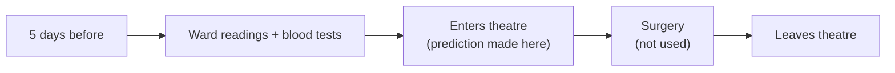
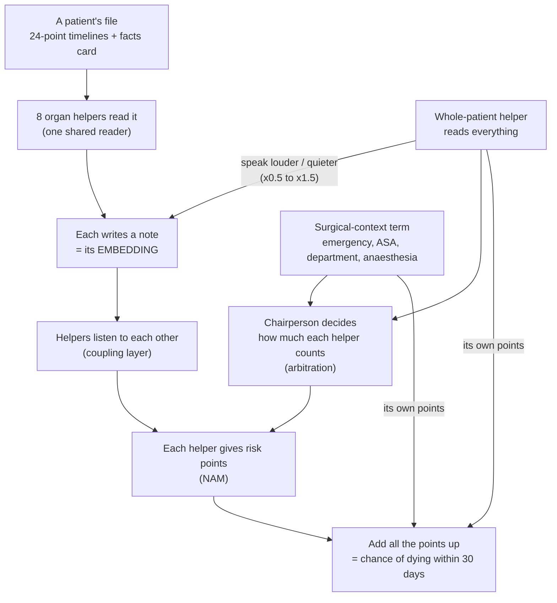

# INSPIRE DNN v4 — explained simply

This guide explains the whole pipeline, from the raw patient files to the final pictures,
in the plainest words possible. Every special word is explained the first time it appears,
and there is a word list at the end. The code lives in `src-dnn/`; this file is the "why"
and the "what", the code is the "how".

---

## 1. The goal, in one paragraph

Some people die within 30 days after an operation. We want a computer program that looks at
a patient **before** their operation and says how likely that is. Then doctors can take extra
care of the high-risk patients: talk to the family, book an intensive-care bed, or rethink
the plan. The program must also say **why**, in a way a surgeon can check: "the kidneys added
most of the risk", not just "62%".

---

## 2. The data

**Data** means the information we have. Ours comes from the INSPIRE dataset of a Korean
hospital, with one file per patient.

| | |
|---|---|
| Patients (full cohort) | about **99,886** |
| Died within 30 days | about **469** — roughly **1 in 213** (0.47%) |
| Subset notebook | every death + up to 10,000 survivors ≈ **10,469** patients |

Because deaths are so rare, the subset has a higher death rate than real life. So its
scores are for checking the pipeline works, not the numbers to publish.

Each patient's file holds six lists:

| List | What it is |
|---|---|
| `operations` | every operation: date, department, emergency or not, ASA grade, anaesthesia type, procedure code |
| `labs` | blood tests (creatinine, haemoglobin, potassium, …) with the time taken |
| `ward_vitals` | bedside checks on the ward: heart rate, blood pressure, breathing, oxygen, temperature, coma score |
| `vitals` | readings *during* surgery (not used — see §3) |
| `diagnoses` | illness codes (ICD-10) |
| `medications` | medicines given, with their family codes (ATC) |

---

## 3. Pre-op, not peri-op

We use only the **5 days before the patient enters theatre** for their last operation.
Nothing from during the operation. This is called **pre-operative** (pre-op).



Why:

- **It is when a decision can still change.** After surgery has started, the big choices are made.
- **It is fair.** Surgery readings partly give away how things went, which makes a model look
  better without making it more useful beforehand.

**Peri-operative** (peri-op) would also use the surgery readings. There is a switch for it
(`TIME_WINDOW = "peri_op"`), but it answers a different question ("who needs watching
*after* surgery?"). It also needs its own surgery timeline first: with 24 time points spread
over 5 days, a 3-hour operation fills only about one point. So it is a later experiment.

---

## 4. Turning a patient file into numbers

### 4.1 Time series — the egg carton

A **time series** is the same thing measured again and again, in time order — like writing
your height on every birthday. We have **52** of them (heart rate, blood pressure,
creatinine, …), grouped by organ system (§5).

Readings happen at messy times. So we use an **egg carton with 24 holes** spread evenly over
the 5 days, and put each reading into the nearest hole.

- A hole with no reading close by is **missing data**.
- We fill empty holes with sensible guesses. This is called **imputation**:
  - fast-changing vitals: a smooth line between real readings;
  - slow blood tests: the last real value is carried forward;
  - never measured at all: the typical value from the training patients.
- Every hole also gets a **mask** sticker: 1 = real reading, 0 = filled in. The model always
  sees the stickers, so it knows what was guessed.

**Standardising** puts everything on the same ruler (average 0, spread 1), so blood sugar
(around 110) does not shout louder than potassium (around 4). The ruler is measured on
training patients only.

### 4.2 The facts card — static features

**Static** means it does not change during those 5 days. About 120 facts per patient:

- age, sex, weight, height;
- **emergency** (must happen now) or **scheduled** (planned ahead);
- **ASA grade**: the anaesthetist's fitness score, 1 = healthy to 5 = very unlikely to survive;
- department, and anaesthesia type (general, spinal, …) — *new in v4*;
- illness codes grouped by body chapter (**ICD-10**: e.g. I21 = heart attack);
- infection signs, previous operations, frailty score;
- summary numbers from the time series (average creatinine, lowest blood pressure, …);
- the **NEWS2** score (§6);
- *new in v4:* what the operation is on, and which medicine families were given (§5.2).

---

## 5. The eight organ systems

An **organ system** is a group of body parts that work together. The model has eight
"helpers", one per system:

| Helper | Measurements over time | Count |
|---|---|---|
| Kidneys (renal) | bun, calcium, chloride, creatinine, ionised calcium, phosphorus, potassium, sodium, dialysis, urine | 10 |
| Heart & circulation | ck, ck-mb, troponin, heart rate, blood pressure (3), balloon pump | 8 |
| Lungs & breathing | blood gases (6), oxygen given, breathing rate, oxygen level, ventilator, ECMO | 11 |
| Metabolism & liver | albumin, liver tests (4), glucose, HbA1c, lactate, total protein, temperature | 10 |
| Blood (haematology) | clotting (4), CRP, haemoglobin, haematocrit, white cells (3), platelets | 10 |
| Brain & nerves | coma score: eyes, movement, speech | 3 |
| Digestive (GI) | none in this dataset | 0 |
| Bones & joints (MSK) | none in this dataset | 0 |

### 5.1 Why GI and MSK have no measurements

The dataset has no blood test or bedside reading that belongs only to the gut, or only to
bones and muscles. Even the surgery readings have none. In v3 these two helpers learned only
from their illness codes — like students given just the title page of the book.

### 5.2 What v4 gives them (and everyone else)

Two sources were already in the data but unused:

- **What the operation is on.** Operations have **ICD-10-PCS procedure codes**. The second
  letter says which body system is operated on:
  - D, F → digestive;
  - K–S → muscles, tendons, ligaments, bones, joints;
  - 2–6 → heart and vessels;
  - T → urinary (kidneys);
  - B → lungs;
  - 0–1 → nervous system;
  - 7 → blood/lymph;
  - G → hormones (metabolism).

  For each system the model gets: "is *this* operation on me?" and "how many earlier
  operations were on me?".
- **Medicine families.** Medicines have **ATC codes**:
  - A → gut (except A10, diabetes medicines → metabolism);
  - M → bones and muscles;
  - C → heart;
  - R → lungs;
  - N → nerves;
  - B → blood;
  - H → metabolism;
  - G04 → kidneys.

  For each system, the model gets how many of "its" medicines were given in the 5 days.

Every system is still built the same way: its own measurements (if any) plus its own facts.

**Should GI and MSK be removed?** Not on a guess. Part 11's ablation now trains a version
**without** them (their facts go to the whole-patient helper, nothing is thrown away). If
removing them changes nothing and their risk points stay near zero, fold them in. Otherwise
keep them. The data decides.

### 5.3 The surgical-context term (new in v4)

Emergency vs scheduled, ASA, department and anaesthesia type now have **their own risk
points**, instead of being mixed into the whole-patient helper. So every patient's breakdown
can say "the surgical situation added this much", and for the whole test set we can compare
it for emergency vs scheduled patients (Part 13.6).

---

## 6. NEWS2 — the nurses' points game

**NEWS2** is a points system UK nurses use to spot a patient getting sicker. Seven checks,
each 0 (normal) to 3 (very abnormal), added up:

| Check | 3 | 2 | 1 | 0 | 1 | 2 | 3 |
|---|---|---|---|---|---|---|---|
| Breaths per minute | ≤8 | | 9–11 | 12–20 | | 21–24 | ≥25 |
| Oxygen level, Scale 1 (%) | ≤91 | 92–93 | 94–95 | ≥96 | | | |
| On extra oxygen? | | yes | | no | | | |
| Top blood pressure (mmHg) | ≤90 | 91–100 | 101–110 | 111–219 | | | ≥220 |
| Pulse per minute | ≤40 | | 41–50 | 51–90 | 91–110 | 111–130 | ≥131 |
| Alert? | | | | alert | | | new confusion / voice / pain / unresponsive |
| Temperature (°C) | ≤35.0 | | 35.1–36.0 | 36.1–38.0 | 38.1–39.0 | ≥39.1 | |

The total is 0–4 for low, 5–6 for medium, and 7 or more for high. Any single 3 also means a doctor should come quickly.
Our code matches the official Royal College of Physicians chart, and a self-test checks
every band edge before NEWS2 is allowed into the model.

Where the data forces a guess:

- **Scale 2** (for some lung patients) needs a doctor's decision that is not recorded, so
  everyone gets Scale 1.
- **"Alert"** is not recorded either, so it comes from the coma score (GCS): alert only if
  perfect. This may be unfair to patients who are always a bit confused or have a
  breathing tube. That is a question for a surgeon.

**NEWS2 checks in the pipeline:**

1. computed from real ward readings (stage 04);
2. real deaths vs synthetic deaths, before vs after SMOTENC (§8.2b);
3. before vs after "wobbling" real deaths (§9.1b);
4. *v4:* real readings vs the **filled-in** timeline (Part 13.7a): does filling invent
   deterioration?;
5. *v4:* synthetic patients' **story check** (Part 13.7b): a synthetic patient's NEWS2 is
   blended from two real deaths, but its timeline is borrowed from one. Do they agree as
   well as they do for real patients?

---

## 7. The model — a team meeting

**A model** is a giant recipe with thousands of adjustable dials. **Training** shows it many
patients with the answer and nudges the dials to be less wrong each time. One trip through
all training patients is an **epoch**.



Step by step, with the real names:

1. **Encoder (the reader).** An **encoder** reads raw data and writes a short summary. One
   reader is shared by all eight helpers, wearing a name tag ("now reading kidneys"), so small
   helpers learn from big ones.
2. **Transformer and attention.** The reader is a **transformer**: it looks at all 24 holes
   at once and decides which matter most — like using a highlighter. The highlighting is
   called **attention**.
3. **Embedding (the note).** Each helper's summary is a list of numbers. With the `medium`
   preset there are 32 numbers; `large` has 64 and `xlarge` has 128. That list is the
   **embedding**: the patient's "home address" in the model's mind. Similar patients live on
   the same street. The model decides by itself what each number means.
4. **Whole-patient helper.** A **layer** is one step in the recipe. This one reads every
   fact at once, turns each organ helper's volume up or down (only between half and one and
   a half — it cannot put words in their mouths), and gives its own risk points.
5. **Coupling layer.** Bodies are connected — a weak heart hurts the kidneys. Each helper
   listens to the other seven. Nobody tells it who to listen to; it learns that, and we draw
   it for a surgeon to check.
6. **Risk points (NAM).** Each helper turns its note into risk points (kidneys +1.2,
   lungs +0.3, …). **NAM** (Neural Additive Model) means the final answer is the points
   **added up**, so the explanation is exact.
7. **Arbitration (the chairperson).** For each patient it decides how much each helper
   counts (for a heart operation, the heart may count double). On average everyone counts
   the same.
8. **The answer.** The points are added and turned into a chance from 0% to 100%.

The sizes of every step are printed in §9.8 and saved as `tables/layer_sizes.csv`, the same
kind of table as in the reference paper.

---

## 8. How it learns

### 8.1 Two stages

1. **Pre-training — puzzle practice without answers.** One helper's information is hidden
   and the others must guess it, like covering one jigsaw piece. Each helper also redraws its
   own data from its note. No "died / survived" answers are needed, so it practises on all
   ~60,000 training patients and learns how bodies normally behave.
2. **Fine-tuning — the real question.** Now it sees the answers and learns to predict death,
   moving the pre-trained parts only gently so the body knowledge is not forgotten.

### 8.2 The rare-deaths problem

Imagine a huge jar of blue marbles (survivors) with a few red ones (deaths). A model saying
"always blue" is right 99.5% of the time and useless. Three fixes:

- **Synthetic patients (SMOTENC):** pretend red marbles made by blending two similar real
  ones — *v4:* from the same department, ASA grade **and** emergency/scheduled status — at
  most 5 per real death.
- **Wobbled copies (augmentation):** each real death gets 2 slightly changed copies.
- **Fair handfuls (balanced batches):** about 1 in 10 patients in every practice handful is
  a death.

### 8.3 No cheating

- **Training (60%)** is the practice book.
- **Validation (20%)** is the mock exam that decides when to stop.
- **Test (20%)** is the real exam, never seen until the end.

Brilliant on practice but poor on the mock exam means the model **memorised**. Several
checks look for exactly that.

### 8.4 The model's diary (new in v4)

While training, the notebook writes down:

- **every epoch:** validation scores for all patients, emergency patients and scheduled
  patients — starting **before any training**;
- **at chosen moments:** a **snapshot** of every snapshot patient's embeddings, risk points
  and predicted risk. The moments are before training, after pre-training, chosen
  fine-tuning epochs, the last epoch and the chosen model;
- **at the end:** the final model, saved with everything needed to reload it. It is then
  loaded back and must give identical predictions.

---

## 9. How we score it

- **AUROC:** pick one patient who died and one who survived. How often does the model rank
  the one who died higher? 1.0 is perfect; 0.5 is a coin flip.
- **AUPRC:** when the model raises the alarm, how often is it right — and how many deaths
  does it catch? This is the honest score when deaths are rare. Random guessing scores
  about the death rate.
- **Calibration / Brier score:** when it says 10%, do about 10 in 100 such patients die?
  Lower Brier is better.
- **Confidence interval (CI):** the range the true score probably lies in. Fewer deaths give
  a wider range.
- **Baselines:** simpler models (logistic regression, gradient boosting) the deep model must
  beat.
- **Ablation:** take one part out; if nothing gets worse, that part was not earning its
  place.
- **Ensemble:** several copies trained from different random starts (**seeds**) vote.

---

## 10. Part 13 — looking inside the model (every picture, and how to read it)

| Section | Picture / table | How to read it |
|---|---|---|
| 13.1 | saved models, `test_predictions.csv` | every test patient's risk and per-term points, for any later analysis |
| 13.2 | **training curves** by group | left: AUPRC, right: AUROC; dots on the far left = before training and after pre-training; dotted lines = random guessing for that group; grey line = chosen epoch |
| 13.3 | **embedding maps** (PCA, t-SNE, UMAP) | one dot per patient, coloured emergency/scheduled × died/survived, at four moments in training; deaths drawn bigger. If deaths drift together over time, the model learned something real. Only "who is near whom" matters on t-SNE/UMAP, not distances or axes |
| 13.3b | **neighbourhood enrichment** | among each patient's 15 nearest neighbours (in the full embedding, not the flat map), how much more often a dead patient's neighbours died than average. 1 = random; higher = similar patients share the outcome. Also per organ system |
| 13.3c | maps by department, ASA, NEWS2 band, top risk term; one map per organ system | what the groups on the map actually are |
| 13.4 | **clusters** | k-means finds natural groups nobody labelled, described in plain terms (size, death rate, emergency share, department, ASA, which system adds most risk). A high-risk cluster a surgeon recognises is evidence; one nobody recognises is a question |
| 13.5 | **cosine-similarity heatmaps** | a square comparing every pair of patients: red = model thinks they are alike, blue = opposite. Blocks appearing after training = patients in the same group look alike to the model |
| 13.6 | **emergency vs scheduled tables** | (1) scores per group with CIs; (2) average risk points per term per group — the surgical-context bar shows what "emergency" itself adds; (3) how much real data each group had — emergency patients usually arrive with less |
| 13.7 | **NEWS2 checks** | (a) real vs filled-in scores — filling should rarely change the band; (b) synthetic patients' NEWS2 story vs real patients' |
| 13.8 | **SHAP beeswarms** inside each system | rows = that system's inputs, most important at the top; dots right = raised the risk, left = lowered it; red = high value, blue = low. "Creatinine: red dots on the right" = high creatinine raises the kidney points |
| 13.9 | **score vs embedding size** | AUPRC/AUROC for 16, 32, 64, 128 (and 256) numbers, with a band over seeds — like the reference paper's Fig. 6. Pick the smallest size whose band overlaps the best |
| 13.10 | **reuse test** | a simple model reads ICU admission, long stay and death from the frozen embeddings. If the after-pre-training embeddings already predict ICU admission, the label-free practice learned real physiology |
| 13.11 | status list | every section: ok / skipped (and why) / FAILED (with the error) |

**About SHAP.** **SHAP** shares out credit fairly: if the kidney points went up by 0.8, it
splits that 0.8 among the kidney inputs. We use **expected gradients**, the method behind
SHAP's `GradientExplainer`, written in `inspire_dnn/explain.py`, so no extra package is
needed. The model's main explanation is still the exact per-system breakdown; SHAP is a
check *inside* each system. The **completeness gap** says how well the shares add up
(near 0 is good).

**About PCA, t-SNE and UMAP.** We cannot picture 32 or 128 dimensions, so these squash the
embedding onto a flat map:

- **PCA** is a straight-line squash;
- **t-SNE** and **UMAP** focus on keeping near neighbours near.

---

## 11. Bigger data and Isambard-AI

| Profile | Patients | Embedding size | Where |
|---|---|---|---|
| `subset` | ~10,469 | 32 (`medium`) | Kaggle/Colab |
| `full` | ~99,886 | 64 (`large`) | Kaggle/Colab, several hours |
| `isambard` | ~99,886 | 128 (`xlarge`), sweep 16→256 | Isambard-AI, see `isambard/README_isambard.md` |

The model is small, so **one GPU per run is enough**. Isambard's value is running the full
cohort, the ensemble, every ablation and the size sweep in one go.

**Bigger is not automatically better:** pre-training learns from every patient, but the
death prediction learns from ~469 deaths. The size sweep (13.9) decides with data.

**Mixed precision (bf16)** means doing the arithmetic with shorter numbers, which is faster
on modern GPUs. It is only used for training.

---

## 12. What a run produces

Everything goes into `inspire_outputs/` (on Kaggle: `/kaggle/working/inspire_outputs`):

```
inspire_outputs/
├── figures/     every plot as a PNG, numbered in order and named after its title
├── models/      final_model_<id>.pt (+ ensemble members) -- reload with load_inspire_model()
├── snapshots/   snapshot_XX_<moment>.npz -- embeddings, risk points, predictions per moment
└── tables/      every results table as CSV (epoch log, group metrics, clusters, SHAP,
                 NEWS2 checks, size sweep, reuse test, layer sizes, verification summary)
```

---

## 13. How to run

- **Kaggle / Colab:** open a notebook from `notebooks/` and Run All.
- **Before a long run:** `python -m pytest -q tests` (about 1 minute). This checks the new
  layers and the SHAP code with random numbers.
- **Isambard-AI:** `sbatch isambard/run_inspire_isambard.sbatch`. It runs the tests first and
  stops if any fail.
- **After editing a stage:** run `python build_notebook.py`. Edit files in `pipeline/` or
  `inspire_dnn/`, never the notebook directly — the notebooks are generated from these.

---

## 14. Honest status of v4

- **Tested for real:**
  - stages 00–07 (including the new features) on a 5,000-patient fake cohort;
  - every Part 13 analysis section, end-to-end, against mock model outputs;
  - 42 unit tests that need no PyTorch.
- **Not yet run with PyTorch:** the surgical-context layer, snapshots during training, SHAP
  and the size sweep. New unit tests cover them — run `pytest` once before the first long
  run.
- **Fake data means nothing clinically.** Every number from the dry runs only shows the
  wiring works.

## 15. Questions for a surgeon (sign-off)

1. Is the procedure-code → organ-system map right (§5.2)? For emergency operations, is the
   procedure known before surgery starts?
2. Medicine families: A10 (diabetes) and H (hormones) under metabolism, G04 under kidneys?
3. CK (a muscle and heart enzyme): heart or bones & muscles?
4. NEWS2 "alert" from a perfect coma score: fair?
5. Do the clusters (13.4) and the per-system SHAP top inputs (13.8) make clinical sense?

---

## Word list

| Word | Meaning |
|---|---|
| ablation | take one part out and see if the model gets worse |
| arbitration | the chairperson: how much each organ system's points count for this patient |
| ASA grade | anaesthetist's fitness score, 1 (healthy) to 5 (very unlikely to survive) |
| ATC code | the family code of a medicine |
| attention | the transformer's highlighter: which time points matter most |
| AUPRC / AUROC | scores of how well deaths are found / ranked (§9) |
| batch | a practice handful of patients (256 by default) |
| bf16 / mixed precision | shorter numbers for faster training on modern GPUs |
| calibration | does "10%" really mean 10 in 100? |
| cluster | a natural group of similar patients found without labels |
| cosine similarity | how alike two embeddings point: 1 alike, 0 unrelated, −1 opposite |
| coupling layer | organ helpers listening to each other |
| embedding | the model's list-of-numbers summary of a patient or organ system |
| encoder | the part that reads data and writes the summary |
| ensemble | several models voting |
| epoch | one full pass through the training patients |
| expected gradients | the SHAP method we use |
| fine-tuning | stage 2: learning the real question with answers |
| ICD-10 / ICD-10-PCS | illness codes / operation codes |
| imputation | filling missing values with sensible guesses |
| layer | one step in the model's recipe |
| mask | the "real or filled-in" sticker on each value |
| NAM | Neural Additive Model: the answer is points added up |
| NEWS2 | the nurses' early-warning points game (§6) |
| organ system | a group of body parts that work together |
| PCA / t-SNE / UMAP | ways to squash an embedding onto a flat map |
| pre-op / peri-op | before surgery only / including surgery |
| pre-training | stage 1: puzzle practice without answers |
| seed | the random starting point of a training run |
| SHAP | a fair way to share credit among inputs |
| SMOTENC | making synthetic deaths by blending similar real ones |
| snapshot | a saved copy of the embeddings at one moment in training |
| standardising | putting every measurement on the same ruler |
| static feature | a fact that does not change during the 5 days |
| surgical context | emergency/scheduled, ASA, department, anaesthesia — its own risk term in v4 |
| time series | the same thing measured repeatedly over time |
| transformer | the kind of reader the encoder uses |
| validation / test | the mock exam / the real exam |
| whole-patient layer | the helper that reads everything and adjusts each system's volume |
