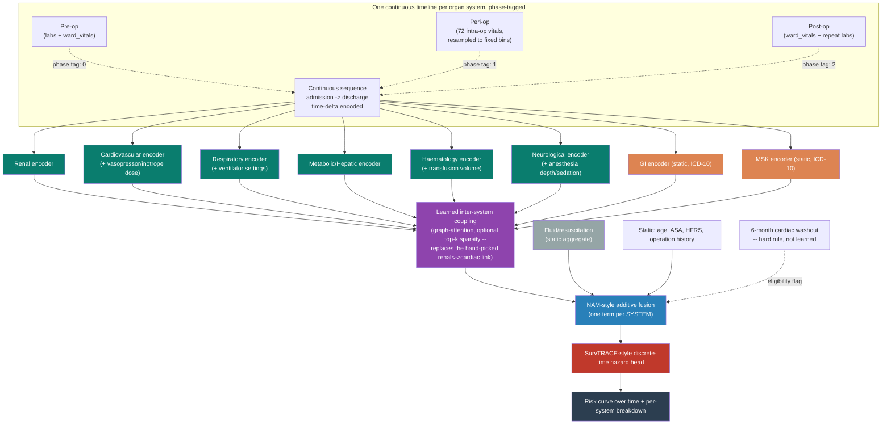

# PACO-Net v2: Phase-Aware Feature Mapping and Architecture Changes

> **This is the one doc to read for current thinking.** It covers the latest novelty,
> the full feature mapping, and every architecture change in flight (§1-6), plus what was
> already done and confirmed before this revision (§7, at the bottom). Everything else —
> planning history, EDA detail, meeting-by-meeting notes — has moved to `../archive/`, split
> into `planning_and_reference/` and `results_and_history/`. This doc gets updated as work
> progresses; the archive stays as a historical record and generally shouldn't need editing.

> **What this page is.** The consolidated, PACO-Net-aligned revision of the organ-system
> feature mapping and architecture, incorporating: the full 123-parameter audit (labs +
> intra-op vitals + ward vitals), the pre/peri/post phase-aware timeline, the learned
> graph-attention coupling (replacing the hand-picked renal↔cardiac link), and diffusion-based
> minority augmentation. This supersedes the 30-feature pilot mapping in
> `feature_audit_findings.md` and folds the intra-op vitals in for the first time.
>
> **Status:** design consolidation — ready to implement, not yet built.

---

## 1. Why this revision, in one paragraph

The original 6-organ-system architecture used ~30 features, all pre-op, because the
pipeline only had a pre-op window. PACO-Net's phase-aware design (pre/peri/post) removes
that constraint — the 72 intra-op parameters that were sitting unused become the **peri-op**
phase's data. This revision maps *all 123 available parameters* to organ systems, tags each
by which phase(s) it's observed in, and grounds the intra-op drug/device features (vasopressor
doses, ventilator settings, anesthetic depth) using the same organ-support logic as the SOFA
score (Vincent et al. 1996) — so the mapping is clinically defensible, not ad hoc.

---

## 2. Complete feature mapping, by organ system and phase

**Legend:** Pre = pre-op (admission → surgery start) · Peri = peri-op (surgery start → surgery
end) · Post = post-op (surgery end → discharge/30-day window)

### 2.1 Renal

| Feature | Source table | Phase | SOFA-analogous role |
|---|---|---|---|
| creatinine | labs | Pre, Post | Core renal marker |
| bun | labs | Pre, Post | Core renal marker |
| sodium, potassium, chloride | labs | Pre, Post | Electrolyte/renal function |
| calcium, phosphorus, ica | labs | Pre, Post | Renal-mineral axis |
| crrt | ward_vitals | Pre, Post | Renal organ *support* (dialysis) |
| uo (urine output) | ward_vitals + vitals | Pre (rare), Peri, Post | Direct renal function signal |
| hes (hydroxyethyl starch) | vitals | Peri | Dual-tagged — volume expander with known renal toxicity; kept visible here as a caveat feature, not a primary renal signal |

### 2.2 Cardiovascular

| Feature | Source table | Phase | SOFA-analogous role |
|---|---|---|---|
| troponin_i, troponin_t, ck, ckmb | labs | Pre, Post | Cardiac injury markers |
| hr, nibp_sbp/dbp/mbp | ward_vitals | Pre, Post | Core hemodynamics |
| art_sbp/dbp/mbp, nibp_sbp/dbp/mbp, hr | vitals | Peri | Continuous intra-op hemodynamics |
| ci, cvp, svi | vitals | Peri | Cardiac performance/preload |
| pap_sbp/dbp/mbp | vitals | Peri | Right-heart/pulmonary pressure |
| sti, stii, stiii, stv5 | vitals | Peri | Ischemia monitoring (ST-segment) |
| dobui, dopai, mlni | vitals | Peri | Inotrope dose — **organ *support* signal**, same logic as SOFA cardiovascular component |
| eph, epi, epii, nepi, pepi, phe, vaso | vitals | Peri | Vasopressor dose — organ support signal |
| ntgi | vitals | Peri | Vasodilator dose — organ support (opposite direction) |
| iabp | ward_vitals | Pre, Post | Mechanical cardiac support device flag |

### 2.3 Respiratory

| Feature | Source table | Phase | SOFA-analogous role |
|---|---|---|---|
| pao2, paco2, ph, hco3, be, sao2 | labs | Pre, Post | Blood gas / respiratory function |
| spo2, rr, fio2 | ward_vitals | Pre, Post | Core respiratory monitoring |
| spo2, rr, fio2 | vitals | Peri | Continuous intra-op respiratory monitoring |
| air, o2, n2o, etco2 | vitals | Peri | Ventilation/gas exchange |
| minvol, peep, pip, pmean, pplat, vt | vitals | Peri | Ventilator settings — **organ support signal**, same logic as SOFA respiratory component |
| etdes, etgas, etiso, etsevo | vitals | Peri | Anesthetic gas concentration (respiratory-delivered) |
| vent, ecmo | ward_vitals | Pre, Post | Mechanical respiratory support device flag |

### 2.4 Metabolic / Hepatic

| Feature | Source table | Phase | SOFA-analogous role |
|---|---|---|---|
| glucose, hba1c | labs | Pre, Post | Metabolic control |
| albumin, alp, alt, ast, total_bilirubin, total_protein | labs | Pre, Post | Hepatic function |
| lactate | labs | Pre, Post | Perfusion/metabolic stress marker |
| bt (body temperature) | ward_vitals + vitals | Pre, Peri, Post | Thermoregulation |
| d5w, d10w, d50w | vitals | Peri | Dextrose infusion (metabolic support) |
| alb5, alb20 | vitals | Peri | Albumin infusion (hepatic-synthetic-function-adjacent) |

### 2.5 Haematology / Coagulation

| Feature | Source table | Phase | SOFA-analogous role |
|---|---|---|---|
| hb, hct, wbc, platelet | labs | Pre, Post | Core haematology |
| aptt, ptinr, fibrinogen, d_dimer | labs | Pre, Post | Coagulation |
| crp, lymphocyte, seg | labs | Pre, Post | Inflammatory/immune |
| ebl (estimated blood loss) | vitals | Peri | Direct haematologic stress event |
| rbc, ffp, pc, cryo, pheresis | vitals | Peri | Transfusion — **organ support signal**, same logic as SOFA coagulation component |

### 2.6 Neurological

| Feature | Source table | Phase | SOFA-analogous role |
|---|---|---|---|
| gcs_e, gcs_m, gcs_v | ward_vitals | Pre, Post | Core neuro function (Glasgow Coma Scale) |
| bis (bispectral index) | vitals | Peri | Anesthesia-depth proxy for consciousness level |
| cbro2 | vitals | Peri | Cerebral oxygenation |
| ppf, ppfi, mdz, ftn, sft, rfti | vitals | Peri | Sedative/opioid dose — modulates and proxies neuro/consciousness state during surgery |

### 2.7 Diagnosis-derived systems (unchanged from baseline)

| System | Source | Phase |
|---|---|---|
| GI | ICD-10 chapter XI | Static (diagnosis-level, not time-varying) |
| MSK | ICD-10 chapter XIII | Static |

### 2.8 Fluid / Resuscitation (cross-cutting — explicitly *not* an organ)

| Feature | Source table | Phase | Why separate |
|---|---|---|---|
| ns, hns, hs, psa | vitals | Peri | Crystalloid volume reflects clinician *decision*, not organ *state* — fed as a static/aggregate feature at the NAM fusion level, same treatment as GI/MSK, not through an organ encoder |

**Open judgment call (flagged, not resolved):** whether fluid volumes belong here at all,
or should be dropped as a confound of surgical duration/blood loss rather than a genuine
signal. Worth a second opinion from your supervisor before finalizing.

---

## 3. Full list of architecture changes vs. the original baseline

| # | Change | Replaces | Status |
|---|---|---|---|
| 1 | Phase-aware continuous timeline with segment embeddings (pre/peri/post) | Pre-op-only fixed window | Designed this session |
| 2 | Peri-op resampling to fixed time bins before joining the timeline | N/A (peri-op previously unused) | Open decision: bin size (5 min proposed) |
| 3 | Continuous time-delta encoding across phase boundaries | Per-phase position reset | Designed this session |
| 4 | 72 intra-op vitals mapped to organ systems via SOFA-style organ-support logic | Intra-op vitals excluded entirely | Mapping complete (§2) |
| 5 | Fluid/resuscitation as a cross-cutting static feature, not an organ | N/A | Flagged as open judgment call |
| 6 | Learned graph-attention inter-organ coupling (optionally top-k sparse) | Single hand-picked renal↔cardiac link | Designed, code skeleton provided |
| 7 | Diffusion model (TabDDPM) for minority static-feature generation, conditioned on (department, ASA) and organ system | SMOTENC | Designed, code skeleton provided |
| 8 | Two-stage synthetic generation: missingness-pattern model + value model | SMOTENC's implicit full-feature generation | Designed this session |
| 9 | 6-month cardiac washout rule kept as a static hard-coded eligibility flag, untouched by phase-tagging | N/A (already a deliberate design stance) | Unchanged — explicitly preserved |
| 10 | SurvTRACE-style discrete-time hazard head | Flat single-probability output | Previously designed, unchanged by this revision |

---

## 4. Updated architecture diagram

---

## 5. Open decisions still needed from you before implementation

1. **Post-op window end** — fixed duration (e.g. 72h) vs. discharge date. Affects post-op
   data volume per patient and cross-patient comparability.
2. **Peri-op resampling bin size** — 5 minutes proposed; too coarse loses brief events
   (e.g. a transient hypotensive episode), too fine reintroduces the sequence-length problem
   the resampling step exists to solve.
3. **Fluid/resuscitation placement** (§2.8) — keep as cross-cutting static feature, or drop
   as a confound of surgery duration/blood loss.
4. **Diffusion generation and phase completeness** — check per-minority-patient phase
   coverage before training the diffusion model on peri-op features; generating synthetic
   peri-op data for a phase most real minority patients lack coverage for would compound
   scarcity rather than solve it.

---

## 6. Novelty ledger entries this revision adds/updates

| Idea | Grounding | Status |
|---|---|---|
| SOFA-style organ-support mapping for intra-op drug/device features | Vincent et al. 1996 (SOFA score) — direct precedent for treating dose/device-use as an organ-system signal | 🟢 Mapping complete |
| Phase-aware segment embeddings for clinical timelines | Adapted from Devlin et al. 2018 (BERT segment embeddings) — no clinical precedent found doing this specifically for pre/peri/post; a principled *combination*, not invented from nothing | 🔵 Researched, designed |
| Continuous time-delta encoding across phase boundaries (vs. per-phase position reset) | Own design choice, extending the existing irregular-sampling handling already built for the pre-op window | 🔵 Researched, designed |
| Fluid volumes as cross-cutting static feature, not organ-owned | Own design choice — open judgment call, not literature-grounded | ⚪ Idea, flagged as unresolved |

---

## 7. Previous work and results to date

*(Full detail behind every line here lives in `../archive/results_and_history/` and
`../archive/planning_and_reference/` — this section is the short version so this doc
stays self-contained.)*

### 7.1 Baseline architecture (built and tested)

- 6 organ-system transformer encoders (renal, cardiovascular, respiratory,
  metabolic/hepatic, haematology, neurological) reading real pre-op time series
- 2 diagnosis-code-derived systems (GI from ICD-10 chapter XI, MSK from chapter XIII)
- Fused via a Neural Additive Model (NAM) — one term per organ *system*, not per feature,
  which is the architecture's most defensible novelty claim so far
- Two-phase training: unsupervised autoencoder pre-training (label-free), then supervised
  fine-tuning on 30-day mortality
- Class imbalance handled via grouped SMOTENC (stratified by department × ASA) + Tomek-link
  cleanup, target ratio 1:10, combined with `pos_weight` loss-weighting

### 7.2 Cohort and label facts (confirmed)

- Full cohort: ~99,886 patients
- Recomputed label `died_30day_from_last_op`: **469 real deaths** — not the folder label's
  942 (that gap is expected/correct, not a bug)
- Deaths are ~0.5–0.9% of the full cohort depending on label definition

### 7.3 Confirmed run results (10,942-patient downsampled cohort, pre-SMOTENC-fix)

| Metric | Value |
|---|---|
| Test set | 2,189 real patients, 94 real deaths |
| AUPRC | **0.658** (primary metric at this rarity) |
| AUROC | 0.967 |
| Brier score | 0.097 |
| At best-F1 threshold | 76% of real deaths caught (71/94), 60% precision |
| Runtime | 23.4 min total (141 cells, zero errors) |

**Benchmark comparison:** AUROC 0.967 (this model, 10,942 patients) vs. 0.89–0.92
(Shickel et al. 2023, 56,242 patients) — explicitly *not yet* a fair comparison, since the
cohort sizes differ. A genuine full-cohort run is needed before this claim holds up.

### 7.4 A real bug, found and fixed

Grouped SMOTENC silently failed on every stratum during the first full-scale run — an
`imbalanced-learn` 0.14.x compatibility issue (`categorical_features` expects integer
indices, was passed a boolean mask). Reproduced independently, confirmed as a genuine
library bug, fixed with a one-line change. **The 0.658 AUPRC above was achieved with only
loss-weighting active** (`pos_weight=22.36`) — SMOTENC wasn't contributing yet, so the next
run with the fix applied is a real (not guaranteed) chance at a better number.

### 7.5 Status immediately before this revision

Immediate next steps that were queued: (1) re-run with the SMOTENC fix, (2) run the true
full 99,886-patient cohort instead of the 10,942 downsample, (3) begin PACO-Net's
phase-aware encoding. This document (§1-6 above) is that third step, expanded to also
cover the learned coupling layer and diffusion-based augmentation your supervisor
requested — all three original next-steps are now in flight together rather than
sequential.
