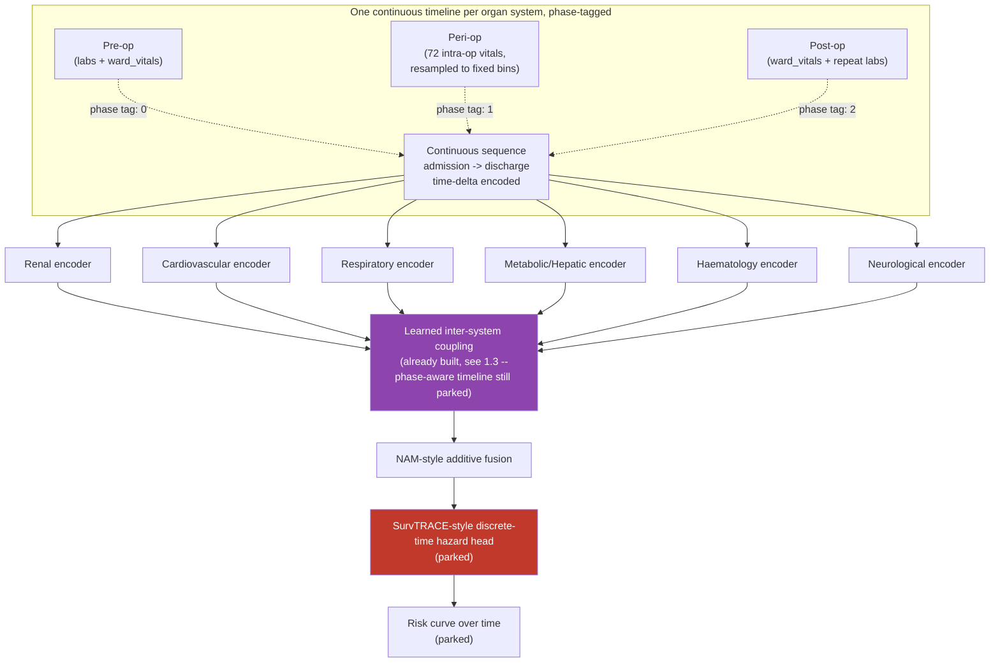

# Peri-operative Mortality Risk: Current Architecture and Work

> **This is the one doc to read for current thinking.** Renamed and restructured from
> `PACO_Net_Latest_Work_and_Results.md` — **the phase-aware/diffusion PACO-Net redesign
> covered in that doc is parked, not active work right now.** Current priority is
> strengthening and validating the existing architecture: a real SMOTE bug found and
> fixed, NEWS2 integrated as a feature with a before/after augmentation check, and a
> general learned system-correlation layer added alongside the existing hand-coded
> cardiovascular-renal link. The parked PACO-Net design is kept, in full, in §6 below —
> nothing there is lost, it's just clearly separated from what's actually in flight.

---

## 1. What's actually being worked on right now

Three concrete additions to the existing baseline architecture (§2), all built and
tested this round:

### 1.1 The SMOTE bug — found and fixed

Reproduced against the actual installed `imbalanced-learn` (0.14.2), not assumed:
`SMOTENC`'s `categorical_features` argument raises `ValueError: The truth value of an
array with more than one element is ambiguous` when given a boolean mask directly —
exactly what the existing `grouped_smotenc()` was doing. Because that error was caught
by the same bare `except ValueError` used for legitimate "stratum too small" skips,
**every stratum was silently failing this way, and grouped_smotenc generated zero
synthetic patients, on every run** — including the confirmed 0.658 AUPRC run in §7
below, which was achieved with only loss-weighting active, not SMOTE.

Fixed with integer indices (`np.where(mask)[0].tolist()`) instead of the boolean mask.
Verified end-to-end against test data: 33 real synthetic patients generated from a
500-patient test cohort where the unfixed version generated zero.

### 1.2 NEWS2 — integrated as a feature, with a before/after augmentation check

NEWS2 (Royal College of Physicians, 2017) is computed from data already collected
(respiratory rate, SpO2, oxygen use, temperature, systolic BP, heart rate,
consciousness) and merged into each patient's static feature vector **before** SMOTE
runs — so synthetic patients get a legitimately interpolated NEWS2 value, not one
computed only after the fact.

A `check_news2_before_after_augmentation()` function compares the real ("before") vs.
real+synthetic ("after") NEWS2 distribution, flags any synthetic patient with an
implausible score (outside a clinically plausible [0, 20] range), and runs a KS test.
Every NEWS2 scoring band was unit-tested against the official RCP table, including
exact boundary values (systolic BP 90 vs. 91, heart rate 130 vs. 131, temperature 39.0
vs. 39.1) — all pass.

**One flagged approximation, for clinical review:** NEWS2 normally scores consciousness
via AVPU, not directly available here — substituted with GCS=15 mapping to "Alert" and
anything below to the most severe AVPU band.

### 1.3 System correlation layer — general, learned, alongside the existing link

The existing architecture hand-codes exactly one cross-system link: cardiovascular
summary stats (mean heart rate, MAP deviation, IABP flag) fed into the renal branch,
encoding the known cardiorenal relationship. **This is kept, unchanged** — it's a real,
well-established clinical relationship, not something to discard.

Added alongside it: a general multi-head attention layer across ALL organ systems'
pooled embeddings, run after each system's own encoder and before fusion. It can
discover OTHER cross-system relationships the architecture doesn't currently encode by
hand (e.g. respiratory↔cardiovascular), and reports exactly which systems it found move
together most strongly — the artifact to check against known physiology once run on
real data.

Verified with a real forward pass on synthetic tensors: correct output shapes, sensible
top-correlation output, and — critically — confirmed the existing NAM fusion's
per-system interpretability output is still fully present and decomposable, so this
addition doesn't quietly undermine the architecture's main interpretability claim.
Toggleable via `CONFIG["USE_SYSTEM_CORRELATION_LAYER"]` for a clean ablation against the
original, correlation-layer-free architecture.

**Honest status: none of the three additions above have been run against real patient
data yet.** All three are built, and tested against synthetic/test data standing in for
the real schema. The next real step is running them on real data and checking the
results — not treating "tested" as "validated."

---

## 2. Current baseline architecture (built and tested, unchanged by this update)

- 6 organ-system transformer encoders (renal, cardiovascular, respiratory,
  metabolic/hepatic, haematology, neurological) reading real pre-op time series
- 2 diagnosis-code-derived systems (GI from ICD-10 chapter XI, MSK from chapter XIII)
- Fused via a Neural Additive Model (NAM) — one term per organ *system*, not per
  feature, which is the architecture's most defensible novelty claim
- Two-phase training: unsupervised autoencoder pre-training (label-free), then
  supervised fine-tuning on 30-day mortality
- Class imbalance handled via grouped SMOTENC (stratified by department × ASA) +
  Tomek-link cleanup, target ratio 1:10, combined with `pos_weight` loss-weighting —
  see §1.1 for the bug found in this mechanism

---

## 3. Feature mapping (current scope: pre-op labs and ward vitals only)

This is the mapping actually in use right now — six organ systems, sourced from
pre-op labs and ward vitals. (The full 123-parameter mapping including intra-op
vitals, phase tags, and SOFA-style organ-support roles for drug/device data — built for
the parked PACO-Net design — is kept in §6.2 for when that work resumes, but is **not**
part of the current active feature set.)

| Body system | Lab tests used | Vital signs used |
|---|---|---|
| Renal | BUN, calcium, chloride, creatinine, ionised calcium, phosphorus, potassium, sodium | Urine output, dialysis (CRRT) use |
| Cardiovascular | CK, CK-MB, troponin I | Heart rate, blood pressure (systolic/diastolic/mean), balloon pump (IABP) use |
| Respiratory | Base excess, bicarbonate, PaCO2, PaO2, pH, SaO2 | Inspired oxygen %, respiratory rate, SpO2, ventilator use, ECMO use |
| Metabolic/Hepatic | Albumin, ALP, ALT, AST, glucose, HbA1c, lactate, bilirubin, total protein | Body temperature |
| Haematology | aPTT, CRP, fibrinogen, haemoglobin, haematocrit, lymphocytes, platelets, INR, band cells, WBC | *(none)* |
| Neurological | *(none)* | Glasgow Coma Scale (eye, motor, verbal) |
| GI (diagnosis-derived) | ICD-10 chapter XI + General Surgery department flag | — |
| MSK (diagnosis-derived) | ICD-10 chapter XIII + Orthopaedics department flag | — |

Plus: NEWS2 (§1.2, new), HFRS frailty score (75+), an infection/fever composite flag,
operation-count/history features, and the 6-month cardiac-recovery exception (a fixed
rule, not learned).

---

## 4. Open decisions

1. Whether to re-run the confirmed §7 baseline with the SMOTE fix applied, before or
   alongside adding NEWS2/the correlation layer, to isolate which change drove any
   improvement — recommended: one change at a time, not all three at once.
2. Whether the NEWS2 AVPU-vs-GCS substitution (§1.2) is acceptable, or whether a real
   AVPU field should be sourced instead — needs clinical input.
3. Everything in §6.5 (the PACO-Net-specific open decisions) is paused along with that
   work, not currently needing a decision.

---

## 5. Novelty ledger — current work

| Idea | Grounding | Status |
|---|---|---|
| General learned cross-system correlation, alongside the existing hand-coded cardiorenal link | Closest precedent: IOC-MT (Kong et al. 2025) for general ICU organ dysfunction — not perioperative mortality specifically | 🟢 Built, unit-tested; not yet run on real data |
| NEWS2 as a model feature, integrated pre-augmentation | Royal College of Physicians NEWS2 (2017) — standard, well-established score, applied here as a feature rather than only a bedside tool | 🟢 Built, scoring bands verified exact against the official table |
| NEWS2-based before/after augmentation validation | Own design choice — a concrete plausibility check for synthetic minority patients, not previously present | 🟢 Built, tested |

---

## 6. Parked: PACO-Net phase-aware / diffusion redesign

**Not active work.** Kept in full below so nothing designed is lost, and so it can be
picked back up without re-deriving it, once the current work (§1) is validated on real
data and there's a case for expanding scope again.

### 6.1 Why this revision was proposed, in one paragraph

The original 6-organ-system architecture used ~30 features, all pre-op, because the
pipeline only had a pre-op window. PACO-Net's phase-aware design (pre/peri/post) would
remove that constraint — the 72 intra-op parameters that are currently unused would
become the **peri-op** phase's data. The full revision would map *all 123 available
parameters* to organ systems, tag each by which phase(s) it's observed in, and ground
the intra-op drug/device features (vasopressor doses, ventilator settings, anesthetic
depth) using the same organ-support logic as the SOFA score (Vincent et al. 1996).

### 6.2 Complete feature mapping, by organ system and phase (parked design)

**Legend:** Pre = pre-op (admission → surgery start) · Peri = peri-op (surgery start →
surgery end) · Post = post-op (surgery end → discharge/30-day window)

#### Renal

| Feature | Source table | Phase | SOFA-analogous role |
|---|---|---|---|
| creatinine | labs | Pre, Post | Core renal marker |
| bun | labs | Pre, Post | Core renal marker |
| sodium, potassium, chloride | labs | Pre, Post | Electrolyte/renal function |
| calcium, phosphorus, ica | labs | Pre, Post | Renal-mineral axis |
| crrt | ward_vitals | Pre, Post | Renal organ *support* (dialysis) |
| uo (urine output) | ward_vitals + vitals | Pre (rare), Peri, Post | Direct renal function signal |
| hes (hydroxyethyl starch) | vitals | Peri | Dual-tagged — volume expander with known renal toxicity |

#### Cardiovascular

| Feature | Source table | Phase | SOFA-analogous role |
|---|---|---|---|
| troponin_i, troponin_t, ck, ckmb | labs | Pre, Post | Cardiac injury markers |
| hr, nibp_sbp/dbp/mbp | ward_vitals | Pre, Post | Core hemodynamics |
| art_sbp/dbp/mbp, nibp_sbp/dbp/mbp, hr | vitals | Peri | Continuous intra-op hemodynamics |
| ci, cvp, svi | vitals | Peri | Cardiac performance/preload |
| pap_sbp/dbp/mbp | vitals | Peri | Right-heart/pulmonary pressure |
| sti, stii, stiii, stv5 | vitals | Peri | Ischemia monitoring (ST-segment) |
| dobui, dopai, mlni | vitals | Peri | Inotrope dose — organ *support* signal |
| eph, epi, epii, nepi, pepi, phe, vaso | vitals | Peri | Vasopressor dose — organ support signal |
| ntgi | vitals | Peri | Vasodilator dose — organ support (opposite direction) |
| iabp | ward_vitals | Pre, Post | Mechanical cardiac support device flag |

#### Respiratory

| Feature | Source table | Phase | SOFA-analogous role |
|---|---|---|---|
| pao2, paco2, ph, hco3, be, sao2 | labs | Pre, Post | Blood gas / respiratory function |
| spo2, rr, fio2 | ward_vitals | Pre, Post | Core respiratory monitoring |
| spo2, rr, fio2 | vitals | Peri | Continuous intra-op respiratory monitoring |
| air, o2, n2o, etco2 | vitals | Peri | Ventilation/gas exchange |
| minvol, peep, pip, pmean, pplat, vt | vitals | Peri | Ventilator settings — organ support signal |
| etdes, etgas, etiso, etsevo | vitals | Peri | Anesthetic gas concentration |
| vent, ecmo | ward_vitals | Pre, Post | Mechanical respiratory support device flag |

#### Metabolic / Hepatic

| Feature | Source table | Phase | SOFA-analogous role |
|---|---|---|---|
| glucose, hba1c | labs | Pre, Post | Metabolic control |
| albumin, alp, alt, ast, total_bilirubin, total_protein | labs | Pre, Post | Hepatic function |
| lactate | labs | Pre, Post | Perfusion/metabolic stress marker |
| bt (body temperature) | ward_vitals + vitals | Pre, Peri, Post | Thermoregulation |
| d5w, d10w, d50w | vitals | Peri | Dextrose infusion (metabolic support) |
| alb5, alb20 | vitals | Peri | Albumin infusion |

#### Haematology / Coagulation

| Feature | Source table | Phase | SOFA-analogous role |
|---|---|---|---|
| hb, hct, wbc, platelet | labs | Pre, Post | Core haematology |
| aptt, ptinr, fibrinogen, d_dimer | labs | Pre, Post | Coagulation |
| crp, lymphocyte, seg | labs | Pre, Post | Inflammatory/immune |
| ebl (estimated blood loss) | vitals | Peri | Direct haematologic stress event |
| rbc, ffp, pc, cryo, pheresis | vitals | Peri | Transfusion — organ support signal |

#### Neurological

| Feature | Source table | Phase | SOFA-analogous role |
|---|---|---|---|
| gcs_e, gcs_m, gcs_v | ward_vitals | Pre, Post | Core neuro function |
| bis (bispectral index) | vitals | Peri | Anesthesia-depth proxy for consciousness |
| cbro2 | vitals | Peri | Cerebral oxygenation |
| ppf, ppfi, mdz, ftn, sft, rfti | vitals | Peri | Sedative/opioid dose |

#### Diagnosis-derived and fluid (parked design, same as current — see §3)

GI (ICD-10 chapter XI) and MSK (ICD-10 chapter XIII) stay static/diagnosis-level. Fluid
(ns, hns, hs, psa) stays a cross-cutting static aggregate, not an organ, in the parked
design too.

### 6.3 Full list of parked architecture changes

| # | Change | Replaces | Status |
|---|---|---|---|
| 1 | Phase-aware continuous timeline with segment embeddings (pre/peri/post) | Pre-op-only fixed window | Parked |
| 2 | Peri-op resampling to fixed time bins | N/A | Parked, open decision: bin size |
| 3 | Continuous time-delta encoding across phase boundaries | Per-phase position reset | Parked |
| 4 | 72 intra-op vitals mapped via SOFA-style organ-support logic | Intra-op vitals excluded | Mapping complete, parked |
| 5 | Fluid/resuscitation as cross-cutting static feature | N/A | Same treatment as current (§3) |
| 6 | Learned graph-attention inter-organ coupling | Hand-picked renal↔cardiac link only | **Superseded — see §1.3, this is now built, just without the phase-aware timeline** |
| 7 | Diffusion model (TabDDPM) for minority generation | SMOTENC | Parked — SMOTE kept and fixed instead, see §1.1 |
| 8 | Two-stage synthetic generation (missingness + values) | SMOTENC's implicit generation | Parked |
| 9 | 6-month cardiac washout as a hard rule | N/A | Unchanged, still true in current architecture |
| 10 | SurvTRACE-style discrete-time hazard head | Flat probability output | Parked |

**Note on #6:** the system correlation layer built in §1.3 is the same underlying idea
as this parked item, decoupled from the phase-aware timeline it was originally designed
alongside. It's live now, on the existing pre-op-only architecture — the phase-aware
part specifically (items 1-3) is what's actually parked.

### 6.4 Parked architecture diagram

### 6.5 Open decisions, if/when this resumes

1. Post-op window end — fixed duration (e.g. 72h) vs. discharge date.
2. Peri-op resampling bin size — 5 minutes proposed.
3. Diffusion generation and phase completeness, if diffusion is revisited instead of
   the currently-fixed SMOTE.

---

## 7. Previous work and confirmed results (unchanged, still the reference baseline)

### 7.1 Cohort and label facts (confirmed)

- Full cohort: ~99,886 patients
- Recomputed label `died_30day_from_last_op`: **469 real deaths** — not the folder
  label's 942 (expected/correct gap, not a bug)
- Deaths are ~0.5–0.9% of the full cohort depending on label definition

### 7.2 Confirmed run results (10,942-patient downsampled cohort, pre-SMOTE-fix)

| Metric | Value |
|---|---|
| Test set | 2,189 real patients, 94 real deaths |
| AUPRC | **0.658** (primary metric at this rarity) |
| AUROC | 0.967 |
| Brier score | 0.097 |
| At best-F1 threshold | 76% of real deaths caught (71/94), 60% precision |
| Runtime | 23.4 min total (141 cells, zero errors) |

**These numbers were achieved with the SMOTE bug present (§1.1)** — only loss-weighting
was actually contributing, not SMOTE. A re-run with the fix applied, plus NEWS2 and the
correlation layer, is the natural next step, one change at a time (§4.1) so any
improvement can be attributed correctly.

**Benchmark comparison:** AUROC 0.967 (this model, 10,942 patients) vs. 0.89–0.92
(Shickel et al. 2023, 56,242 patients) — not yet a fair comparison, since cohort sizes
differ. A genuine full-cohort run is needed before this claim holds up.

### 7.3 Status

Immediate next steps: (1) re-run with the SMOTE fix alone, isolated, (2) add NEWS2 and
re-run, (3) add the correlation layer and re-run, (4) once validated at this scale, run
the true full 99,886-patient cohort. The phase-aware/diffusion PACO-Net work (§6) stays
parked until there's a case to expand scope again.
