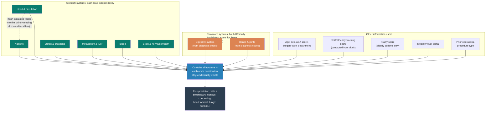
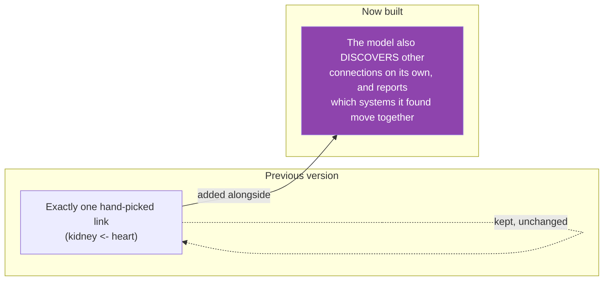

# Predicting Surgical Risk by Body System — A Plain-Language Summary

**Prepared for clinical review. No coding or machine-learning background assumed.**

---

## 1. What this project actually does, in one paragraph

We built a computer model that predicts a patient's risk of dying within 30 days of
surgery — but instead of producing one unexplained number, it reads the patient's data
**one body system at a time** (kidneys, heart, lungs, and so on), and shows you how much
each system contributed to that patient's risk. The goal is a prediction a clinician can
actually interrogate — "why does it think this patient is high-risk?" — rather than a
black box.

---

## 2. How the current model is built — the flowchart

**The key design choice, in plain terms:** each body system gets its own small reader,
and the final answer is built by *adding up* each system's opinion — not blending them
into an unreadable mush. That's what makes "why is this patient high risk" answerable.

---

## 3. Exactly what data goes into each body system

This is the literal, verified mapping from the working code — not an approximation.

| Body system | Lab tests used | Vital signs used |
|---|---|---|
| **Kidneys (renal)** | BUN, calcium, chloride, creatinine, ionised calcium, phosphorus, potassium, sodium | Urine output, dialysis (CRRT) use |
| **Heart & circulation (cardiovascular)** | CK, CK-MB, troponin I | Heart rate, blood pressure (systolic/diastolic/mean), balloon pump (IABP) use |
| **Lungs & breathing (respiratory)** | Blood gas: base excess, bicarbonate, PaCO2, PaO2, pH, SaO2 | Inspired oxygen %, respiratory rate, SpO2, ventilator use, ECMO use |
| **Metabolism & liver (metabolic/hepatic)** | Albumin, ALP, ALT, AST, glucose, HbA1c, lactate, bilirubin, total protein | Body temperature |
| **Blood (haematology)** | aPTT, CRP, fibrinogen, haemoglobin, haematocrit, lymphocytes, platelets, INR, band cells, white cell count | *(none — no dedicated blood vitals in this dataset)* |
| **Brain & nervous system (neurological)** | *(no dedicated neuro lab exists in this dataset)* | Glasgow Coma Scale (eye, motor, verbal components) |
| **Digestive (GI)** | Not lab-based — built from diagnosis codes (ICD-10 chapter XI) and whether General Surgery treated the patient | — |
| **Bones & joints (MSK)** | Not lab-based — built from diagnosis codes (ICD-10 chapter XIII) and whether Orthopaedics treated the patient | — |

**Also feeding into the model, alongside the above:**
- **NEWS2** — the standard UK early-warning score, computed directly from the vitals above
- **Frailty score (HFRS)** — a published scoring system, applied to patients aged 75+
- **Infection signal** — fever, abnormal white cell count, elevated CRP, and specific high-risk diagnosis codes, combined into one flag
- **Operation history** — how many prior operations in the same department, and — specifically for cardiac surgery — a hard rule requiring 6 months' recovery before another operation counts as a new episode
- **Procedure type (ICD-10-PCS)** — *what* operation was actually done, not just which department performed it

---

## 4. Interpretability — what's actually built, and what's parked

### What's built now: the "adding up" explanation

Every prediction can be broken down into how much each body system pushed the risk up or
down. This is not a guess bolted on afterward — it's a literal read-out of the model's
own internal calculation. If the model says a patient is high-risk, you can see whether
that's because of their kidneys, their infection markers, or several systems at once.

### New since the last version: systems that "talk" to each other

The model previously had exactly one hand-picked link between body systems (heart data
feeding into the kidney reading, reflecting a known clinical relationship). That link is
still there — it's a real, well-established relationship and we're not removing it. What's
new: the model can now also **discover other connections on its own**, across all body
systems, rather than being limited to the one link we told it about.

This has been tested end-to-end (correct outputs, and — importantly — checked that the
"which system caused this prediction" breakdown described above still works with this
addition). **It has not yet been run on real patient data** — that's the next step, and
what it actually finds should be checked against known physiology (does the kidney-heart
link still show up strongly? does anything else show up that's clinically surprising?)
before being trusted.

### Also new: an early-warning score, and a fixed data-generation bug

Two more concrete additions since the last version:

- **NEWS2** (the standard UK early-warning score used in hospitals) is now computed from
  the vitals already listed in §3 and included as a feature, with a before/after check
  whenever synthetic patient data is generated (see §6) to make sure the added data still
  looks clinically plausible.
- A real bug in how synthetic minority (died) patients were generated was found and
  fixed — see §6 for what this means for the existing 0.658/0.967 numbers below.

### Parked for now: a risk curve over time

An earlier proposal (internally called PACO-Net) looked at showing risk as a curve over
time — before, during, and after surgery — rather than one pre-op number, using the
richer during-surgery monitoring data. **This is not active work right now.** It's
designed and grounded in real research, but the current priority is strengthening and
validating the existing pre-op model (the correlation layer, NEWS2, and the SMOTE fix
above) rather than expanding scope. Worth revisiting once the current work is validated
on real data — flagging here so it isn't confused with what's actually being worked on.

---

## 5. How this compares to existing approaches — is it actually new?

| What we're doing | Closest published comparison | The real difference |
|---|---|---|
| Combining body-system predictions by literally adding them up, so each system's contribution is exact and readable | A 2021 study of ~60,000 surgical patients used a similar "adding up" approach, but per individual lab value, not per body system | We decompose by *whole body system* (each one a small model reading many readings over time), not by single numbers |
| Two body systems (digestive, bones/joints) built from diagnosis codes instead of lab data, in the same framework as the six lab-based systems | A 2025 ICU study linked six body systems together, but all six had real continuous monitoring data | No comparable study mixes "systems with real readings" and "systems built from diagnosis codes" in one unified model |
| Keeping some medical knowledge as a fixed rule (the 6-month cardiac recovery rule) rather than making the model learn everything | Not discussed as a deliberate approach in the studies we reviewed — most either hard-code everything or learn everything | A stated, reasoned choice: some things (like a known clinical protocol) don't need to be "discovered," and shouldn't be left for the model to guess at with limited data |

**An honest caveat, stated plainly:** this comparison is based on a targeted search of
relevant published work, not an exhaustive systematic review. Treat it as good evidence
this is a real, distinctive approach — not as a guaranteed, independently verified claim
of novelty.

---

## 6. What's working — real results, real numbers

- Tested on **10,942 real patients** (a large working subset; not yet the full ~99,886-patient
  cohort)
- **AUPRC 0.658** — the metric that matters when an outcome is rare (deaths are ~4% of
  patients here). In plain terms: when the model flags someone as high-risk, it's right
  roughly 6-7 times out of 10
- **Catches 76% of real deaths** in the group of patients it was tested on
- **Every clinical sanity-check came back correct**: higher surgical-risk score (ASA)
  reliably meant higher death rate; cardiac surgery patients showed meaningfully higher
  risk than general surgery — the underlying data behaves the way real clinical experience
  says it should

**Important caveat on the numbers above:** a real bug was found in how synthetic
minority (died) patient data was being generated — it was silently generating none at
all, meaning the 0.658/0.967 numbers above were achieved without that mechanism
actually contributing anything. The bug is now fixed. This means the numbers above could
plausibly improve once re-run with the fix — but that hasn't been confirmed yet, so treat
0.658/0.967 as the current honest baseline, not a floor guaranteed to be beaten.

---

## 7. Limitations — stated plainly, not buried

- **Not yet run on the full patient cohort** — current results are from a large working
  subset (10,942 of ~99,886 patients), not the complete dataset
- **Single hospital system, no external validation** — this hasn't yet been tested on data
  from a different hospital or population, which any real clinical use would require
- **Not yet compared against a simple model** — a straightforward statistical model on the
  same data hasn't yet been benchmarked against this one, which is a necessary check before
  claiming the added complexity is worth it
- **The consciousness component of NEWS2 is approximated**, not a true bedside assessment —
  it's estimated from Glasgow Coma Scale readings already in the data, not the real ACVPU
  check a nurse would perform
- **The system-correlation addition (§4) has been built and tested mechanically, but not
  yet run on real patient data** — what it actually finds needs a clinical sanity check
  once it is
- **The synthetic-data bug fix (§6) has not yet been re-run against real data** — the fix
  is in place, but whether it actually changes the 0.658/0.967 numbers hasn't been confirmed
- **The risk-curve idea (§4, "parked") is a designed proposal, not active work** — grounded
  in real research, but not the current priority and not built
