# EDA Findings — Full Dataset (99,886 patients)

> Companion page to `inspire_eda.ipynb`. Every figure below is from the full-cohort run
> — **99,886 patients, all 942 recorded deaths, loaded in 505 seconds**. Each section
> explains what the graph shows, how to read it, what we actually found, and why it
> matters — written so it's useful even if you haven't opened the notebook. Technical
> detail behind each section lives in `notes.md`.
>
> **One idea comes up constantly below, so it's worth stating once, clearly:** every
> chart that involves "died" now shows it **two ways** — died within 30 days of surgery
> (**469 patients**, the strict definition in `notes.md` §4) and died at any point ever
> recorded in the dataset (**942 patients**, all-cause). These are not two different
> groups — the 469 are a subset of the 942. They're shown together everywhere so you can
> see whether a pattern holds under both definitions, or only shows up under one.

---

## 1. How many patients died?

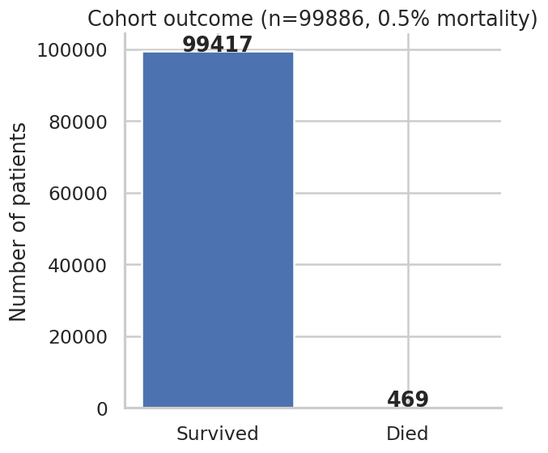

**What you're looking at:** three bars — everyone who survived, everyone who died at any
point (all-cause), and everyone who died specifically within 30 days of surgery.

**What we found:**

| | Count | Rate | pos_weight |
|---|---|---|---|
| Survived | 98,944 | — | — |
| Died (all-cause) | 942 | 0.94% | 105.04 |
| Died (≤30 days) | 469 | 0.47% | 210.97 |

**Why it matters:** this is the single most important number in the whole project. A
model that guesses "survived" for every single patient would already be 99.5% "accurate"
under the 30-day definition — and still be completely useless. Every downstream choice
(the `pos_weight` in the loss function, using AUPRC instead of AUROC, how you split
train/test) exists specifically because of this number.

**Next step:** decide which definition (469 or 942) the model should actually target —
see the flag at the very end of this document, it's the single open decision blocking
several other next steps.

---

## 1b. Comparing the two death definitions directly

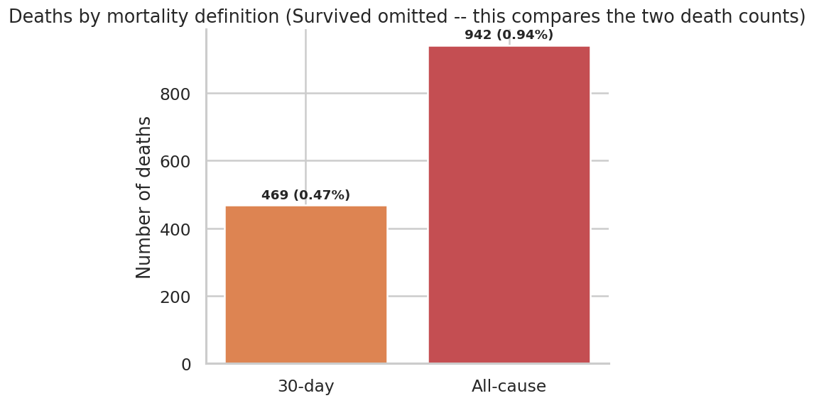

**What you're looking at:** just the two death counts, side by side, with Survived
removed — this chart exists purely to compare 469 against 942, not to show the whole
cohort.

**What we found:** `docs/notes.md` has documented "942 deaths" throughout the project so
far. That number is real, but it's **all-cause**, not 30-day. Digging into *why* they
differ turned up something important: **473 patients are labeled "died" in the dataset's
own folder structure, but did not die within 30 days of their last operation** — some
died months later, of causes that may have nothing to do with the surgery.

**Why it matters:** if the training pipeline currently trusts the folder name as the
ground-truth label (it does, per `notes.md` §7), then **half of the "died" class the
model is being trained on is arguably mislabeled** relative to the 30-day definition the
project has always said it's predicting.

**Next step:** this is the highest-priority fix in the whole project right now — see
the note at the bottom of this document.

---

## 2. Who tends to die: age, ASA class, and sex

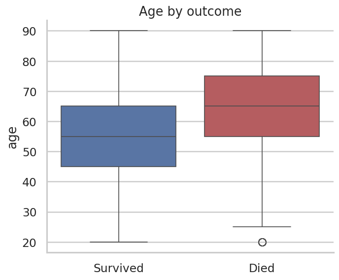
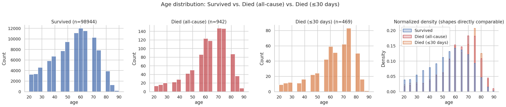
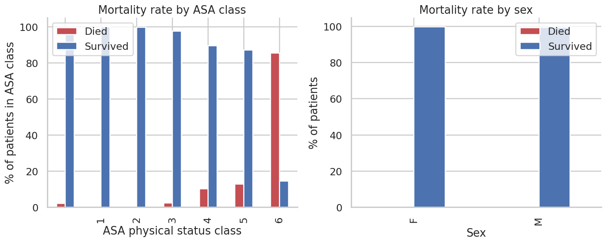

**What you're looking at:**
- The boxplot compares the age *range* for survivors vs. everyone who died.
- The 4-panel chart shows the full age *shape* for three groups separately (Survived,
  Died all-cause, Died ≤30 days), plus all three overlaid as normalized curves so their
  shapes are directly comparable regardless of how many patients are in each group.
- The ASA/sex chart shows mortality *rate* (not raw counts) by ASA class and by sex,
  computed both ways (all-cause and 30-day) — four small charts in total.

**What we found:**
- **Median age: 55 for survivors, 65 for both death groups.** A clear, consistent
  10-year gap — and notably, the 30-day and all-cause death groups have the *same*
  median age, so age alone doesn't distinguish an acute peri-operative death from a
  death that happens months later for unrelated reasons.
- **ASA class climbs the way it should clinically** — mortality rate increases steadily
  from ASA 1 (healthiest) through ASA 6 (near-certain death), under both definitions.
- **Sex shows a real, moderate difference**: male patients have a noticeably higher
  mortality rate than female patients, under both definitions. (This chart used to be
  broken — see the callout below.)

**Why it matters:** age and ASA class behaving exactly as clinical intuition predicts is
a strong sanity check that the labels and data are trustworthy. If they *didn't* show
this pattern, that would be a red flag about the data itself, not a discovery.

> **A fix worth knowing about:** the sex chart previously plotted Survived% and Died%
> stacked on the same 0–100 scale. Since the death rate is under 1%, the "Died" bar was
> visually zero height — not because there was no signal, just because the chart made it
> invisible. It's now plotted as a direct mortality-rate bar per sex, which is why the
> difference is visible at all.

**Next step:** none needed — this section is a validation check, not an open question.

---

## 3. Which surgical departments have the highest death rates

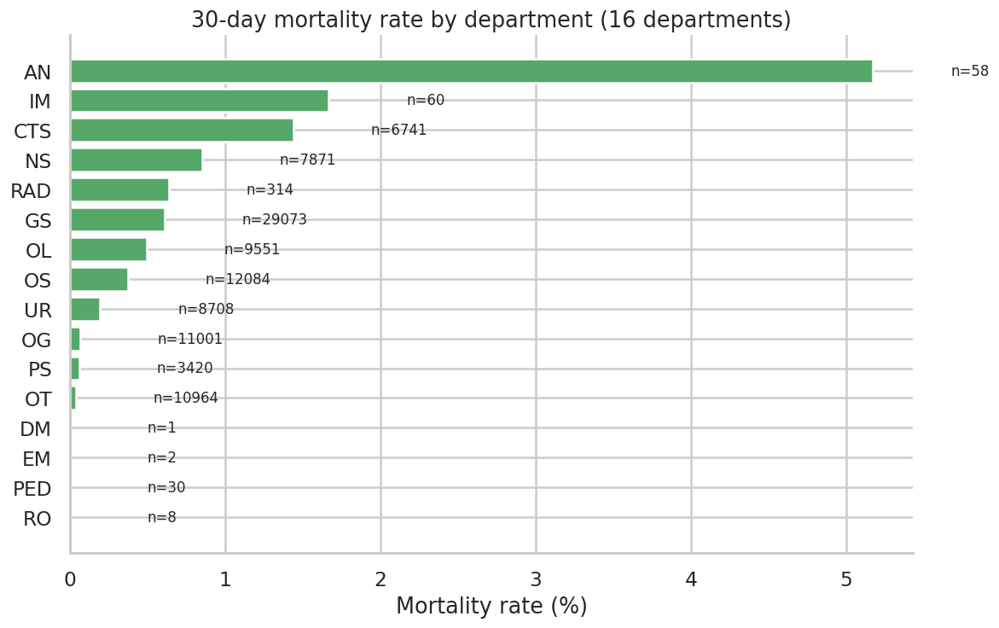
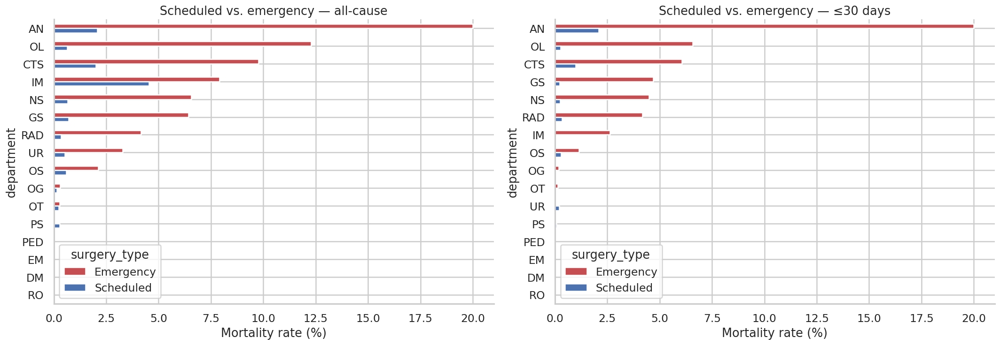

**What you're looking at:** every department's mortality rate, sorted highest to lowest,
shown both ways (all-cause / 30-day) side by side. The second chart breaks each
department further into scheduled vs. emergency surgery.

**What we found (30-day definition):**

| Department | Mortality rate | Patients |
|---|---|---|
| AN (Anaesthesia) | 5.17% | 58 |
| IM (Internal Medicine) | 1.67% | 60 |
| CTS (Cardiothoracic Surgery) | 1.44% | 6,741 |
| NS (Neurosurgery) | 0.85% | 7,871 |
| GS (General Surgery) | 0.61% | 29,073 |
| OL | 0.49% | 9,551 |
| OS | 0.37% | 12,084 |
| UR (Urology) | 0.20% | 8,708 |
| OG, PS, OT, DM, EM, PED, RO | 0.00–0.06% | — |

**Why it matters:** department carries real signal, but it's probably a *stand-in* for
something else — which departments handle the sickest, highest-risk operations — rather
than a direct cause. The scheduled/emergency breakdown is how you test that: if a
department only looks risky because it does more emergency work, that's a different
finding than the department itself being inherently dangerous.

**Next step:** this is exactly the analysis your current research focus (ICD-10 +
department interpretability) needs — cross-reference this table against the ICD-10
findings below to see how much department risk is actually diagnosis/procedure risk in
disguise.

---

## 4. Which diagnoses (ICD-10 codes) predict death

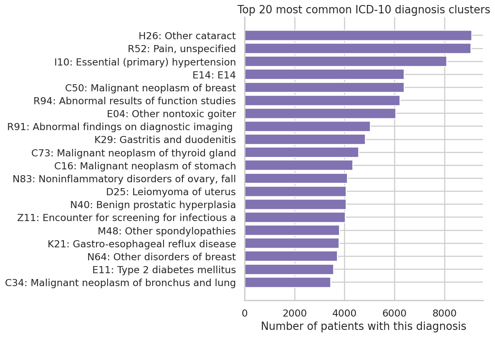
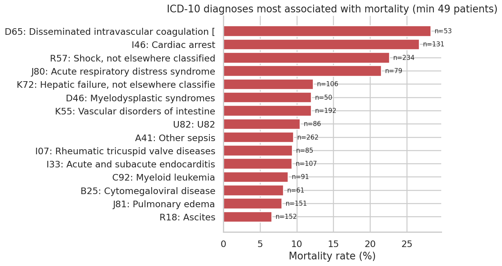
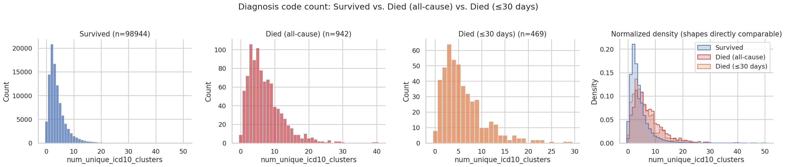

**What you're looking at:** the first chart shows the *most common* diagnoses in the
cohort (says nothing about risk by itself). The second shows which diagnoses have the
*highest death rate* among patients who have them (filtered to codes with at least 49
patients, so a single unlucky patient can't fake a "100% mortality" code). The third
shows how many distinct diagnosis codes each patient has, compared across the three
outcome groups.

**What we found:** the diagnoses most strongly linked to death are all **acute
deterioration events**, not long-standing chronic conditions:

| ICD-10 | Meaning | Mortality rate | Patients |
|---|---|---|---|
| D65 | Disseminated intravascular coagulation | 28.3% | 53 |
| I46 | Cardiac arrest | 26.7% | 131 |
| R57 | Shock | 22.6% | 234 |
| J80 | Acute respiratory distress syndrome | 21.5% | 79 |
| K72 | Hepatic failure | 12.3% | 106 |
| A41 | Other sepsis | 9.5% | 262 |

Patients who died had noticeably more diagnosis codes on average than survivors:
**survivors averaged 4.0 codes; all-cause deaths averaged 7.2; 30-day deaths averaged
6.0.** Interestingly, the all-cause death group has *more* codes on average than the
30-day group — plausible explanation: patients who survive longer before eventually
dying have more time to accumulate additional diagnoses in the record.

**Why it matters:** this makes strong clinical sense — it's acute crises, not
pre-existing background conditions, that drive peri-operative death. It also means a
simple *count* of how many diagnoses a patient has already carries real signal, before
you even look at which specific codes they are.

**Next step:** directly feeds your current research priority. These 6 codes (plus the
9 more visible in the chart) are strong starting candidates for either explicit
"high-risk diagnosis" features, or for validating the organ-system groupings once that
work starts.

---

## 5. Which types of operations are riskiest

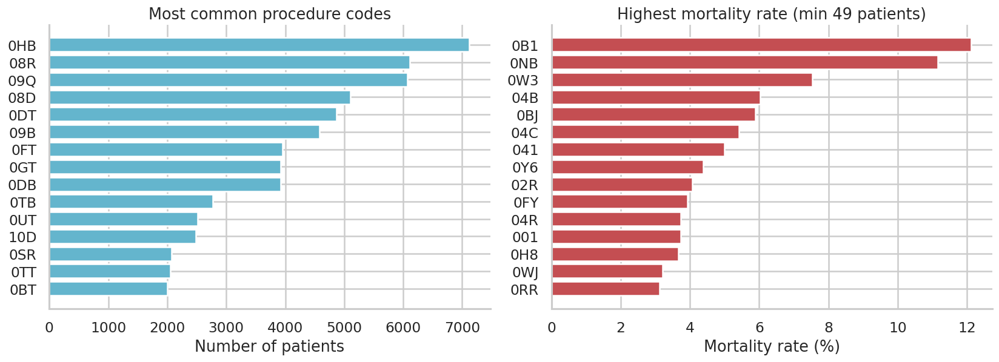

**What you're looking at:** the most common procedure codes (`icd10_pcs` — what was
*done*, distinct from diagnosis codes which describe what was *wrong*), each with its
patient count and death rate.

**What we found:** procedure risk varies a lot even among common procedures. Code `0HB`
(7,119 patients) sits at a low 0.15% mortality, while code `0TT` (2,049 patients) sits
at **1.95%** — roughly 13x higher, despite being performed on a comparably large number
of patients (so it's not just small-sample noise).

**Why it matters:** diagnosis codes describe how sick the patient already was;
procedure codes describe how risky the intervention itself is. These are genuinely
different signals. Keeping them as separate features (rather than merging into one
"severity" number) means a future model can learn both independently.

**Next step:** worth pulling the actual procedure descriptions for the highest-risk
codes (0TT, 0FT, 0DT) to sanity-check them clinically, the way we did for the diagnosis
codes above — currently these are just codes, not readable descriptions.

---

## 6. Do we actually have the data we need?

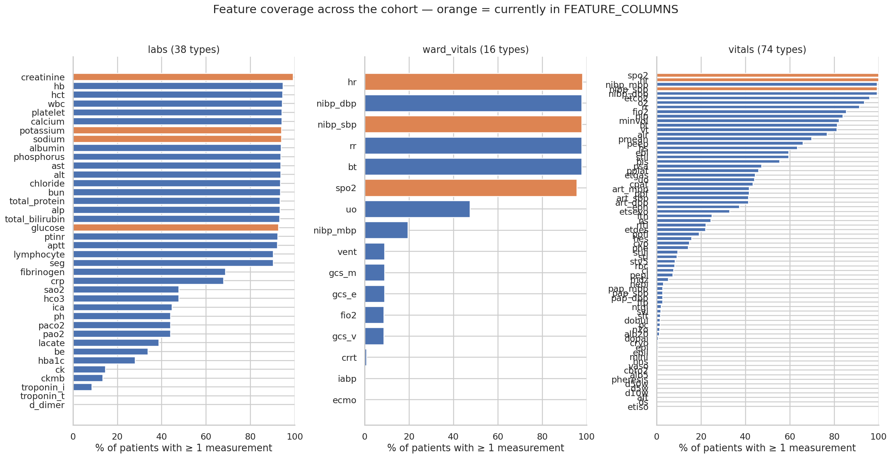

**What you're looking at:** for every lab, ward vital, and intra-operative vital in the
dataset, what percentage of the 99,886 patients have at least one measurement of it.

**What we found:** coverage is excellent across the board. The top labs are measured in
**92–99% of all patients**:

| Feature | Coverage |
|---|---|
| creatinine | 99.3% |
| hb, hct | ~94.6% |
| wbc, platelet | ~94.3% |
| calcium, potassium, sodium | ~94.1% |
| albumin | 93.9% |

All 38 documented labs and all 16 documented ward vitals were found. The intra-operative
`vitals` table came back with **74 distinct types** — 2 more than the 72 documented in
`notes.md` §11. Worth a quick reconciliation (likely just two rarely-used codes that
weren't in the earlier smaller sample), but not a major discrepancy.

**Why it matters:** this directly answers "do we have enough real data to expand past
the current 7 features?" — yes, comfortably. Coverage was the main open question blocking
`notes.md` §15 item 5, and it's now resolved in the positive.

**Next step:** this unblocks the organ-system feature expansion work. With this
confirmed, the next step is deciding the pre-op-vs-peri-op scope question (`notes.md`
§4), since that determines whether the 74 intra-op vitals are in scope too.

---

## 7. Where are the gaps

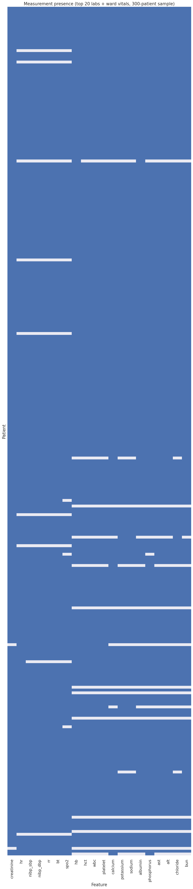

**What you're looking at:** a sampled grid (300 patients, evenly split between outcomes
so both are visible) — each row is a patient, each column a feature, blue means "this
patient has at least one measurement of this feature," grey means "completely missing
for this patient."

**What we found:** mostly blue, as expected given the coverage numbers above, but with
visible patchiness — some patients (rows) are much sparser than others, and a couple of
features show more grey than the rest.

**Why it matters:** the pipeline currently fills every gap with linear interpolation.
This chart shows roughly how often it's doing that, and for which specific
features/patients it's doing the *most* guessing rather than working with real
measurements — a vertical grey stripe flags a feature worth reconsidering; a horizontal
grey stripe flags a patient who's a candidate for the `min_observations` filter already
in the pipeline.

**Next step:** this is the audit step for `notes.md` §15 item 7 (missing data handling)
— the next task there is deciding whether the current approach (plain linear
interpolation) is good enough, or whether model-based imputation is worth building for
the sparsest features/patients this chart highlights.

---

## 8. Do the 7 currently-used features actually separate survivors from deaths?

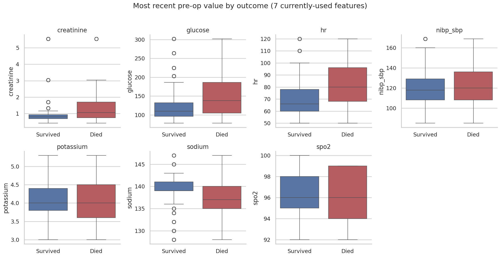

**What you're looking at:** box plots for each of the 7 features the model currently
uses (glucose, potassium, sodium, creatinine, heart rate, oxygen saturation, blood
pressure), comparing the most recent pre-op value between patients who died and patients
who survived.

**What we found:** visible separation between the two boxes for most of the 7 features
— exactly what you'd want to see if these are genuinely useful model inputs, not noise.

**Why it matters:** this is a direct check on the model's actual current inputs, not
just "interesting data exploration" — it answers "is the model's existing feature set
actually earning its place?"

**Next step:** any feature here with little to no visible separation between the two
boxes is a candidate to reconsider or replace once the organ-system expansion happens.

---

## 9. Are any of the features redundant with each other?

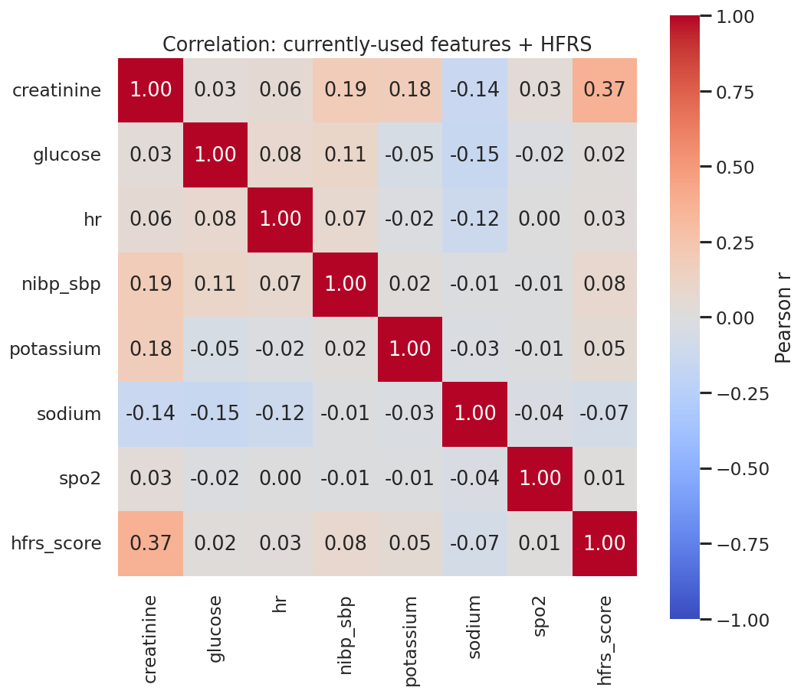

**What you're looking at:** a correlation matrix across the 7 current features plus the
HFRS frailty score — darker/more saturated cells mean two features move together more
strongly.

**What we found:** most pairs show fairly low correlation (as expected for physiological
measurements from different organ systems), with the HFRS row/column showing how
strongly frailty tracks each individual lab value.

**Why it matters:** any pair with |r| > 0.7 is a redundancy candidate — feeding a model
the same information twice under two different names doesn't help it and can actually
hurt training. This also directly tests whether HFRS is carrying genuinely new
information or whether it's just a repackaging of something already in the lab values
(e.g. the sodium/albumin correlations already noted in `INSPIRE_Project_Notes.md` §11).

**Next step:** if any pair here shows |r| > 0.7, decide whether to drop one, or combine
them, before adding more features to the pipeline — better to catch redundancy now than
after expanding to the full feature set.

---

## 10. The frailty score (HFRS)

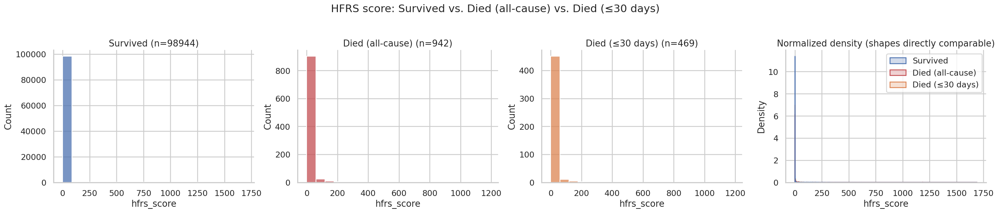
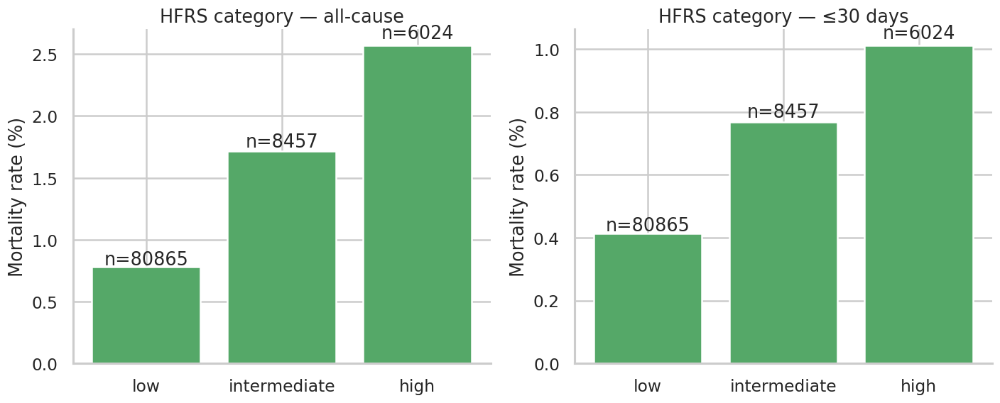

**What you're looking at:** the first chart shows the HFRS score distribution split
across Survived / Died (all-cause) / Died (≤30 days). The second shows mortality rate
for each of HFRS's three official risk tiers (low / intermediate / high), computed both
ways.

**What we found:** the died groups skew toward higher HFRS scores than survivors, and
mortality rate increases across the low → intermediate → high categories, in the
direction you'd expect.

**Why it matters:** this tests whether a single frailty number, built purely from a
patient's diagnosis history, predicts death on its own — a much cheaper signal than the
full lab/vitals time series if it holds up.

> **Caveat worth repeating:** the current HFRS implementation counts a patient's entire
> diagnosis history with no time limit, rather than the published 2-year window from
> Gilbert et al. 2018 (see `notes.md` §15 item 9). Treat these specific numbers as
> preliminary until that's fixed — an unbounded lookback will inflate scores for
> patients with long INSPIRE histories.

**Next step:** implement the 2-year window fix, then re-run this exact cell to see how
much the numbers shift — that's the direct test of how much the current caveat matters.

---

## 11. Does frailty matter more for emergency surgery?

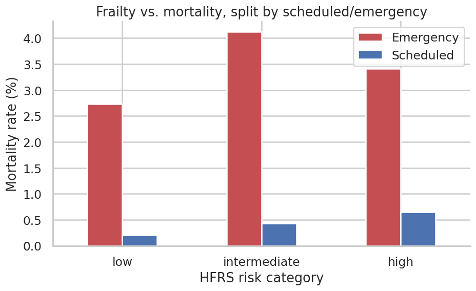

**What you're looking at:** mortality rate by HFRS category, with scheduled and
emergency surgery plotted as two separate lines.

**What we found:** worth reading directly off the chart — the hypothesis specifically
predicts the emergency line should rise more steeply across HFRS categories than the
scheduled line.

**Why it matters:** the reasoning (`notes.md` §15 item 10) is that a surgeon who
schedules an operation has already, informally, screened the patient for fitness — so
frailty should carry less extra information for scheduled surgery. For emergency
surgery, no such screening happens, so frailty should matter much more. This chart is
the direct visual test of that idea.

**Next step:** if the pattern holds, this becomes a real, citable finding for the paper.
If it doesn't clearly separate, that's still useful — it means the conditional-
independence hypothesis needs a more careful statistical test (not just a visual one)
before it goes in the paper.

---

## 12. Does having multiple operations increase risk?

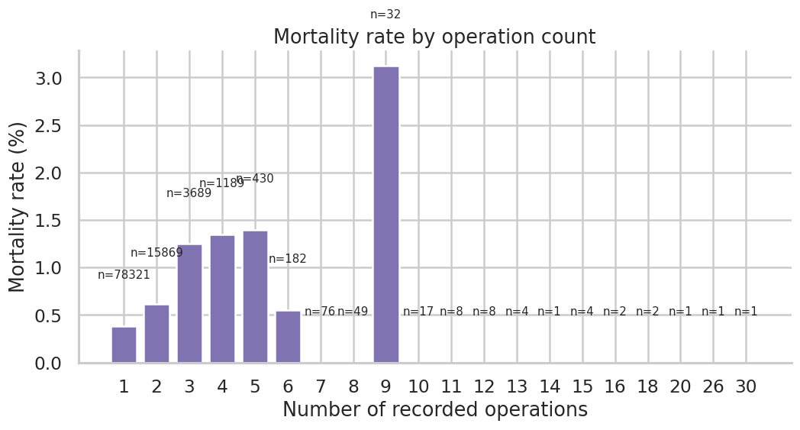

**What you're looking at:** mortality rate plotted against the number of operations a
patient has recorded (1, 2, 3, etc.).

**What we found:** worth reading directly off the chart for the exact shape — watch
specifically for whether it climbs steadily with operation count, or stays flat/noisy.

**Why it matters:** this is a patient-level question, not an operation-level one — it
asks whether a patient who's had several operations is inherently higher-risk as a
person, separate from the risk of any single operation the current pipeline predicts.

**Next step:** categories with very few patients (e.g. patients with 5+ operations) will
be noisy — treat any pattern there cautiously until the numbers are larger.

---

## 13. What the raw data actually looks like over time

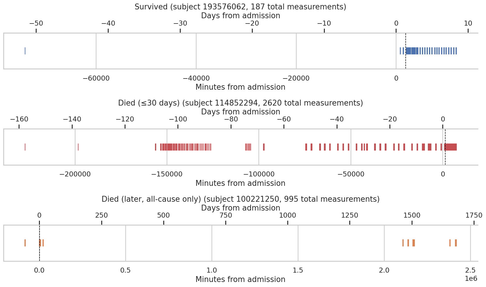

**What you're looking at:** three real patients — one survivor, one who died within 30
days, one who died later — each shown as a timeline of every single measurement taken,
with a dashed line marking the moment surgery started. Each panel now has **two x-axes**:
minutes from admission (bottom, matches the raw data) and days from admission (top, much
easier to read at a glance).

**What we found:** monitoring density and timing vary a lot between the three examples —
some patients have long gaps in measurement, especially before or long after surgery.

**Why it matters:** this is the most literal, ground-truth view of what the model
actually sees. Every gap in these timelines is a place where `align_time_series()`
(`notes.md` §8) has to guess via linear interpolation rather than use a real
measurement — and the gaps right before surgery matter most, since that's the exact
window the model uses to make its prediction.

**Next step:** worth looking at a few more examples like this, specifically for patients
flagged as sparse in Section 7's missingness heatmap, to see what "sparse" actually
looks like on a real timeline.

---

## Summary and highest-priority next steps

The dataset behaves the way real clinical data should — older and sicker (higher ASA)
patients die more often, specific diagnoses and departments carry strong, clinically
coherent signal, and coverage is strong enough to support expanding well beyond the
current 7 features.

**Two things need a decision before going further:**

1. **Which mortality definition is correct — 469 (30-day) or 942 (all-cause)?** This
   isn't just a labeling detail. It changes the class-imbalance ratio (`pos_weight` 105
   vs. 211), and 473 patients are literally in the opposite class depending on which
   definition is used. Recommend resolving this first, before any further model training.
2. **Fix the label source in `load_real_subjects()`** once definition #1 is decided —
   right now it trusts folder names, which encode the all-cause definition regardless of
   which one the project intends to predict.

Everything else in this document — the ICD-10/department interpretability work, the
organ-system feature expansion, the HFRS 2-year-window fix — can proceed in parallel,
but the two items above are the ones actually blocking a trustworthy full-scale model
run. See `notes.md` §15 for the complete, prioritised research roadmap this feeds into.
