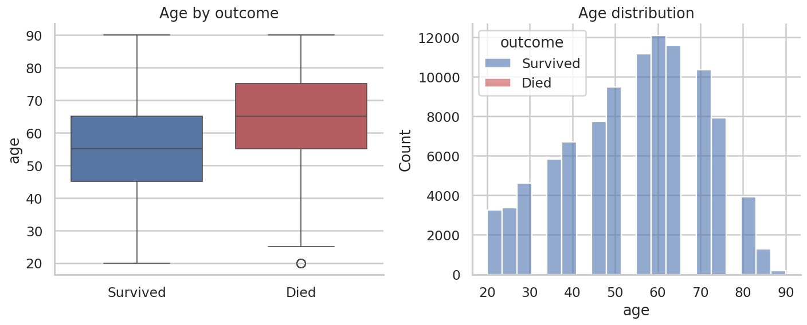
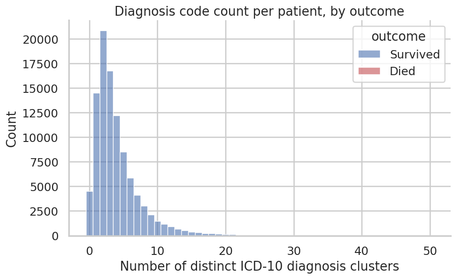
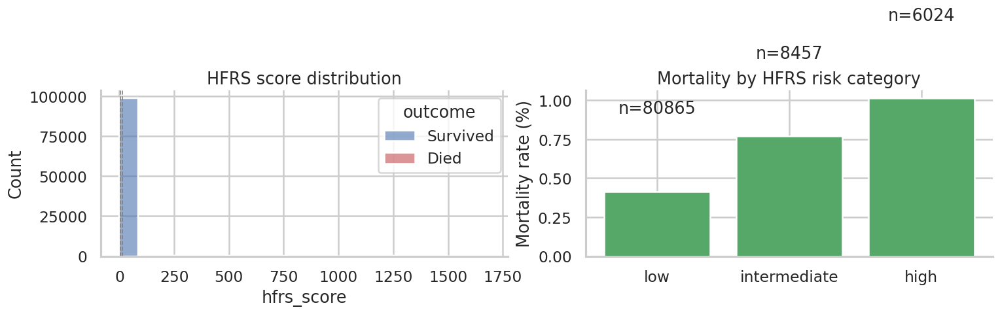

# EDA Findings — Full Dataset (99,886 patients)

> Companion page to `inspire_eda.ipynb`. Every figure below is from the full-cohort run
> (99,886 patients, `died_30day` definition). Each plot is followed by what it shows and
> why it matters, in plain language — see `notes.md` for the technical detail behind
> each section.

---

## 1. How many patients died?

Out of 99,886 patients, only **469 died within 30 days (0.47%)** — roughly 1 death for
every 212 survivors.

**Why it matters:** this is the single most important number in the project. It's why
everything downstream has to be handled carefully — a model that guesses "survived" for
every patient would already be 99.5% "accurate" while being useless. This number drives
the `pos_weight` setting used in training.

> **Note:** `docs/notes.md` documents "942 deaths" throughout — that figure counts *any*
> death ever recorded, with no 30-day window. See `notes.md` §1b for the two definitions
> compared directly; this page uses the 30-day definition throughout.

---

## 2. Who tends to die: age, sex, ASA class

Patients who died were noticeably older — **median age 65 vs. 55** for survivors, a
10-year gap. ASA class (a 1–5 clinical severity scale doctors already use, where 5 means
"critically ill regardless of surgery") should show mortality climbing as the class
number climbs.

**Why it matters:** this is a sanity check, not a discovery. If older or sicker patients
weren't dying more often, that would point to a problem with the data or the labels.
Since they are, the dataset is behaving the way real clinical data should.

---

## 3. Which surgical departments have the highest death rates

| Department | Mortality rate | Patients |
|---|---|---|
| AN (Anaesthesia) | 5.17% | 58 |
| IM (Internal Medicine) | 1.67% | 60 |
| CTS (Cardiothoracic Surgery) | 1.44% | 6,741 |
| NS (Neurosurgery) | 0.85% | 7,871 |
| GS (General Surgery) | 0.61% | 29,073 |
| OL | 0.49% | 9,551 |
| OS | 0.37% | 12,084 |
| UR (Urology) | 0.20% | 8,708 |
| OG, PS, OT, DM, EM, PED, RO | 0.00–0.06% | — |

**Why it matters:** department carries real signal, but it's likely a *stand-in* for
something else — which departments handle the sickest, highest-risk operations — rather
than a cause on its own. The second plot (split by emergency vs. scheduled) tests this:
a department can look risky purely because it does more emergency work, which is itself
risky regardless of department.

---

## 4. Which diagnoses (ICD-10 codes) predict death

The diagnoses most associated with death are all acute deterioration events, not
chronic background conditions:

| ICD-10 | Meaning | Mortality rate |
|---|---|---|
| D65 | Disseminated intravascular coagulation | 28.3% |
| I46 | Cardiac arrest | 26.7% |
| R57 | Shock | 22.6% |
| J80 | Acute respiratory distress syndrome | 21.5% |
| K72 | Hepatic failure | 12.3% |
| A41 | Other sepsis | 9.5% |

Patients who died also had more diagnosis codes on average (**mean 6.05**) than
survivors (**mean 4.03**).

**Why it matters:** this makes strong clinical sense — it's acute crises, not pre-existing
conditions, that drive peri-operative death. It also means a simple *count* of how many
diagnoses a patient has already carries signal, before even looking at which ones.

---

## 5. Which types of operations are riskiest

Some procedures done thousands of times are very safe (under 0.2% mortality, e.g. code
`0HB` at 7,119 patients / 0.15%); others carry much higher risk even at similar volume
(e.g. `0TT` at 2,049 patients / **1.95%** mortality — the highest rate among the common
codes).

**Why it matters:** diagnosis codes describe how sick the patient already was; procedure
codes describe how risky the intervention itself is. Keeping these separate (rather than
merging them) lets a model eventually learn both signals independently — see `notes.md`
§15 item 2.

---

## 6. Do we actually have the data we need?

Coverage across the full cohort is excellent — nearly every lab is measured in
**92–99% of patients**:

| Feature | Coverage |
|---|---|
| creatinine | 99.3% |
| hb, hct | ~94.6% |
| wbc, platelet | ~94.3% |
| calcium, potassium, sodium | ~94.1% |
| albumin | 93.9% |

`vitals` (intra-op) came back with 74 distinct types recorded — 2 more than the 72
documented in `notes.md` §11, worth a quick reconciliation but not a major discrepancy.

**Why it matters:** this answers "do we even have enough real data to expand beyond the
current 7 features?" — yes, comfortably. This directly unblocks `notes.md` §15 item 5.

---

## 7. Where are the gaps

A sampled view (300 patients, stratified by outcome) of which measurements are present
(blue) vs. missing (grey) for the highest-coverage labs and ward vitals.

**Why it matters:** the pipeline currently fills gaps by linear interpolation. This shows
how often it actually has to do that, and for which features it's doing the most
guessing — vertical grey stripes flag a feature worth reconsidering; horizontal grey
stripes flag sparse patients (candidates for the `min_observations` filter).

---

## 8. Do the 7 currently-used features actually separate survivors from deaths

Box plots for glucose, potassium, sodium, creatinine, heart rate, oxygen saturation, and
blood pressure, comparing died vs. survived.

**Why it matters:** this checks the model's actual inputs directly — do these values
really look different between the two groups? A feature with no visible difference
between boxes isn't pulling its weight.

---

## 9. Are any of the features redundant with each other

A correlation matrix across the 7 current features plus the HFRS frailty score.

**Why it matters:** pairs with |r| > 0.7 are redundancy candidates — feeding the model
the same information twice under two different names. This also shows whether HFRS
tracks any single lab value closely enough to be redundant with it, or whether it
carries independent signal.

---

## 10. The frailty score (HFRS)

HFRS score distribution and mortality rate by risk category (low / intermediate / high).

**Why it matters:** tests whether a single frailty number, built purely from diagnosis
history, predicts death on its own. **Caveat:** the current implementation counts a
patient's entire diagnosis history rather than the published 2-year window — see
`notes.md` §15 item 9. Treat these numbers as preliminary until that's fixed.

---

## 11. Does frailty matter more for emergency surgery

Mortality rate by HFRS category, split into scheduled vs. emergency surgery lines.

**Why it matters:** the hypothesis (`notes.md` §15 item 10) is that a surgeon who
schedules an operation has already screened for fitness, so frailty should matter less
for scheduled surgery and much more for emergency surgery, where no such screening
happens. This plot is a direct visual test — look for the emergency line rising more
steeply than the scheduled line.

---

## 12. Does having multiple operations increase risk

Mortality rate by number of recorded operations per patient.

**Why it matters:** tests whether a patient who's had several operations is inherently
higher-risk than a single-operation patient — a patient-level question, distinct from
predicting risk for any one operation (`notes.md` §15 item 11).

---

## 13. What the raw data actually looks like over time

For one patient who died and one who survived: every timestamp a measurement was taken,
with a dashed line marking surgery start.

**Why it matters:** this is the most literal view of what the model actually sees —
how densely a patient is monitored, and how large the gaps are right before surgery,
which is exactly where the model most needs good data and where interpolation is doing
the most guessing.

---

## Summary

The dataset behaves the way real clinical data should (older/sicker patients die more),
specific diagnoses and departments carry strong, clinically coherent signal, coverage is
strong enough to support expanding well beyond the current 7 features, and one
definitional question — 469 (30-day) vs. 942 (all-cause) deaths — still needs a decision
before these numbers can be treated as final. See `notes.md` §15 for the full research
roadmap this feeds into.
