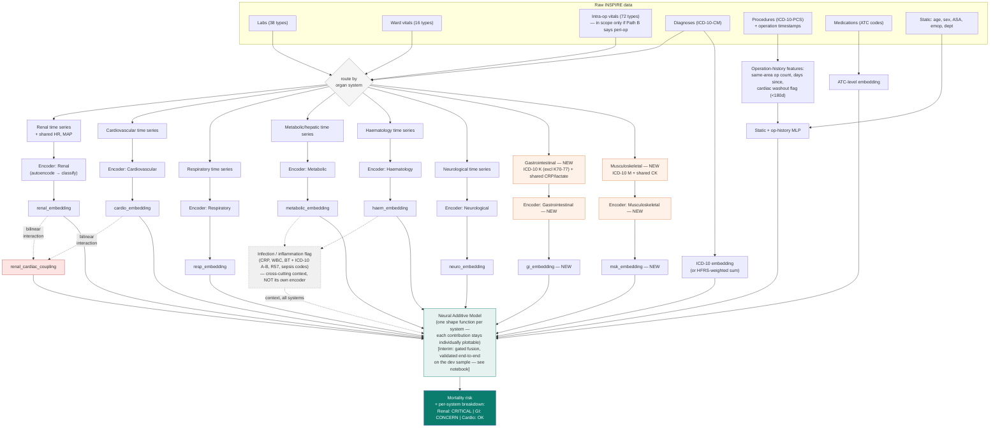

# Section 4 — REFINED: Target architecture — system-separated encoders

> **Status of this refinement vs. the current `roadmap_and_architecture.md` §4:** the
> underlying 126-parameter count (38 labs + 16 ward vitals + 72 intra-op vitals) is
> unchanged and re-verified below. What's refined: **two systems added** (Gastrointestinal,
> Musculoskeletal, per the meeting), the **infection/inflammation open question is
> resolved** (was flagged as "doesn't currently have a clean home" — now a cross-cutting
> flag, not a 7th/9th system, with the reasoning stated), a **cross-mapped-features**
> column added since several parameters now feed more than one system deliberately (not
> as an oversight), an explicit **renal↔cardiovascular coupling** node, and the
> **static/joint branch expanded** with the new operation-history and cardiac-washout
> features. Drop this section in to replace the current §4.1–§4.2 wholesale.

## 4.1 Organ-system feature grouping (126 parameters total — verified unchanged)

38 labs + 16 ward vitals + 72 intra-op vitals = 126, re-counted directly against the
dataset schema and cross-checked against the 30-patient sample (all 36 of the 38 labs and
all 16 of the 16 ward vitals were observed at least once in the sample; only `d_dimer` and
`troponin_t` never appeared, consistent with the existing `feature_audit_findings.md`
"never present pre-op" finding).

**What actually changed from the original table below: nothing is removed or
re-assigned — Gastrointestinal and Musculoskeletal are added as two new *consumers* of a
subset of the existing 126 parameters (mainly via diagnosis/procedure codes, plus a small
number of shared labs), not as two new parameter buckets. The 126 total still fully
belongs to the original six.**

| System | Labs | Ward vitals | Intra-op vitals (if Path B includes them) | Cross-mapped with |
|---|---|---|---|---|
| Renal | bun, calcium, chloride, creatinine, ica, phosphorus, potassium, sodium | crrt, uo, **+ nibp_mbp, hr (shared)** | uo | Cardiovascular (nibp_mbp, hr) — see 4.3a |
| Cardiovascular | ck (shared), ckmb, troponin_i, troponin_t | hr (shared), nibp_sbp, nibp_dbp, nibp_mbp (shared), iabp | hr, art_sbp/dbp/mbp, ci, cvp, svi | Renal (hr, nibp_mbp); Musculoskeletal (ck); Gastrointestinal (lacate) |
| Respiratory | be, hco3, paco2, pao2, ph, sao2 | fio2, rr, spo2, vent, ecmo | etco2, fio2, spo2, peep, pip, pplat | — |
| Metabolic / hepatic | albumin, alp, alt, ast, glucose, hba1c, lacate (shared), total_bilirubin, total_protein | bt (shared) | bt, glucose-related infusions | Infection flag (bt); Gastrointestinal/Cardiovascular (lacate) |
| Haematology / coagulation | aptt, crp (shared), d_dimer, fibrinogen, hb, hct, lymphocyte, platelet, ptinr, seg, wbc (shared) | — | ebl, rbc, ffp, cryo | Infection flag (crp, wbc); Gastrointestinal (crp) |
| Neurological | — | gcs_e, gcs_m, gcs_v | bis | — |
| **Gastrointestinal (NEW)** | *no dedicated lab* — crp, lacate (shared, see Haematology/Cardiovascular) | — | — | Haematology (crp); Cardiovascular (lacate) |
| **Musculoskeletal (NEW)** | *no dedicated lab* — ck (shared, see Cardiovascular; provisional) | — | — | Cardiovascular (ck) |
| **Infection / Inflammation** *(cross-cutting flag — not a 7th/9th system, see 4.1a)* | crp, wbc (both shared from Haematology) | bt (shared from Metabolic) | — | Haematology (crp, wbc); Metabolic (bt) |

### 4.1a Resolving the open question: "infection doesn't currently have a clean home"

The original table flagged this directly, noting the most mortality-linked ICD-10 codes
found in EDA (D65 DIC, I46 cardiac arrest, R57 shock, J80 ARDS, K72 hepatic failure, A41
sepsis) cluster around infection/inflammation rather than a single organ system. **This is
now resolved**, not left open:

Infection is modelled as a **cross-cutting flag layered across every system's encoder**
(sourced from CRP, WBC, body temperature, plus ICD-10 chapters A–B and the specific
high-risk codes above), not as its own competing branch. This is grounded in two
independent, converging references: **SOFA** (Vincent et al. 1996) scores exactly six organ
systems with no separate infection system, and **Sepsis-3** (Singer et al. 2016) defines
sepsis specifically as *an infection that triggers a SOFA score change* — i.e. the clinical
standard itself treats infection as a modifier of organ-system scores, not a parallel
seventh score. This also resolves cleanly why R57 (shock) is routed to Cardiovascular
rather than sitting homeless — it's a cardiovascular-system diagnosis with an infection
flag attached, not an infection-system diagnosis.

### 4.1b Why Gastrointestinal and Musculoskeletal have zero dedicated labs

Worth stating plainly rather than leaving implicit: **no lab or ward-vital parameter in
the 126-parameter schema is GI- or MSK-specific** (no amylase/lipase, no dedicated muscle
marker distinct from cardiac CK). Both new systems are therefore driven almost entirely by
**diagnosis codes (ICD-10-CM chapter K excl. K70–77, and chapter M)** and **procedure codes
(ICD-10-PCS body-system letters D/C for GI, K/L/M/N/P/Q/R/S for MSK)**, with the shared
labs (crp, lacate for GI; ck for MSK) providing the only continuous-physiology signal
either branch gets. This is a real, stated limitation of the dataset, not a modelling gap
— worth flagging to whoever reviews the eventual per-system embeddings, since the GI and
MSK branches will structurally have less to work with than the other six.

### 4.1c Renal ↔ Cardiovascular — not just a shared-feature overlap

The `+ nibp_mbp, hr (shared)` note under Renal is a deliberate architectural choice, not
a data-availability convenience: mean arterial pressure and heart rate are added to the
renal branch **because** they causally drive renal perfusion, per the *cardiorenal
syndrome* literature (Ronco et al. 2008, *J Am Coll Cardiol* — five recognised
subtypes of bidirectional heart–kidney interaction). Beyond sharing the raw features, the
architecture (4.2) adds an explicit **learned interaction term** between the renal and
cardiovascular embeddings, so the model can represent "these are abnormal *together, in a
consistent way*" as distinct from "these are independently abnormal."

## 4.2 Pipeline — refined mermaid flowchart

**What's new in this diagram vs. the original:**
- `PROC` split out as its own input (ICD-10-PCS + operation timestamps), feeding a new
  `OPHX` node — the same-area operation count, recency, and cardiac-washout-flag features
  — which joins the static branch rather than sitting unused.
- `G_TS`/`S_TS` → `G_ENC`/`S_ENC` → `G_EMB`/`S_EMB` — the two new systems, styled in orange
  to flag them as new, explicitly noted as code-driven rather than lab-driven.
- `COUPLE` — the renal↔cardiovascular bilinear interaction term, styled red, taking both
  embeddings as input (dashed lines, since it's a derived interaction, not a routed
  feature) and feeding `FUSE` as its own additional signal.
- `INF` — the infection/inflammation cross-cutting flag, styled grey/dashed to show it's
  context rather than a competing system, resolving the open question from 4.1a.
- `FUSE` node's label updated to note the **interim, already-validated** gated-fusion
  implementation (built and end-to-end tested on the 30-patient dev sample) sitting between
  today's plain-concatenation baseline and the target Neural Additive Model — so this
  diagram still states the target architecture (per 4.3's unchanged reasoning) while being
  honest about what's actually running today.

## 4.3 Why a Neural Additive Model for fusion, not plain concatenation

*(Unchanged from the original — still the correct reasoning.)* A `concatenate → Linear`
fusion is simplest but is **no more interpretable** than today's single transformer — the
per-system split disappears again the moment the vectors are concatenated and mixed by a
dense layer. A Neural Additive Model keeps each system's contribution to the final logit
as its own separately-trained, separately-plottable shape function, so "Renal: CRITICAL"
is a real decomposition of the prediction, not a post-hoc story attached to it.

**Addendum:** gated fusion (a learned per-patient weight per branch, rather than a fixed
additive shape function) is a reasonable, less complex **intermediate step** worth
building and validating first — it's already been implemented and runs end-to-end on the
dev sample — before attempting the full NAM, since it means only one new idea (system
separation) is being debugged at a time rather than three (system separation + gating +
additive shape functions) simultaneously. Treat the NAM as the destination, gated fusion
as the first validated waypoint, not a replacement for the destination.

## 4.4 Interpretability layers built on top

*(Unchanged.)* Once the system-separated encoders exist, four complementary
interpretability layers sit on top of them (`Research_Aim.md` §3C):

1. **Concept Bottleneck head** — predict named clinical concepts (AKI stage, haemodynamic
   instability, respiratory failure stage) before predicting mortality.
2. **Sparse autoencoder** on each system's embedding — decompose a dense, tangled
   embedding into sparse, individually-nameable directions.
3. **Attention auditing** — check whether attention concentrates on clinically sensible
   time steps and features, especially around the acute-deterioration ICD-10 codes.
4. **Prototype retrieval** — "this patient's renal trajectory resembles these 3 prior
   patients, 2 of whom died."

---

## 4.5 New open decision this refinement introduces — "Path D"

Worth adding to Section 3's list of open paths, since it's a genuine new fork this
refinement surfaces:

### Path D — Musculoskeletal CK, split or shared?

| Option | Consequence |
|---|---|
| Keep CK shared as-is (current) | Simple; MSK branch gets a small physiology signal, but cardiac and skeletal-muscle injury are conflated |
| Use CK-MB fraction to separate cardiac vs. skeletal CK | More clinically correct, but CK-MB is itself only patchy coverage (20–50%) pre-op — may not add much in practice |
| Split by context (recent cardiac surgery → assume CK is cardiac; recent orthopaedic surgery → assume CK is skeletal) | Uses the operation-history features already being built (4.1c/OPHX) rather than a lab value that may not exist | Introduces an assumption that needs validating against real cases |

**Status:** open — worth a specific question to the clinical reviewer (already flagged in
the organ-system mapping spreadsheet sent for review) before committing either way.

---

*This page is generated from, and should be kept consistent with, `Research_Aim.md` §4
(consolidated roadmap) and `index.md` §14–15. If the two drift apart, `Research_Aim.md` is
the more detailed source — update this page to match it, not the other way round.*