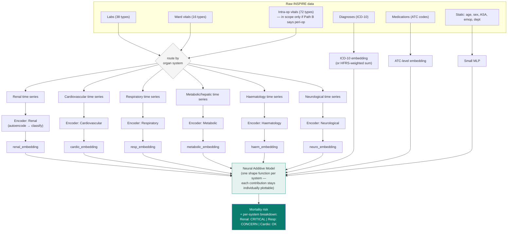

# Roadmap & Architecture — Working Page

> This page is the **actionable companion** to `Research_Aim.md` and `index.md`. Those two
> files explain *why* each item matters, in full prose. This page exists to be checked off
> against, week to week: a task list, the open decisions ("paths") that gate parts of the
> list, and the target architecture everything is building toward. Update it as items move
> from open → in progress → done — it's meant to go stale in a useful way (crossed-off
> boxes), not to be rewritten from scratch each time.

---

## 1. Where things stand right now

**Current pipeline:** two-phase transformer (`dnn_mortality_pipeline.py` /
`dnn_mortality_pipeline_real.py`), autoencoder pre-training → supervised fine-tuning,
7 pre-op features, running on the 29–30 patient development subset. AUROC fluctuates
0.67–0.86 run to run — not yet meaningful, the test set is too small.

**Note:** the 30-day label fix (`inhosp_death_30day()` instead of `died()`) is **already
wired into `dnn_mortality_data_real.py`** (line ~652). The narrative in `index.md` §13
saying this is "not yet applied" is out of date for the `_real` pipeline — worth
double-checking which of `dnn_mortality_pipeline.py` vs `dnn_mortality_pipeline_real.py`
is the one actually being run, and retiring/merging whichever is stale, before it causes
confusion about which numbers are trustworthy.

**Immediate next step, in order:**

1. Confirm with James whether the **full 99,886-patient** folder split was built from
   `died()` or `died_30day()` — this determines whether 942 or 469 (or a third number) is
   the real death count to plan `pos_weight` around at full scale.
2. Run `feature_selection_pipeline.py` and the two audit scripts (`audit_features.py`,
   `audit_static_categorical.py`) at full scale, once the data arrives — this is close to
   zero new engineering and upgrades every "small-sample" caveat currently in the docs.
3. Make the pre-op-only vs. peri-operative **scope decision** (Path B below) — it gates
   whether the 72 intra-op `vitals` parameters are in scope for the architecture work.
4. Start building the organ-system feature grouping (Section 4 below) — this can proceed
   in parallel with 1–3 since it doesn't depend on the full dataset arriving.

---

## 2. Research & analysis task list

Organised by theme. Checkboxes are a starting state — tick them off as work lands.
Full reasoning for each item is in `Research_Aim.md` (section refs given).

### Data & labelling

- [x] Identify the `died()` vs `died_30day()` label mismatch
- [x] Apply `died_30day()` labelling in `dnn_mortality_data_real.py`
- [ ] Confirm full-dataset folder provenance with James
- [ ] Recompute `pos_weight` once the full-dataset label is confirmed
- [ ] Competing-risks relabelling: flag the "died after 30 days" cohort as its own group
      rather than discarding it (`Research_Aim.md` §3A)

### EDA & feature audit

- [ ] Re-run `feature_selection_pipeline.py` at full scale (univariate tests, multiple-
      comparison correction, department-adjusted significance)
- [ ] Re-run `audit_features.py` / `audit_static_categorical.py` at full scale
- [ ] Joint department × ICD-10 × mortality cross-tabulation (`eda_findings.md` §3)
- [ ] Multi-operation sensitivity analysis — last-op vs. first-op vs. exclude
      (`eda_findings.md` §12, `Research_Aim.md` §2.2)
- [ ] ASA as a model input — currently unused by the DNN despite 100% coverage
      (`Research_Aim.md` §2.3)

### Frailty & clinical baselines

- [ ] Fix HFRS to the published 2-year / age-75+ window (`frailty_hfrs.py`)
- [ ] Re-run frailty-vs-mortality comparisons post-fix
- [ ] Implement POSSUM / P-POSSUM as a fourth baseline alongside ASA/NELA
- [ ] Decide whether to fold in NEWS2 (`score_models.py` already has a working
      implementation, currently unused and uncompared)

### Feature scope

- [ ] Organ-system categorisation of all 126 parameters (Section 4 table below)
- [ ] Resolve pre-op-only vs. peri-operative scope (Path B below)
- [ ] Expand `FEATURE_COLUMNS` from 7 to the ~30-feature pre-op set

### Modelling

- [ ] Build system-separated encoders (Section 4 architecture)
- [ ] Categorical embeddings for medications (start at ATC level-2/3) and diagnoses
- [ ] Try masked-value or contrastive pre-training objectives instead of plain
      reconstruction
- [ ] GRU and TCN as additional comparison models
- [ ] Time-to-event reframing — Dynamic-DeepHit / DySurv-style dynamic hazard model, as a
      parallel track to the binary classifier (`Research_Aim.md` §2.8)

### Interpretability (the project's stated main aim)

- [ ] Concept Bottleneck head — AKI stage, haemodynamic instability, respiratory failure
      staging as named intermediate concepts
- [ ] Sparse autoencoder on the learned embeddings
- [ ] Attention auditing — do heads concentrate on the acute-deterioration ICD-10 codes
      already found in EDA (D65, I46, R57, J80, K72, A41)?
- [ ] Prototype / case-based retrieval ("this patient's renal trajectory resembles...")
- [ ] MC Dropout uncertainty, then conformal prediction intervals

### Evaluation

- [ ] Calibration curves + Brier score, not just AUROC/AUPRC
- [ ] Formal benchmark against Shickel et al. 2023 (AUROC 0.92), once the above is stable

---

## 3. Open decisions ("paths")

These are the forks that change what downstream work means. Each is written as a set of
options rather than a single answer — pick one (or run the sensitivity analysis) before
building on top of it.

### Path A — 30-day death count at full scale

| Option | Consequence |
|---|---|
| Folders already = `died_30day()` | 469-ish deaths, current `pos_weight` math is close |
| Folders = `died()` (all-cause), needs relabel | Real 30-day count unknown until relabelled; do this before any full-scale run |

**Status:** blocking — confirm with James before the full-dataset run.

### Path B — Pre-operative only vs. peri-operative

| Option | What it produces | Use case |
|---|---|---|
| Pre-op only (current) | Decision-support tool | "Should we operate? Should ICU be booked?" |
| + intra-operative vitals | Real-time monitoring tool | "Should the surgical team escalate mid-case?" |
| + early post-operative | Early-warning / rescue tool | "Flag this patient before formal deterioration" |

**Recommendation:** these are three different products, not three versions of one model —
build and report all three rather than assuming the pre-op-only frame is final
(`Research_Aim.md` §2.6).

### Path C — Multi-operation patients

| Option | Argument for | Risk |
|---|---|---|
| Label from last operation (current) | Matches "did this specific operation kill the patient" | Ignores earlier ops entirely |
| Label from first operation | Captures the full surgical journey | Wrong reference point for late major surgery |
| Exclude multi-op patients | Cleanest label | Selection bias — repeat-operation patients may be systematically sicker |

**Recommendation:** run as a sensitivity analysis across all three definitions and report
whether conclusions are stable (`Research_Aim.md` §2.2) — the EDA chart
(`16_multi_operation_mortality.png`) already exists to inform this.

---

## 4. Target architecture — system-separated encoders

The core research contribution: instead of one transformer over all features, each
physiological system gets its own encoder and its own embedding, so a prediction can be
read off as a per-system breakdown rather than one opaque score.

### 4.1 Organ-system feature grouping (126 parameters total)

| System | Labs | Ward vitals | Intra-op vitals (if Path B includes them) |
|---|---|---|---|
| Renal | bun, calcium, chloride, creatinine, ica, phosphorus, potassium, sodium | crrt, uo | uo |
| Cardiovascular | ck, ckmb, troponin_i, troponin_t | hr, nibp_sbp, nibp_dbp, nibp_mbp, iabp | hr, art_sbp/dbp/mbp, ci, cvp, svi |
| Respiratory | be, hco3, paco2, pao2, ph, sao2 | fio2, rr, spo2, vent, ecmo | etco2, fio2, spo2, peep, pip, pplat |
| Metabolic / hepatic | albumin, alp, alt, ast, glucose, hba1c, lacate, total_bilirubin, total_protein | bt | bt, glucose-related infusions |
| Haematology / coagulation | aptt, crp, d_dimer, fibrinogen, hb, hct, lymphocyte, platelet, ptinr, seg, wbc | — | ebl, rbc, ffp, cryo |
| Neurological | — | gcs_e, gcs_m, gcs_v | bis |

*Infection/inflammation (K65, sepsis-adjacent codes) doesn't currently have a clean home —
worth deciding whether it deserves its own system box, since the most mortality-linked
ICD-10 codes found in EDA (D65, I46, R57, J80, K72, A41) cluster there rather than under a
single organ system.*

### 4.2 Pipeline

### 4.3 Why a Neural Additive Model for fusion, not plain concatenation

A `concatenate → Linear` fusion is simplest but is **no more interpretable** than today's
single transformer — the per-system split disappears again the moment the vectors are
concatenated and mixed by a dense layer. A Neural Additive Model keeps each system's
contribution to the final logit as its own separately-trained, separately-plottable shape
function, so "Renal: CRITICAL" is a real decomposition of the prediction, not a post-hoc
story attached to it. See `Research_Aim.md` §2.5 and §2.9 for the fuller reasoning and the
gated/mixture-of-experts alternative in between.

### 4.4 Interpretability layers built on top

Once the system-separated encoders exist, four complementary interpretability layers sit
on top of them (`Research_Aim.md` §3C):

1. **Concept Bottleneck head** — predict named clinical concepts (AKI stage, haemodynamic
   instability, respiratory failure stage) before predicting mortality.
2. **Sparse autoencoder** on each system's embedding — decompose a dense, tangled
   embedding into sparse, individually-nameable directions.
3. **Attention auditing** — check whether attention concentrates on clinically sensible
   time steps and features, especially around the acute-deterioration ICD-10 codes.
4. **Prototype retrieval** — "this patient's renal trajectory resembles these 3 prior
   patients, 2 of whom died."

---

*This page is generated from, and should be kept consistent with, `Research_Aim.md` §4
(consolidated roadmap) and `index.md` §14–15. If the two drift apart, `Research_Aim.md` is
the more detailed source — update this page to match it, not the other way round.*
